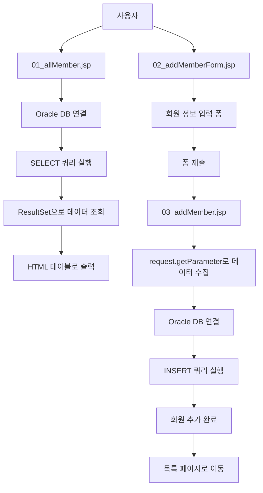

# JSP와 Oracle 데이터베이스 연동 - 회원 관리 시스템 복습 가이드

## 📚 학습 목표
- JSP에서 Oracle 데이터베이스에 연결하는 방법 이해
- PreparedStatement를 사용한 안전한 SQL 실행
- 회원 조회(SELECT)와 회원 추가(INSERT) 기능 구현
- HTML 폼과 JSP 연동을 통한 데이터 처리

## 🏗️ 시스템 구조

```
web-study-08/
├── 01_allMember.jsp      (회원 목록 조회)
├── 02_addMemberForm.jsp  (회원 추가 폼)
├── 03_addMember.jsp      (회원 추가 처리)
└── WEB-INF/lib/
    ├── ojdbc8-23.2.0.0.jar  (Oracle JDBC 드라이버)
    ├── jstl.jar             (JSTL 라이브러리)
    └── standard.jar         (Standard 태그 라이브러리)
```

## 📊 데이터베이스 구조

**MEMBER 테이블**
| 컬럼명 | 데이터 타입 | 설명 |
|--------|-------------|------|
| name | VARCHAR2 | 회원 이름 |
| userid | VARCHAR2 | 회원 아이디 |
| pwd | VARCHAR2 | 비밀번호 |
| email | VARCHAR2 | 이메일 |
| phone | VARCHAR2 | 전화번호 |
| admin | NUMBER | 권한 (1:관리자, 0:일반회원) |

## 🔄 시스템 흐름도



## 💡 핵심 개념

### 1. JDBC 연결 과정
1. **드라이버 로딩**: `Class.forName("oracle.jdbc.driver.OracleDriver")`
2. **데이터베이스 연결**: `DriverManager.getConnection(url, uid, upw)`
3. **SQL 실행 객체 생성**: `PreparedStatement`
4. **쿼리 실행**: `executeQuery()` 또는 `executeUpdate()`
5. **리소스 해제**: `finally` 블록에서 connection, statement 닫기

### 2. PreparedStatement의 장점
- **SQL 인젝션 방지**: 매개변수를 안전하게 처리
- **성능 향상**: 미리 컴파일된 SQL 재사용
- **가독성**: 동적 값을 `?`로 표현하여 명확

### 3. JSP 선언문 활용
- `<%! ... %>`: 멤버 변수와 메소드 선언
- 데이터베이스 연결 정보를 선언문에 정의

## 📝 상세 코드 분석

### 1. 회원 목록 조회 (01_allMember.jsp)

#### 핵심 구조
```jsp
<%!
    // 데이터베이스 연결 객체들 선언
    Connection con = null;
    PreparedStatement pstmt = null;
    ResultSet rs = null;
    
    // 데이터베이스 연결 정보
    String url = "jdbc:oracle:thin:@localhost:1521:FREE";
    String uid = "system";
    String upw = "password";
    String sql = "select * from member";
%>
```

#### 실행 과정
1. **드라이버 로딩**
   ```jsp
   Class.forName("oracle.jdbc.driver.OracleDriver");
   ```

2. **데이터베이스 연결**
   ```jsp
   con = DriverManager.getConnection(url, uid, upw);
   ```

3. **PreparedStatement 생성 및 실행**
   ```jsp
   pstmt = con.prepareStatement(sql);
   rs = pstmt.executeQuery();
   ```

4. **결과 처리**
   ```jsp
   while(rs.next()) {
       out.println("<tr>");
       out.println("<td>" + rs.getString("name") + "</td>");
       out.println("<td>" + rs.getString("userid") + "</td>");
       // ... 다른 필드들
       out.println("</tr>");
   }
   ```

5. **리소스 해제**
   ```jsp
   finally {
       rs.close();
       pstmt.close();
       con.close();
   }
   ```

### 2. 회원 추가 폼 (02_addMemberForm.jsp)

#### 폼 구조
```html
<form action="03_addMember.jsp" method="post">
    <input type="text" name="name" size="20"/>        <!-- 이름 -->
    <input type="text" name="userid" size="20"/>      <!-- 아이디 -->
    <input type="password" name="pwd" size="20"/>     <!-- 비밀번호 -->
    <input type="email" name="email" size="20"/>      <!-- 이메일 -->
    <input type="text" name="phone" size="20"/>       <!-- 전화번호 -->
    <input type="radio" name="admin" value="1"/>      <!-- 관리자 -->
    <input type="radio" name="admin" value="0"/>      <!-- 일반회원 -->
</form>
```

#### 중요 포인트
- **action**: 폼 데이터를 처리할 JSP 페이지 지정
- **method="post"**: 보안상 POST 방식 사용
- **name 속성**: 서버에서 `request.getParameter()`로 값 접근

### 3. 회원 추가 처리 (03_addMember.jsp)

#### 데이터 수집
```jsp
request.setCharacterEncoding("UTF-8");  // 한글 인코딩 설정

String name = request.getParameter("name");
String userid = request.getParameter("userid");
String pwd = request.getParameter("pwd");
String email = request.getParameter("email");
String phone = request.getParameter("phone");
int admin = Integer.parseInt(request.getParameter("admin"));
```

#### INSERT 쿼리 실행
```jsp
String sql = "insert into member values (?, ?, ?, ?, ?, ?)";
pstmt = con.prepareStatement(sql);

// 매개변수 설정
pstmt.setString(1, name);
pstmt.setString(2, userid);
pstmt.setString(3, pwd);
pstmt.setString(4, email);
pstmt.setString(5, phone);
pstmt.setInt(6, admin);

// 실행 (성공: 1, 실패: 0)
int result = pstmt.executeUpdate();
```

## 🔧 실습 단계별 가이드

### Step 1: 환경 설정
1. Oracle 데이터베이스 설치 및 실행
2. MEMBER 테이블 생성
3. JDBC 드라이버 라이브러리 추가

### Step 2: 데이터베이스 연결 테스트
1. 기본 연결 정보 설정
2. 연결 테스트 코드 작성
3. 드라이버 로딩 확인

### Step 3: 조회 기능 구현
1. SELECT 쿼리 작성
2. ResultSet 데이터 처리
3. HTML 테이블로 출력

### Step 4: 추가 기능 구현
1. HTML 폼 생성
2. 데이터 수집 및 검증
3. INSERT 쿼리 실행

## ⚠️ 주의사항 및 베스트 프랙티스

### 1. 보안 고려사항
- **PreparedStatement 사용**: SQL 인젝션 방지
- **입력 데이터 검증**: 클라이언트 입력값 항상 검증
- **에러 메시지 최소화**: 상세한 DB 정보 노출 방지

### 2. 리소스 관리
```jsp
finally {
    if(rs != null) rs.close();
    if(pstmt != null) pstmt.close();
    if(con != null) con.close();
}
```

### 3. 인코딩 처리
```jsp
request.setCharacterEncoding("UTF-8");  // 한글 처리를 위한 필수 설정
```

### 4. 데이터 타입 변환
```jsp
int admin = Integer.parseInt(request.getParameter("admin"));  // 문자열을 정수로 변환
```

## 🎯 연습 문제

1. **수정 기능 추가**: 기존 회원 정보를 수정하는 기능 구현
2. **삭제 기능 추가**: 선택한 회원을 삭제하는 기능 구현
3. **검색 기능 추가**: 이름이나 아이디로 회원을 검색하는 기능 구현
4. **페이징 처리**: 많은 회원 데이터를 페이지별로 나누어 표시
5. **유효성 검사**: JavaScript를 활용한 클라이언트 측 입력 검증

## 📖 추가 학습 자료

- **Connection Pool**: 데이터베이스 연결 최적화
- **DAO 패턴**: 데이터 접근 객체 패턴 적용
- **MVC 패턴**: Model-View-Controller 구조로 리팩토링
- **JSTL**: JSP Standard Tag Library 활용
- **Ajax**: 비동기 통신으로 사용성 개선

## 🏁 마무리

이 예제를 통해 JSP와 Oracle 데이터베이스 연동의 기본 원리를 학습할 수 있습니다. 
실제 웹 애플리케이션 개발에서는 보안, 성능, 유지보수성을 고려한 더 고도화된 패턴들을 적용해야 합니다.

**복습 포인트**:
- JDBC 연결 과정 5단계
- PreparedStatement의 장점과 사용법
- HTML 폼과 JSP의 데이터 연동
- 리소스 해제의 중요성
- 한글 인코딩 처리 방법
