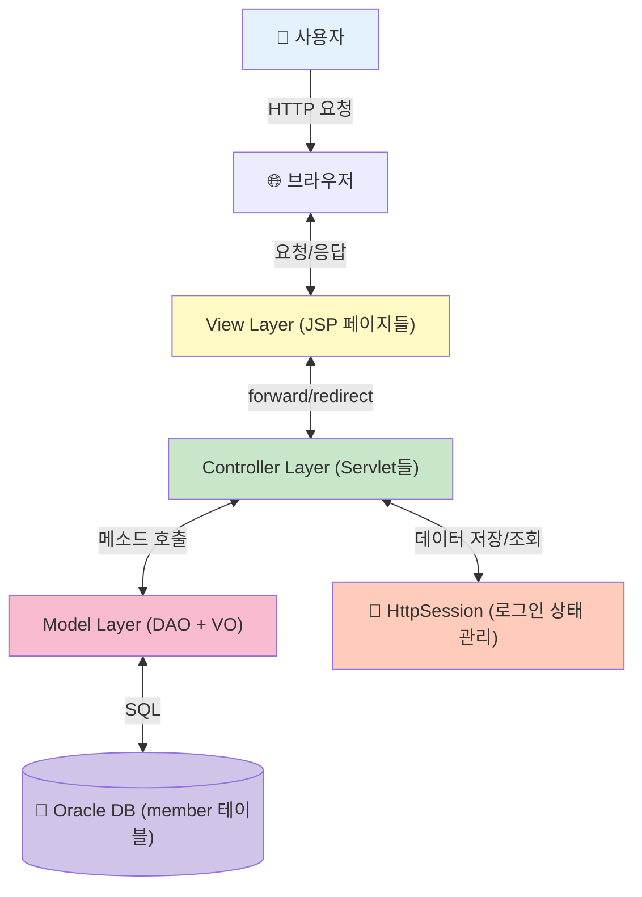
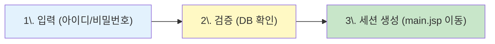
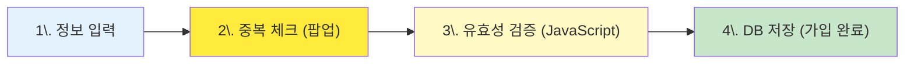
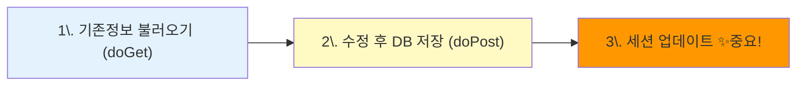
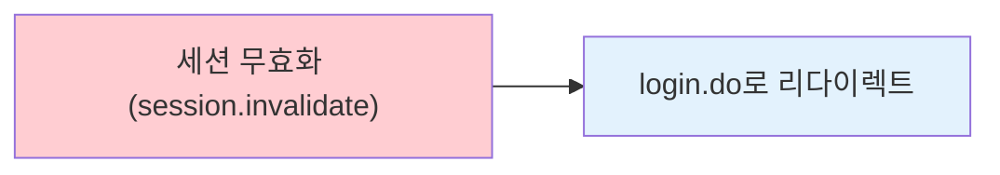
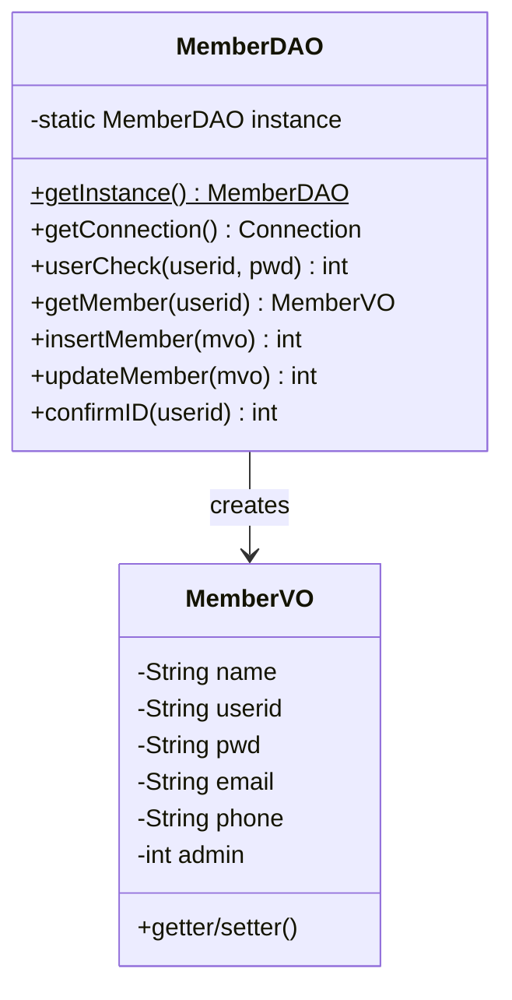
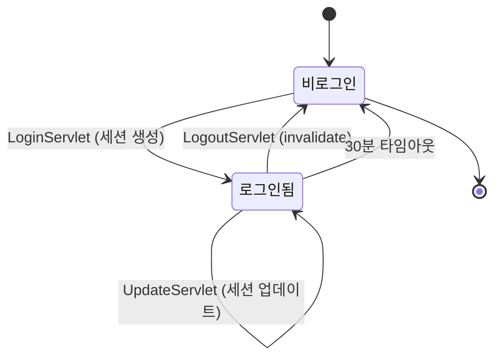
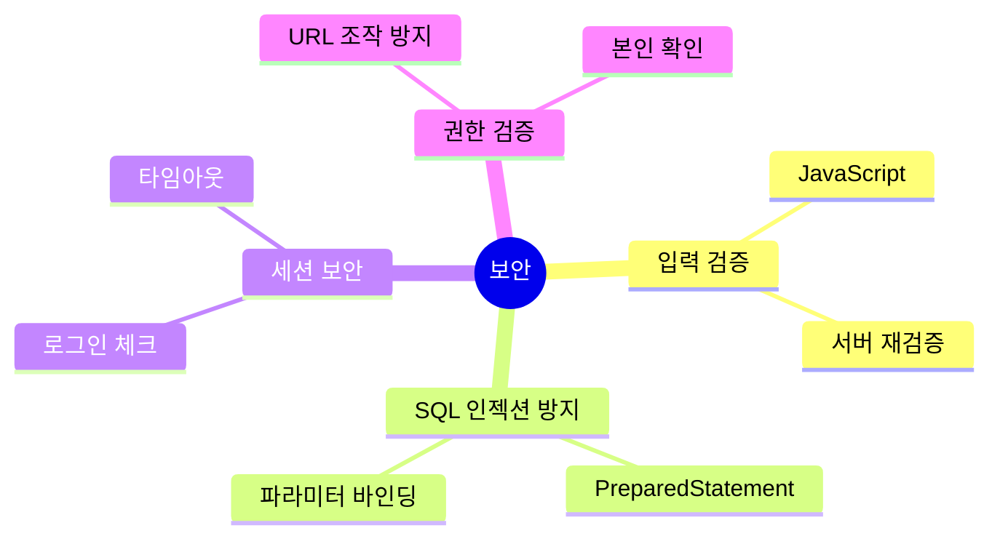
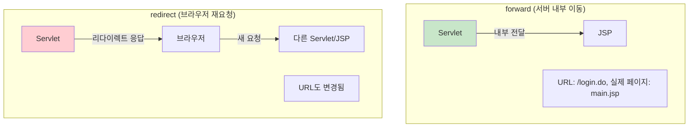
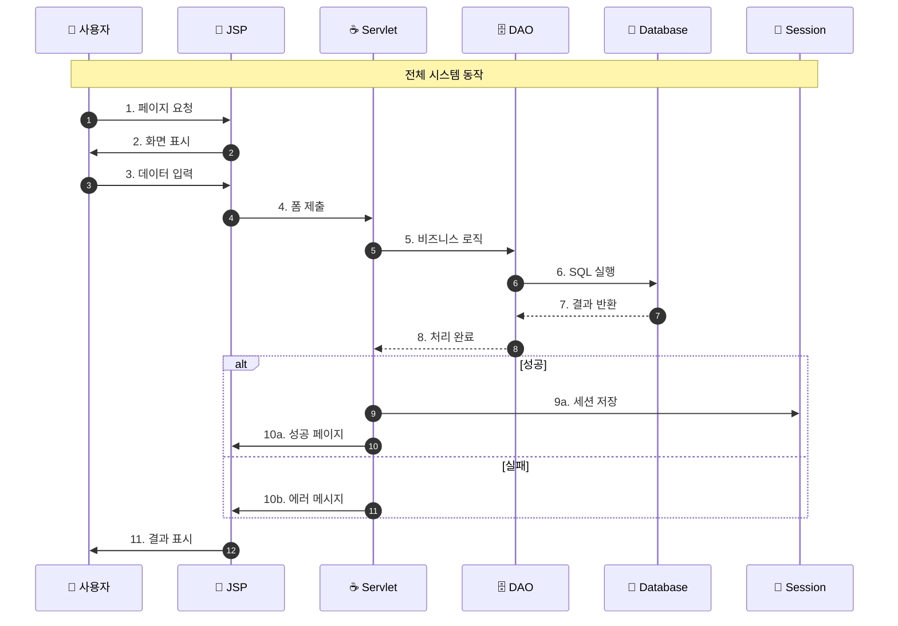

# JSP 로그인 시스템 핵심 요약

> 한눈에 보는 전체 시스템 구조와 핵심 흐름

---

## 🏗️ 시스템 아키텍처 한눈에 보기



---

## 📊 4대 핵심 프로세스 비교표

| 프로세스 | 시작 | 주요 Servlet | 핵심 DAO 메소드 | 세션 변경 | 결과 페이지 |
|---------|------|-------------|----------------|----------|-----------|
| **로그인** | login.jsp | LoginServlet | userCheck(), getMember() | ✅ 생성 | main.jsp |
| **회원가입** | join.jsp | JoinServlet, IdCheckServlet | insertMember(), confirmID() | ❌ 없음 | login.jsp |
| **정보수정** | main.jsp | UpdateServlet | getMember(), updateMember() | ✅ 업데이트 | main.jsp |
| **로그아웃** | main.jsp | LogoutServlet | - | ✅ 삭제 | login.jsp |

---

## 🔄 프로세스별 핵심 흐름

### 1️⃣ 로그인 (3단계)



**핵심 코드:**
```java
// LoginServlet.doPost()
int result = dao.userCheck(userid, pwd);
if(result == 1) {
    session.setAttribute("userid", userid);
    MemberVO mvo = dao.getMember(userid);
    session.setAttribute("loginUser", mvo);
}
```

---

### 2️⃣ 회원가입 (4단계)



**핵심 코드:**
```java
// IdCheckServlet
int result = dao.confirmID(userid);
// result: 0=사용가능, 1=중복

// JoinServlet.doPost()
if(reid.equals(userid)) {  // 중복체크 확인
    result = dao.insertMember(mvo);
}
```

---

### 3️⃣ 회원정보 수정 (3단계)



**핵심 코드:**
```java
// UpdateServlet.doPost()
int result = dao.updateMember(mvo);
if(result == 1) {
    // 세션 업데이트 필수!
    MemberVO updatedMvo = dao.getMember(userid);
    session.setAttribute("loginUser", updatedMvo);
}
```

---

### 4️⃣ 로그아웃 (1단계)



**핵심 코드:**
```java
// LogoutServlet.doGet()
session.invalidate();  // 세션 삭제
response.sendRedirect(contextPath + "/login.do");
```

---

## 🗂️ 파일 구조 한눈에

```
web-study-09/
├─ 📂 Java (로직)
│  ├─ MemberVO.java          ← 데이터 상자
│  ├─ MemberDAO.java          ← DB 전문가 (싱글톤)
│  ├─ LoginServlet.java       ← 로그인 처리
│  ├─ JoinServlet.java        ← 회원가입 처리
│  ├─ UpdateServlet.java      ← 정보수정 처리
│  ├─ LogoutServlet.java      ← 로그아웃 처리
│  └─ IdCheckServlet.java     ← 중복체크 처리
│
├─ 📂 JSP (화면)
│  ├─ login.jsp               ← 로그인 화면
│  ├─ join.jsp                ← 회원가입 화면
│  ├─ main.jsp                ← 메인 화면
│  ├─ memberUpdate.jsp        ← 정보수정 화면
│  └─ idCheck.jsp             ← 중복체크 팝업
│
└─ 📂 JavaScript
   └─ member.js               ← 유효성 검증
```

---

## 🔑 MemberDAO 주요 메소드



| 메소드 | 용도 | SQL | 반환값 |
|-------|------|-----|--------|
| **userCheck()** | 로그인 검증 | SELECT pwd WHERE userid=? | 1:성공, 0:실패, -1:오류 |
| **getMember()** | 회원정보 조회 | SELECT * WHERE userid=? | MemberVO 객체 |
| **insertMember()** | 회원 등록 | INSERT INTO member VALUES(...) | 1:성공, -1:실패 |
| **updateMember()** | 회원정보 수정 | UPDATE member SET ... WHERE userid=? | 1:성공, -1:실패 |
| **confirmID()** | 중복 확인 | SELECT userid WHERE userid=? | 0:사용가능, 1:중복 |

---

## 🎫 세션 라이프사이클



### 세션에 저장되는 데이터

```javascript
session {
    "userid": "chulsoo",              // 아이디
    "loginUser": {                     // 전체 회원정보 (MemberVO)
        name: "김철수",
        userid: "chulsoo",
        pwd: "1234",
        email: "chulsoo@example.com",
        phone: "010-1234-5678",
        admin: 0
    }
}
```

---

## 🔒 보안 체크포인트



### 주요 보안 패턴

1. **PreparedStatement 사용**
```java
// ❌ 위험
String sql = "SELECT * FROM member WHERE userid='" + userid + "'";

// ✅ 안전
String sql = "SELECT * FROM member WHERE userid=?";
pstmt.setString(1, userid);
```

2. **세션 체크**
```jsp
<!-- main.jsp -->
<c:if test="${empty loginUser}">
    <jsp:forward page="/login.do" />
</c:if>
```

3. **URL 파라미터 검증**
```java
// UpdateServlet.doGet()
String userid = request.getParameter("userid");
if(!userid.equals(loginUser.getUserid())) {
    userid = loginUser.getUserid();  // 강제 변경
}
```

---

## 📝 forward vs redirect



| 구분 | forward | redirect |
|-----|---------|----------|
| **URL 변경** | ❌ 안 바뀜 | ✅ 바뀜 |
| **속도** | ⚡ 빠름 | 🐢 느림 |
| **request 공유** | ✅ 공유됨 | ❌ 새로운 request |
| **사용 예** | 로그인 성공 → main.jsp | 로그아웃 → login.do |

---

## 🎯 핵심 흐름 요약



---

## 💡 핵심 개념 치트시트

| 개념 | 설명 | 예시 |
|------|------|------|
| **MVC** | Model(DAO/VO) + View(JSP) + Controller(Servlet) | 역할 분리 |
| **세션** | 로그인 상태를 유지하는 임시 공간 | 도서관 출입증 |
| **VO** | 데이터를 담는 상자 | 택배 상자 |
| **DAO** | DB 접근 전문 클래스 | 사서 선생님 |
| **싱글톤** | 객체를 하나만 만드는 패턴 | getInstance() |
| **PreparedStatement** | 안전한 SQL 실행 | SQL 인젝션 방지 |

---

## 🚀 학습 체크리스트

- [ ] MVC 패턴의 각 계층 역할을 설명할 수 있다
- [ ] 로그인 프로세스 12단계를 순서대로 말할 수 있다
- [ ] 세션의 생성, 사용, 삭제 과정을 이해했다
- [ ] forward와 redirect의 차이를 설명할 수 있다
- [ ] DAO가 싱글톤 패턴을 사용하는 이유를 안다
- [ ] PreparedStatement의 중요성을 이해했다
- [ ] 회원정보 수정 시 세션 업데이트가 필요한 이유를 안다
- [ ] 아이디 중복 체크에서 reid 필드의 역할을 이해했다

---

**이 요약으로 JSP 로그인 시스템의 핵심을 완벽하게 파악할 수 있습니다! 🎉**

📌 **상세한 내용은 Part1, Part2 문서를 참고하세요!**

