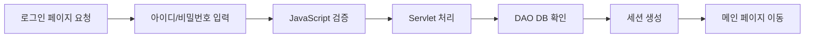
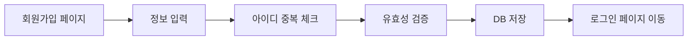
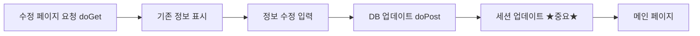
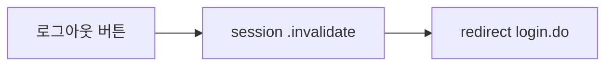

# JSP 로그인 시스템 흐름도 종합 인덱스

> 전체 시스템을 순차적으로 이해할 수 있는 완전한 도식화 문서

---

## 📚 문서 구성

이 시리즈는 JSP 로그인 시스템의 모든 프로세스를 상세한 다이어그램으로 설명합니다.

### 🎯 빠른 시작

처음 보시는 분은 이 순서로 읽어보세요:

1. **[핵심 요약](./JSP_로그인_시스템_핵심요약.md)** ⭐ 시작은 여기서!
   - 한 페이지로 보는 전체 시스템
   - 4대 핵심 프로세스 비교표
   - 주요 개념 치트시트

2. **[Part 1](./JSP_로그인_시스템_흐름도_Part1.md)** 📘 기본 기능
   - 시스템 아키텍처
   - 로그인 프로세스 (12단계 상세)
   - 회원가입 프로세스
   - 아이디 중복 체크

3. **[Part 2](./JSP_로그인_시스템_흐름도_Part2.md)** 📗 고급 기능
   - 회원정보 수정 프로세스
   - 로그아웃 프로세스
   - 세션 생명주기 관리
   - 전체 시스템 통합

---

## 📖 문서별 상세 목차

### 🌟 핵심 요약 (JSP_로그인_시스템_핵심요약.md)

**이런 분께 추천:**
- 빠르게 전체 구조를 파악하고 싶으신 분
- 복습하면서 핵심만 확인하고 싶으신 분
- 시험 전에 훑어보고 싶으신 분

**주요 내용:**
```
✅ 시스템 아키텍처 한눈에 보기
✅ 4대 프로세스 비교표
✅ 프로세스별 핵심 흐름 요약
✅ 파일 구조 및 주요 메소드
✅ 세션 라이프사이클
✅ 보안 체크포인트
✅ forward vs redirect
✅ 핵심 개념 치트시트
```

---

### 📘 Part 1 - 기본 기능 (JSP_로그인_시스템_흐름도_Part1.md)

**이런 분께 추천:**
- 처음부터 체계적으로 학습하고 싶으신 분
- 로그인과 회원가입 과정을 깊이 이해하고 싶으신 분
- MVC 패턴을 확실히 배우고 싶으신 분

**주요 내용:**

#### 1. 전체 시스템 아키텍처
- MVC 패턴 구조도
- 파일 구조와 역할
- 데이터 흐름 개요

#### 2. 로그인 프로세스 상세 흐름도

- 12단계 완전 분석
- LoginServlet 메소드 플로우차트
- MemberDAO.userCheck() 상세
- 세션 관리 흐름
- 로그인 실패 시나리오

#### 3. 회원가입 프로세스 상세 흐름도

- JoinServlet 메소드 플로우차트
- 팝업을 통한 중복 체크
- reid 필드의 보안 역할

#### 4. 아이디 중복 체크 프로세스
- IdCheckServlet 상세 흐름
- 팝업과 부모 창 통신
- window.opener 활용

---

### 📗 Part 2 - 고급 기능 (JSP_로그인_시스템_흐름도_Part2.md)

**이런 분께 추천:**
- Part 1을 읽고 더 깊이 이해하고 싶으신 분
- 세션 관리를 마스터하고 싶으신 분
- 보안 측면을 이해하고 싶으신 분

**주요 내용:**

#### 1. 회원정보 수정 프로세스

- UpdateServlet GET/POST 분리
- 세션 업데이트의 중요성
- URL 파라미터 보안 검증
- MemberDAO.updateMember() 상세

#### 2. 로그아웃 프로세스

- 가장 간단하지만 중요한 프로세스
- 세션 무효화 메커니즘
- forward vs redirect 비교

#### 3. 세션 생명주기 관리
- 전체 생명주기 상태 다이어그램
- 세션 생성 → 활성 → 무효화
- 타임아웃 메커니즘
- 세션 데이터 흐름

#### 4. 전체 시스템 통합 흐름도
- 모든 기능 통합 시퀀스
- 페이지 간 네비게이션 맵
- 데이터베이스 연동 전체 흐름
- 에러 처리 흐름

#### 5. 주요 메소드 호출 체인
- 로그인 메소드 체인
- 회원가입 메소드 체인
- 정보수정 메소드 체인

#### 6. 보안 체크포인트 정리
- 마인드맵으로 보는 보안 요소
- 입력 검증, SQL 인젝션 방지
- 세션 보안, 권한 검증

---

## 🎨 다이어그램 유형별 찾기

### 시퀀스 다이어그램 (Sequence Diagram)
시간 순서대로 객체 간 상호작용을 보여줍니다.

- **Part 1**
  - 로그인 전체 시퀀스 (12단계)
  - 회원가입 전체 시퀀스
  - 아이디 중복 체크 상세 흐름
  - 전체 데이터 흐름 개요

- **Part 2**
  - 회원정보 수정 전체 시퀀스
  - 로그아웃 시퀀스
  - URL 파라미터 보안 검증
  - 세션 타임아웃 메커니즘
  - 전체 시스템 통합 시퀀스

### 플로우차트 (Flowchart)
의사결정과 처리 흐름을 보여줍니다.

- **Part 1**
  - LoginServlet 메소드 플로우
  - MemberDAO.userCheck() 메소드
  - JoinServlet 메소드 플로우
  - MemberDAO.confirmID() 메소드

- **Part 2**
  - UpdateServlet 메소드 플로우
  - MemberDAO.updateMember() 메소드
  - LogoutServlet 플로우
  - 전체 에러 처리 흐름

### 상태 다이어그램 (State Diagram)
시스템의 상태 변화를 보여줍니다.

- **Part 1**
  - 세션 관리 상태 흐름

- **Part 2**
  - 세션 전체 생명주기
  - 세션 무효화 상세
  - 로그인 상태 (핵심 요약)

### 아키텍처 다이어그램
시스템 구조와 컴포넌트를 보여줍니다.

- **Part 1**
  - MVC 패턴 구조
  - 파일 구조와 역할
  - 팝업과 부모 창 통신

- **Part 2**
  - 페이지 간 네비게이션 맵
  - 데이터베이스 연동 전체 흐름
  - 세션 업데이트 구조
  - forward vs redirect 비교

- **핵심 요약**
  - 시스템 아키텍처 전체
  - MemberDAO 클래스 다이어그램

### 그래프/차트
비교와 관계를 보여줍니다.

- **Part 2**
  - 세션 데이터 흐름
  - 메소드 호출 체인 (로그인, 가입, 수정)
  - 보안 체크포인트 마인드맵

---

## 🔍 주제별 찾기

### 로그인 관련
- 핵심 요약: 로그인 3단계 요약
- Part 1: 로그인 프로세스 12단계 완전 분석
- Part 1: LoginServlet 플로우차트
- Part 1: MemberDAO.userCheck() 상세
- Part 1: 로그인 실패 시나리오
- Part 2: 로그인 메소드 호출 체인

### 회원가입 관련
- 핵심 요약: 회원가입 4단계 요약
- Part 1: 회원가입 프로세스 상세
- Part 1: JoinServlet 플로우차트
- Part 1: 아이디 중복 체크 전체 프로세스
- Part 1: IdCheckServlet 상세
- Part 1: 팝업과 부모 창 통신
- Part 2: 회원가입 메소드 호출 체인

### 회원정보 수정 관련
- 핵심 요약: 정보수정 3단계 요약
- Part 2: 회원정보 수정 전체 시퀀스
- Part 2: UpdateServlet GET/POST 플로우
- Part 2: MemberDAO.updateMember() 상세
- Part 2: 세션 업데이트의 중요성
- Part 2: URL 파라미터 보안 검증
- Part 2: 정보수정 메소드 호출 체인

### 로그아웃 관련
- 핵심 요약: 로그아웃 1단계
- Part 2: 로그아웃 시퀀스 다이어그램
- Part 2: LogoutServlet 플로우차트
- Part 2: 세션 무효화 상세

### 세션 관련
- 핵심 요약: 세션 라이프사이클
- Part 1: 세션 관리 상태 흐름
- Part 2: 세션 전체 생명주기
- Part 2: 세션 타임아웃 메커니즘
- Part 2: 세션 데이터 흐름
- Part 2: 세션 무효화 방법들

### 보안 관련
- 핵심 요약: 보안 체크포인트
- 핵심 요약: PreparedStatement 사용법
- 핵심 요약: URL 파라미터 검증
- Part 1: reid 필드의 보안 역할
- Part 2: URL 파라미터 조작 방지
- Part 2: 보안 체크포인트 마인드맵

### MVC/아키텍처 관련
- 핵심 요약: 시스템 아키텍처 전체
- 핵심 요약: 파일 구조 한눈에
- Part 1: MVC 패턴 구조도
- Part 1: 파일 구조와 역할
- Part 1: 데이터 흐름 개요
- Part 2: 페이지 간 네비게이션
- Part 2: 데이터베이스 연동 전체 흐름

### DAO/Database 관련
- 핵심 요약: MemberDAO 주요 메소드
- 핵심 요약: MemberDAO 클래스 다이어그램
- Part 1: MemberDAO.userCheck() 상세
- Part 1: MemberDAO.confirmID() 상세
- Part 2: MemberDAO.updateMember() 상세
- Part 2: 데이터베이스 연동 전체 흐름

---

## 📊 학습 단계별 추천 경로

### 🌱 초급: 처음 배우시는 분

```
1단계: 핵심 요약 읽기 (30분)
   ↓
2단계: Part 1 - 시스템 아키텍처 (20분)
   ↓
3단계: Part 1 - 로그인 프로세스 (40분)
   ↓
4단계: 실제 코드와 비교하며 이해하기
```

### 🌿 중급: 기본을 아시는 분

```
1단계: 핵심 요약으로 전체 복습 (20분)
   ↓
2단계: Part 1 - 회원가입 프로세스 (30분)
   ↓
3단계: Part 2 - 회원정보 수정 (30분)
   ↓
4단계: Part 2 - 세션 생명주기 (20분)
   ↓
5단계: 보안 관련 내용 집중 학습
```

### 🌳 고급: 심화 학습하시는 분

```
1단계: Part 2 - 전체 시스템 통합 흐름 (40분)
   ↓
2단계: Part 2 - 메소드 호출 체인 분석 (30분)
   ↓
3단계: Part 2 - 보안 체크포인트 상세 (30분)
   ↓
4단계: 에러 처리 흐름 분석 (20분)
   ↓
5단계: 실전 프로젝트에 적용하기
```

### 🔄 복습/시험 대비

```
시험 3일 전: Part 1, 2 정독
   ↓
시험 1일 전: 핵심 요약 반복 숙독
   ↓
시험 당일: 핵심 개념 치트시트 최종 확인
```

---

## 💡 효과적인 학습 방법

### 1. 다이어그램과 코드를 함께 보기
```
📊 다이어그램 보기
   ↓
💻 실제 코드 확인
   ↓
🔄 다시 다이어그램으로 흐름 확인
```

### 2. 프로세스 따라 그리기
- 다이어그램을 보고 직접 그려보세요
- 중요한 메소드 호출 순서를 암기하세요

### 3. 디버깅으로 확인하기
- Eclipse에서 breakpoint 설정
- 다이어그램의 각 단계를 실제로 확인

### 4. 변형 시나리오 생각하기
- "로그인 실패하면?"
- "세션이 없으면?"
- "URL을 조작하면?"

---

## 🎯 각 문서의 활용 방법

### 📌 핵심 요약 활용법
- **시험 전**: 마지막 정리용
- **면접 전**: 빠른 복습용
- **프로젝트**: 구조 설계 참고용
- **발표**: 전체 개요 설명용

### 📌 Part 1 활용법
- **학습**: 기초부터 차근차근
- **구현**: 로그인/회원가입 구현 시
- **디버깅**: 로그인 오류 해결 시
- **문서화**: 시스템 설명 자료 작성 시

### 📌 Part 2 활용법
- **심화학습**: Part 1 이후
- **구현**: 정보수정 기능 추가 시
- **보안**: 보안 강화 방안 검토 시
- **최적화**: 세션 관리 개선 시

---

## 📖 원본 가이드 문서

이 흐름도는 다음 가이드를 기반으로 제작되었습니다:

- **JSP_로그인_시스템_완벽_가이드_for_중학생.md**
  - 기초 개념부터 상세 설명
  - 중학생도 이해할 수 있는 쉬운 설명
  - 비유와 예시가 풍부

- **JSP_로그인_시스템_완벽_가이드_for_중학생_Part2.md**
  - 회원정보 수정 과정
  - 로그아웃 과정
  - 코드 한 줄씩 이해하기
  - 프로그래밍 용어 사전
  - 자주 묻는 질문 (Q&A)

**추천**: 텍스트 설명이 필요하면 원본 가이드를, 시각적 이해가 필요하면 이 흐름도 시리즈를 활용하세요!

---

## 🤝 학습 지원

### 질문이 있으신가요?

1. **개념 이해 안 될 때**
   - 핵심 요약의 비유 설명 확인
   - 원본 가이드의 "비유" 섹션 참고

2. **흐름이 복잡할 때**
   - 시퀀스 다이어그램을 단계별로 분해
   - 각 단계마다 실제 코드 확인

3. **코드와 매칭 안 될 때**
   - 플로우차트의 메소드명 확인
   - Eclipse에서 해당 메소드로 이동

### 추가 학습 자료

- **데이터베이스 연동**: `JSP_데이터베이스_연동_복습가이드.md` (web-study-08)
- **로그인 시스템 완전정복**: `로그인_시스템_완전정복_가이드_v2.md`

---

## 📝 문서 버전 정보

- **작성일**: 2025년 11월 17일
- **기반 프로젝트**: web-study-09
- **프레임워크**: JSP/Servlet + Oracle Database
- **다이어그램 도구**: Mermaid

---

## ✅ 학습 완료 체크리스트

### 기본 이해도 체크
- [ ] MVC 패턴의 각 계층을 설명할 수 있다
- [ ] 로그인 프로세스를 순서대로 말할 수 있다
- [ ] 세션이 무엇인지 설명할 수 있다
- [ ] DAO와 VO의 역할을 구분할 수 있다

### 상세 이해도 체크
- [ ] LoginServlet의 doGet과 doPost 차이를 안다
- [ ] userCheck() 메소드가 반환하는 값의 의미를 안다
- [ ] 회원가입에서 reid 필드가 필요한 이유를 안다
- [ ] 정보 수정 후 세션 업데이트가 필요한 이유를 안다

### 고급 이해도 체크
- [ ] forward와 redirect를 상황에 맞게 선택할 수 있다
- [ ] PreparedStatement를 사용해야 하는 이유를 설명할 수 있다
- [ ] URL 파라미터 조작을 방지하는 방법을 안다
- [ ] 세션 타임아웃 메커니즘을 이해했다

### 실전 능력 체크
- [ ] 이 시스템을 직접 구현할 수 있다
- [ ] 발생 가능한 보안 문제를 예측할 수 있다
- [ ] 에러가 발생했을 때 어디를 확인해야 할지 안다
- [ ] 이 구조를 다른 프로젝트에 응용할 수 있다

---

## 🎓 다음 단계

이 시스템을 마스터하셨다면 다음 주제로 넘어가세요:

1. **게시판 시스템** - CRUD 완성
2. **파일 업로드** - 프로필 사진 등록
3. **이메일 인증** - 회원가입 인증
4. **비밀번호 찾기** - 보안 강화
5. **권한 관리** - 관리자 기능
6. **페이징 처리** - 대용량 데이터 처리

---

## 🌟 마지막 조언

> "복잡해 보이는 프로그램도, 하나씩 뜯어보면 이해할 수 있습니다!"

- 처음부터 모든 걸 이해하려 하지 마세요
- 한 가지 프로세스씩 완벽히 이해하세요
- 다이어그램을 직접 그려보세요
- 코드를 실행하며 확인하세요

**여러분은 이미 웹 개발자의 길을 걷고 있습니다! 🚀**

---

**Happy Coding! 💻✨**

