# JSP 로그인 시스템 흐름도 - Part 1

> 전체 시스템의 구조와 로그인/회원가입 프로세스 상세 도식화

---

## 📋 목차

1. [전체 시스템 아키텍처](#1-전체-시스템-아키텍처)
2. [로그인 프로세스 상세 흐름도](#2-로그인-프로세스-상세-흐름도)
3. [회원가입 프로세스 상세 흐름도](#3-회원가입-프로세스-상세-흐름도)
4. [아이디 중복 체크 프로세스](#4-아이디-중복-체크-프로세스)

---

## 1. 전체 시스템 아키텍처

### 1.1 MVC 패턴 구조

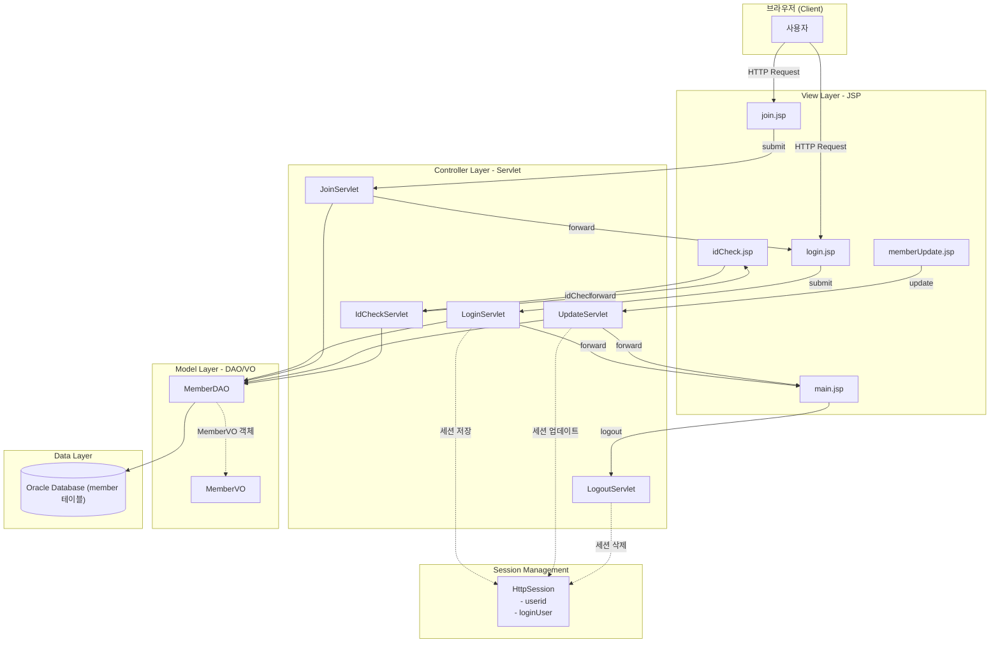

### 1.2 파일 구조와 역할

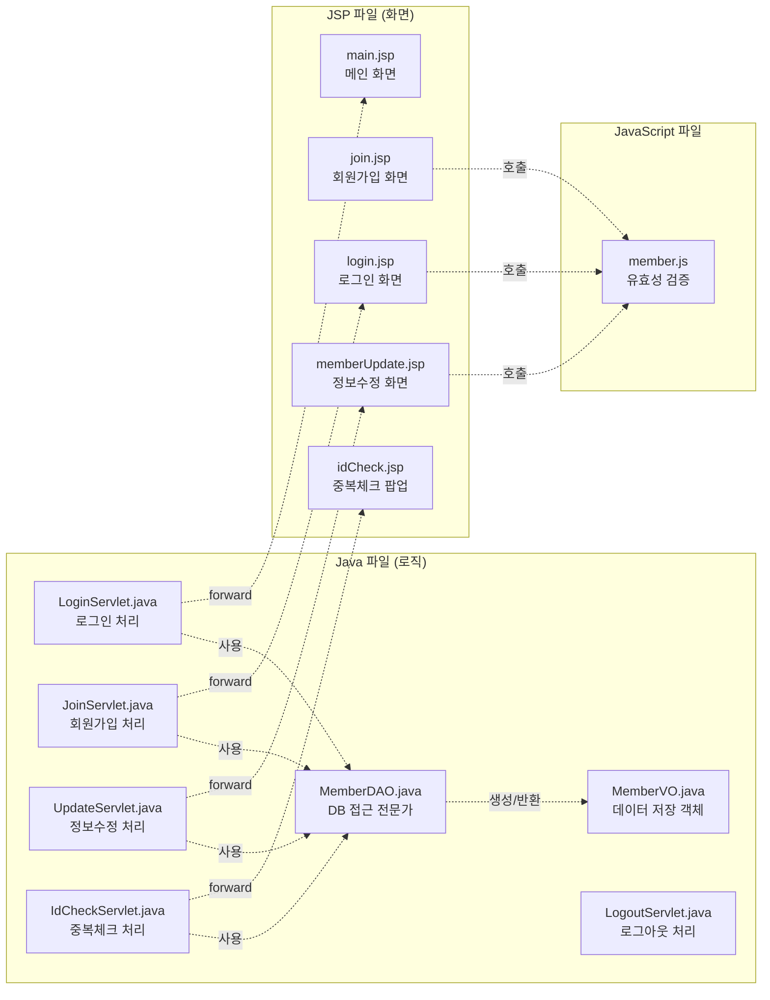

### 1.3 데이터 흐름 개요

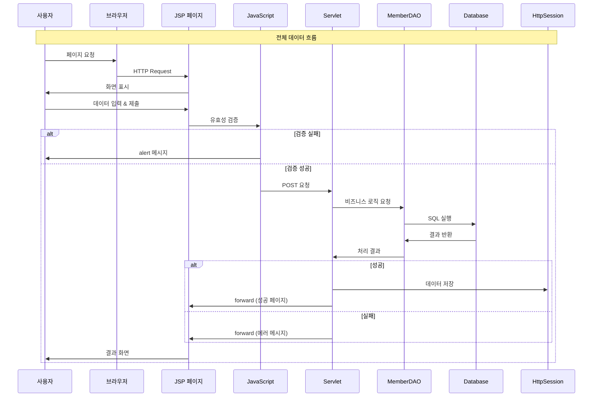

---

## 2. 로그인 프로세스 상세 흐름도

### 2.1 로그인 전체 시퀀스 다이어그램

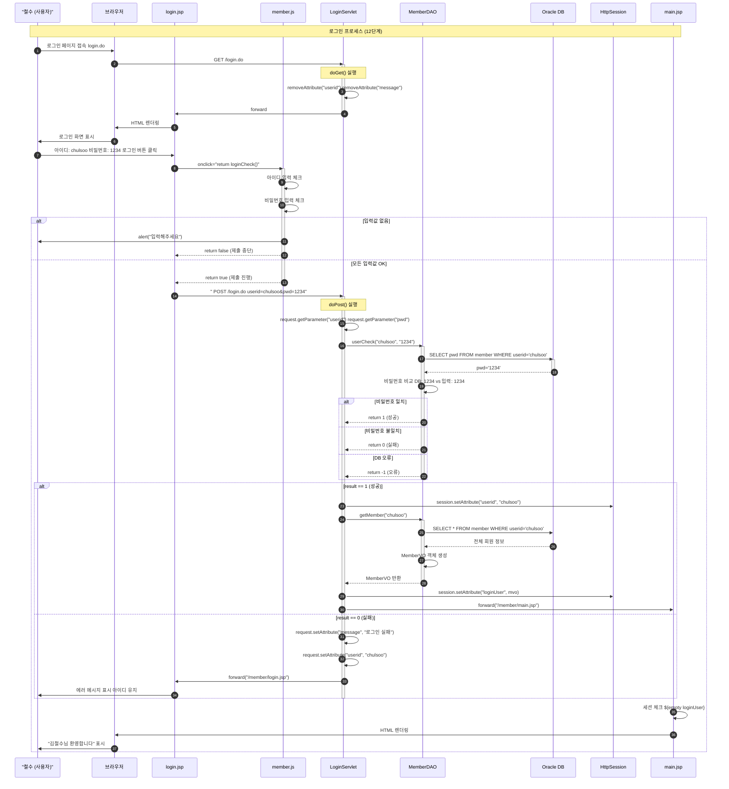

### 2.2 LoginServlet 메소드 플로우차트

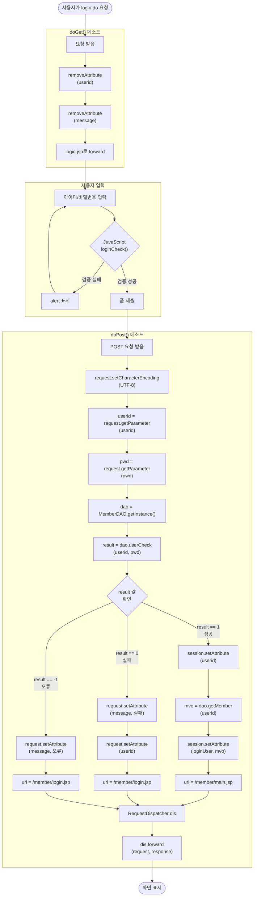

### 2.3 MemberDAO.userCheck() 메소드 상세

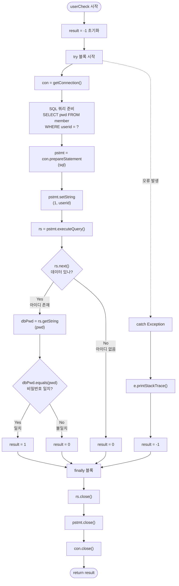

### 2.4 세션 관리 흐름

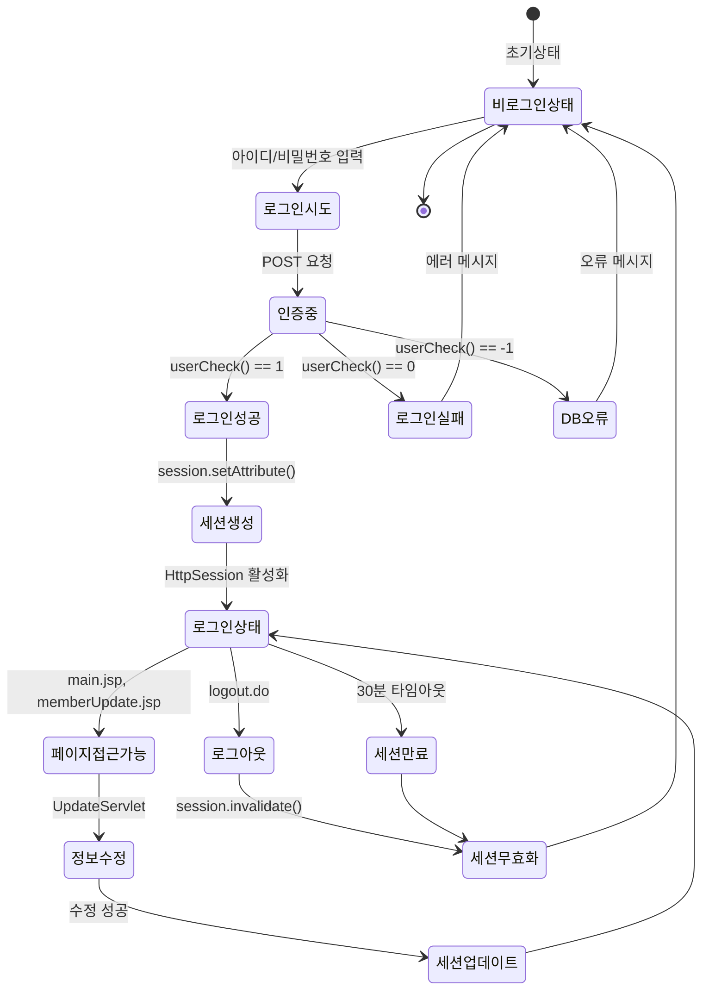

---

## 3. 회원가입 프로세스 상세 흐름도

### 3.1 회원가입 전체 시퀀스 다이어그램

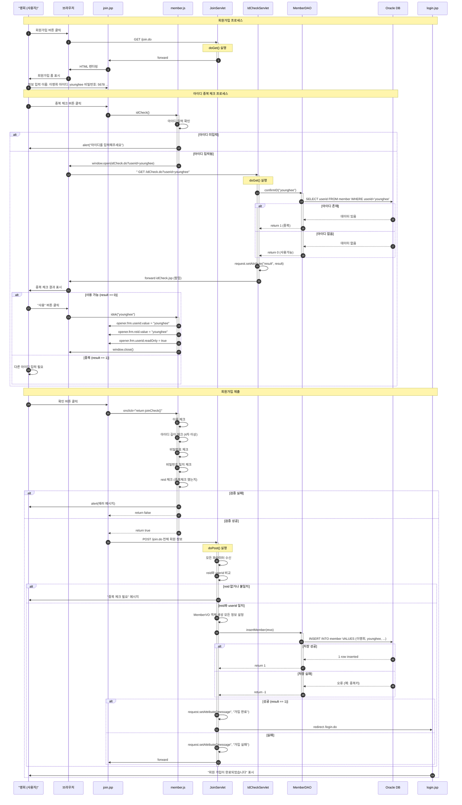

### 3.2 JoinServlet 메소드 플로우차트

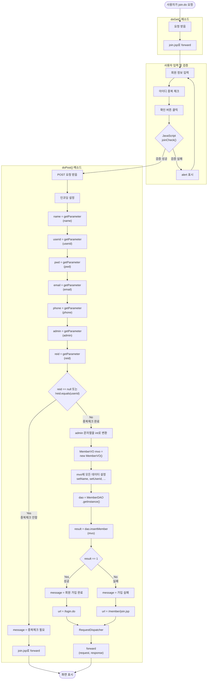

---

## 4. 아이디 중복 체크 프로세스

### 4.1 아이디 중복 체크 상세 흐름

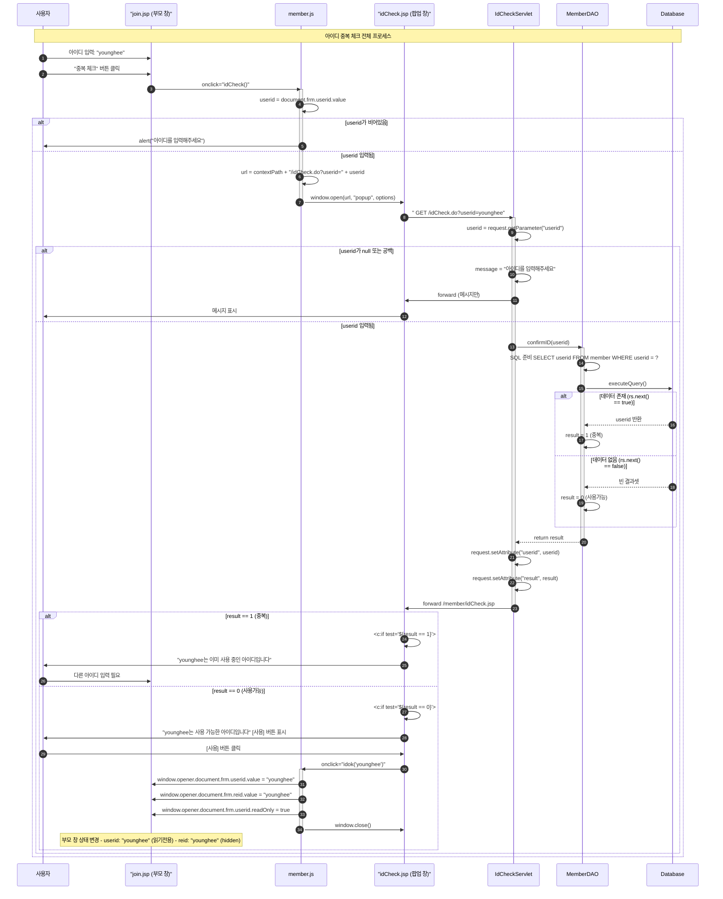

### 4.2 MemberDAO.confirmID() 메소드

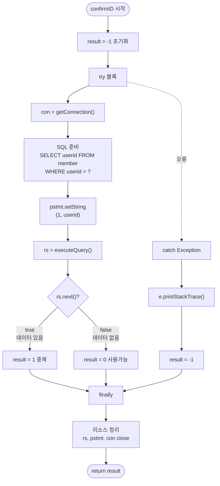

### 4.3 팝업과 부모 창 통신

```mermaid
graph TB
    subgraph "부모 창 (join.jsp)"
        A1[form name='frm']
        A2[input name='userid']
        A3[input name='reid' type='hidden']
        A4[button 중복 체크]
    end
    
    subgraph "JavaScript (member.js)"
        B1["function idCheck()"]
        B2["window.open()"]
        B3["function idok(userid)"]
    end
    
    subgraph "팝업 창 (idCheck.jsp)"
        C1[아이디 입력]
        C2[중복 체크 버튼]
        C3[결과 표시]
        C4[사용 버튼 result==0일 때만]
    end
    
    subgraph "서버 (IdCheckServlet)"
        D1[doGet()]
        D2[confirmID() 호출]
        D3[결과 반환]
    end
    
    A4 -->|클릭| B1
    B1 -->|userid 가져오기| A2
    B1 -->|새 창 열기| B2
    B2 -->|GET 요청| D1
    
    D1 --> D2
    D2 --> D3
    D3 -->|forward| C3
    
    C4 -->|클릭| B3
    B3 -->|window.opener| A2
    B3 -->|값 설정| A3
    B3 -.readOnly=true.-> A2
    B3 -.window.close.-> C1
    
    style A3 fill:#ffeb3b
    style B3 fill:#4caf50
    style C4 fill:#2196f3
```

---

**Part 2로 계속됩니다...**

