# JSP 로그인 시스템 흐름도 - Part 2

> 회원정보 수정과 로그아웃 프로세스 상세 도식화

---

## 📋 목차

1. [회원정보 수정 프로세스](#1-회원정보-수정-프로세스)
2. [로그아웃 프로세스](#2-로그아웃-프로세스)
3. [세션 생명주기 관리](#3-세션-생명주기-관리)
4. [전체 시스템 통합 흐름도](#4-전체-시스템-통합-흐름도)

---

## 1. 회원정보 수정 프로세스

### 1.1 회원정보 수정 전체 시퀀스 다이어그램

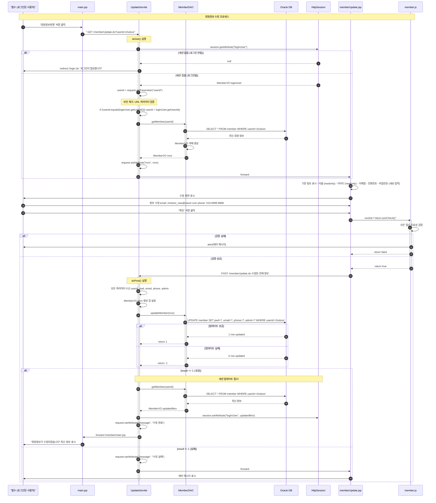

### 1.2 UpdateServlet 메소드 플로우차트

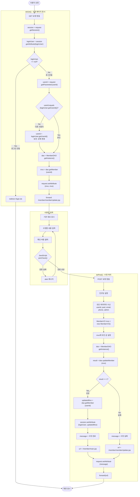

### 1.3 MemberDAO.updateMember() 메소드

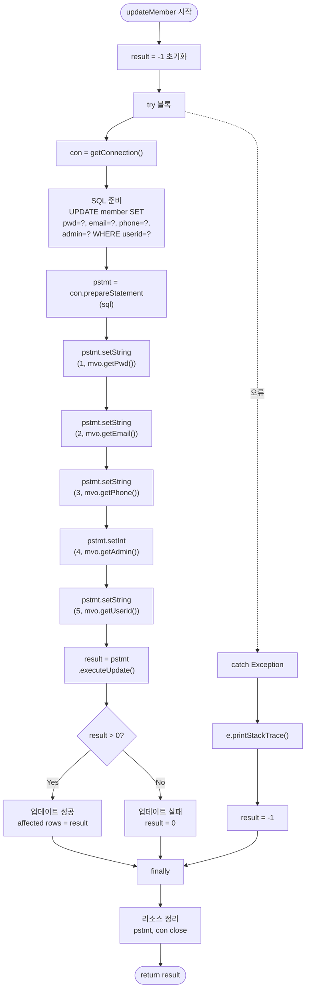

### 1.4 세션 업데이트의 중요성

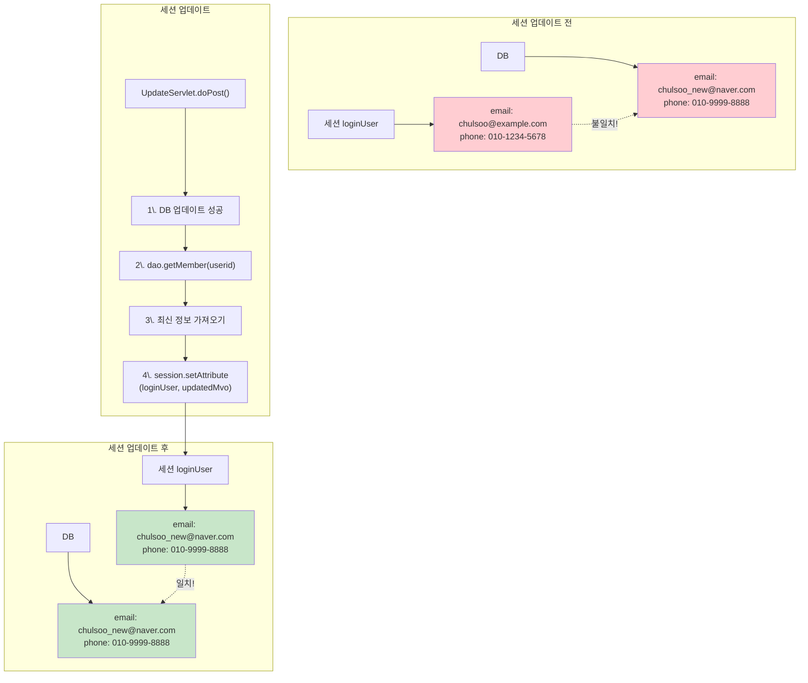

### 1.5 보안: URL 파라미터 검증

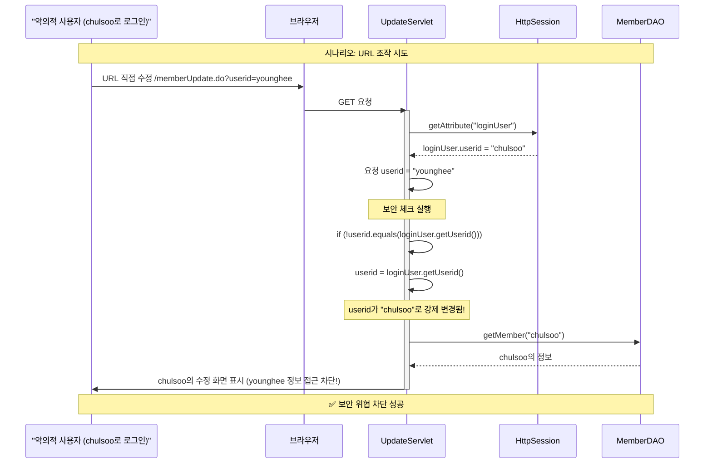

---

## 2. 로그아웃 프로세스

### 2.1 로그아웃 시퀀스 다이어그램

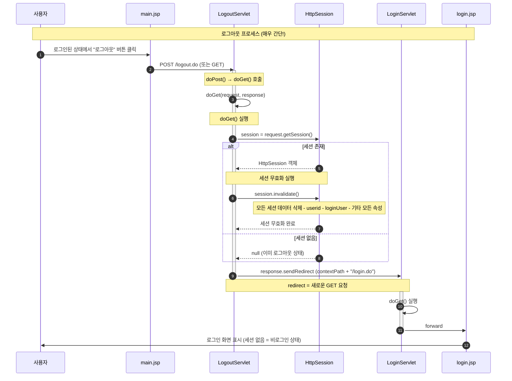

### 2.2 LogoutServlet 플로우차트

```mermaid
flowchart TD
    Start([로그아웃 요청])
    
    subgraph "doPost() 메소드"
        A1[POST 요청 받음]
        A2[doGet(request, response) 호출]
    end
    
    subgraph "doGet() 메소드"
        B1["GET 요청 받음<br/>또는 doPost에서 호출"]
        B2["session = request<br/>.getSession()"]
        B3{"session<br/>!= null?"}
        B4["session.invalidate()<br/>세션 무효화"]
        B5["모든 세션 데이터 삭제<br/>- userid<br/>- loginUser<br/>- 기타 속성"]
        B6["contextPath = request<br/>.getContextPath()"]
        B7["response.sendRedirect<br/>(contextPath + /login.do)"]
    end
    
    C1[LoginServlet으로 리다이렉트]
    C2[login.jsp 표시]
    
    End([로그인 화면])
    
    Start --> A1
    A1 --> A2
    A2 --> B1
    
    Start -.GET 요청.-> B1
    
    B1 --> B2
    B2 --> B3
    
    B3 -->|Yes<br/>세션 있음| B4
    B4 --> B5
    B5 --> B6
    
    B3 -->|No<br/>세션 없음| B6
    
    B6 --> B7
    B7 --> C1
    C1 --> C2
    C2 --> End
```

### 2.3 세션 무효화 상세

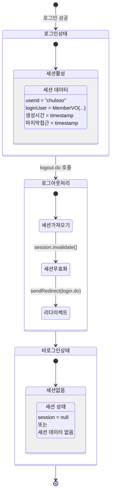

### 2.4 forward vs redirect 비교 (로그아웃 시나리오)

```mermaid
graph TB
    subgraph "Forward 사용 시 (X)"
        A1[로그아웃 요청]
        A2[LogoutServlet]
        A3["session.invalidate()"]
        A4[forward login.jsp]
        A5[브라우저 주소창]
        A6[/logout.do]
        
        A1 --> A2
        A2 --> A3
        A3 --> A4
        A4 --> A5
        A5 --> A6
        
        style A6 fill:#ffcdd2
    end
    
    subgraph "Redirect 사용 시 (O)"
        B1[로그아웃 요청]
        B2[LogoutServlet]
        B3["session.invalidate()"]
        B4[redirect /login.do]
        B5[브라우저 새 요청]
        B6[LoginServlet]
        B7[브라우저 주소창]
        B8[/login.do]
        
        B1 --> B2
        B2 --> B3
        B3 --> B4
        B4 --> B5
        B5 --> B6
        B6 --> B7
        B7 --> B8
        
        style B8 fill:#c8e6c9
    end
    
    Note1["문제: URL이 logout.do로 남음<br/>새로고침 시 혼란"]
    Note2["좋음: URL이 login.do로 변경<br/>명확한 상태 표시"]
    
    A6 -.-> Note1
    B8 -.-> Note2
```

---

## 3. 세션 생명주기 관리

### 3.1 세션 전체 생명주기

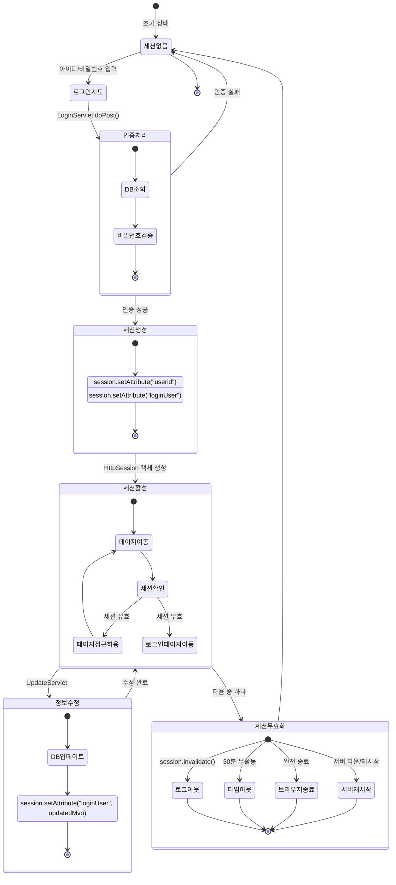

### 3.2 세션 타임아웃 메커니즘

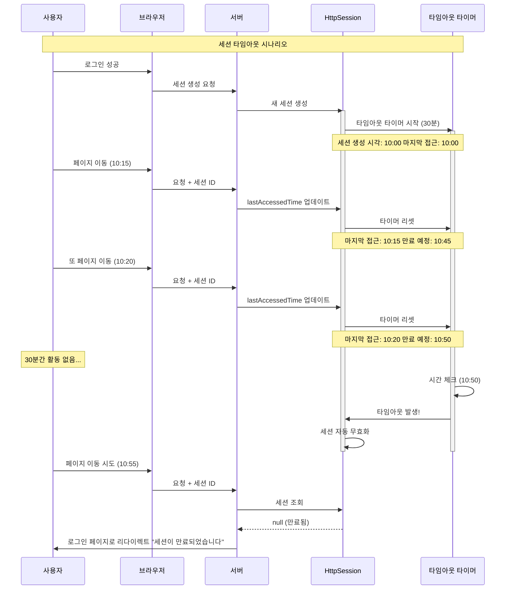

### 3.3 세션 데이터 흐름

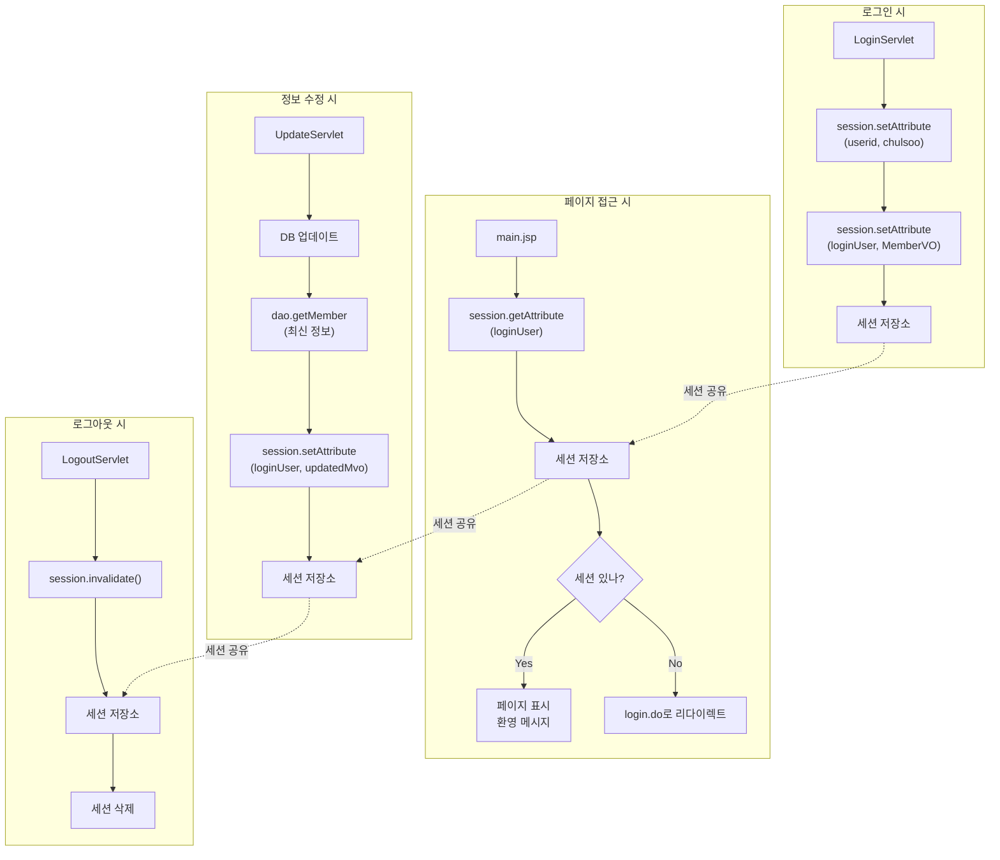

---

## 4. 전체 시스템 통합 흐름도

### 4.1 모든 기능 통합 시퀀스

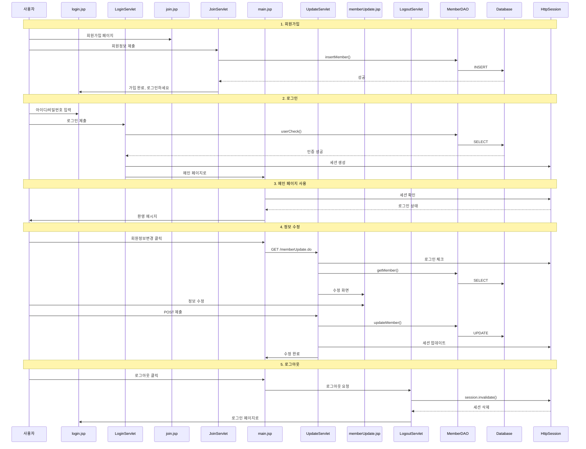

### 4.2 페이지 간 네비게이션 맵

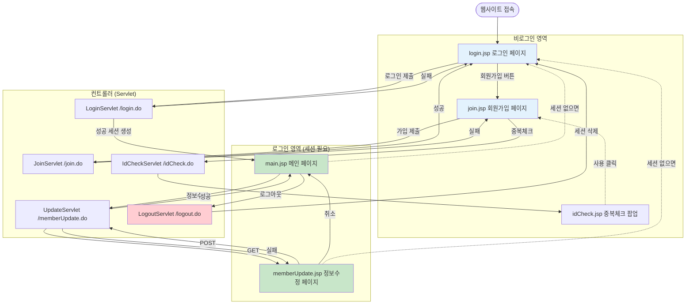

### 4.3 데이터베이스 연동 전체 흐름

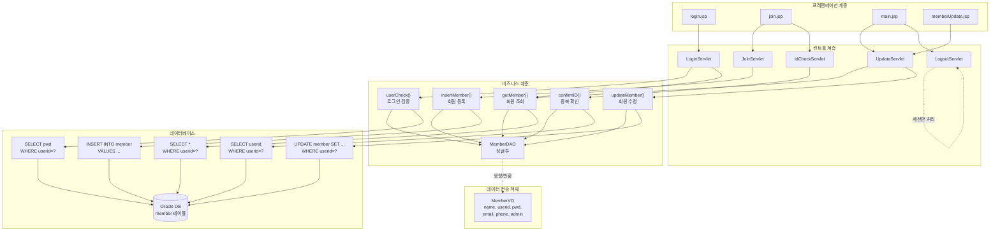

### 4.4 에러 처리 흐름

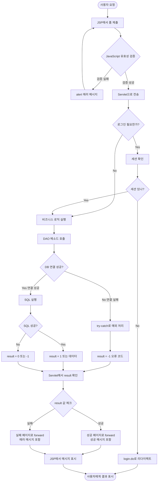

---

## 5. 주요 메소드 호출 체인

### 5.1 로그인 메소드 호출 체인

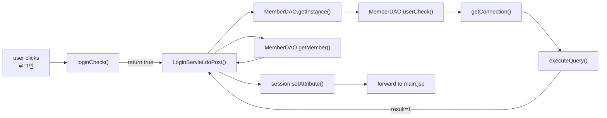

### 5.2 회원가입 메소드 호출 체인

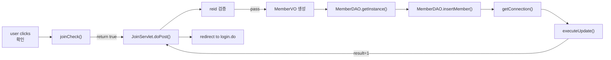

### 5.3 정보수정 메소드 호출 체인

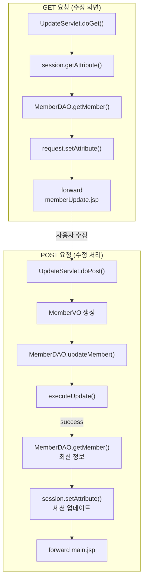

---

## 6. 보안 체크포인트 정리

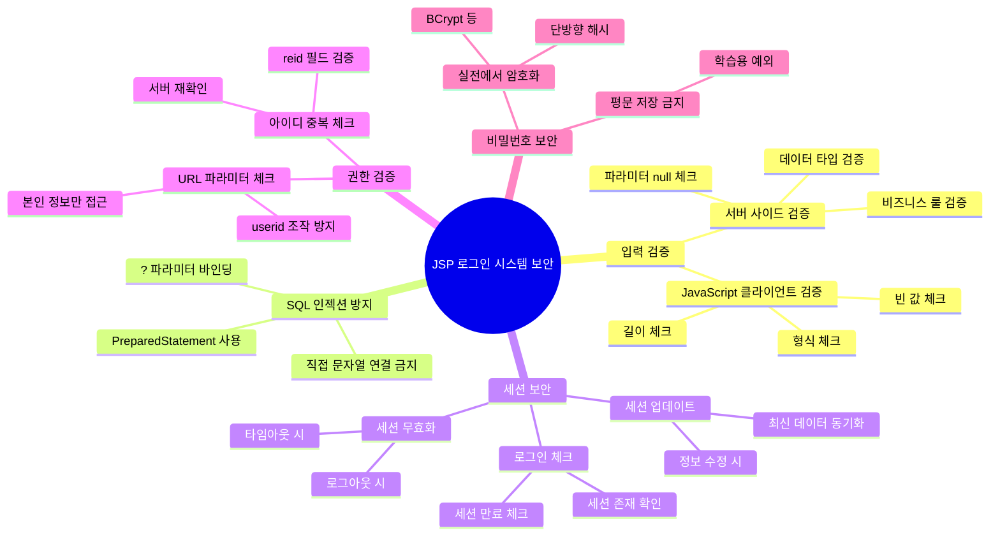

---

**끝! 🎉**

이 문서로 JSP 로그인 시스템의 전체 흐름을 완벽하게 이해할 수 있습니다.

