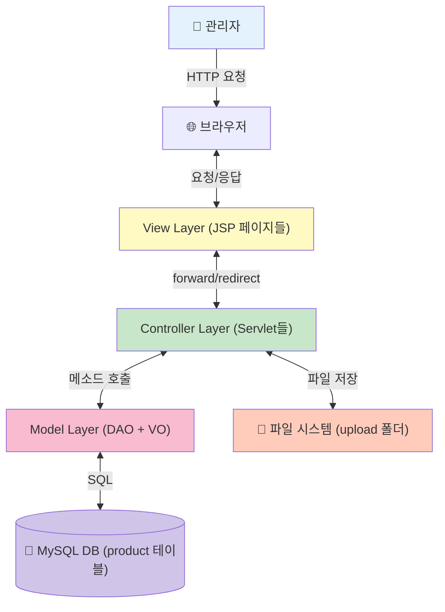
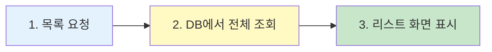
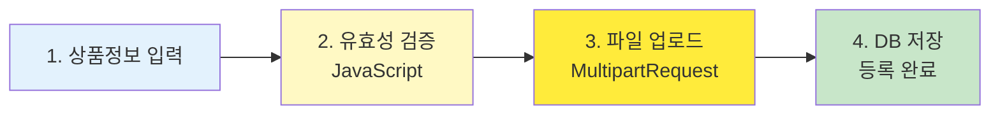
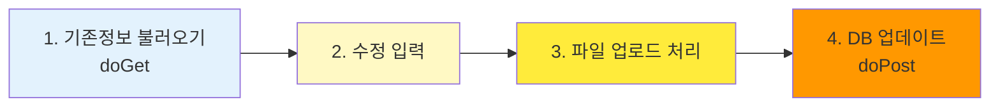
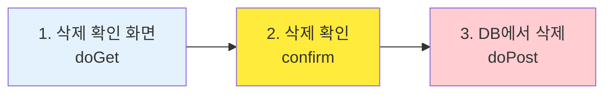
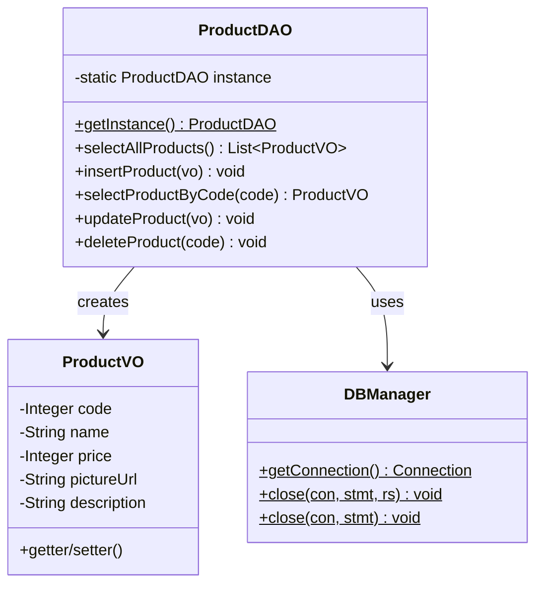
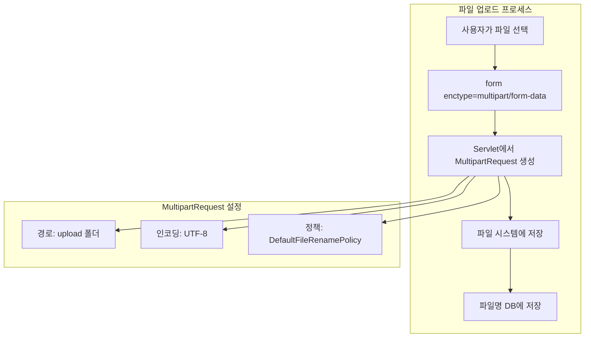
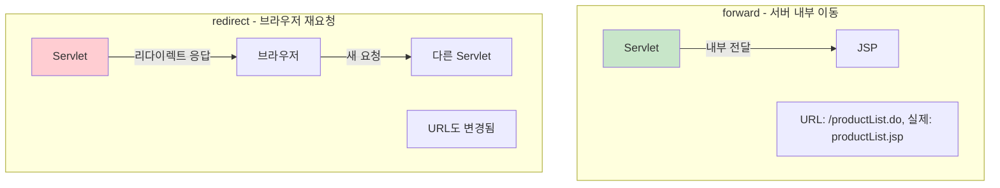
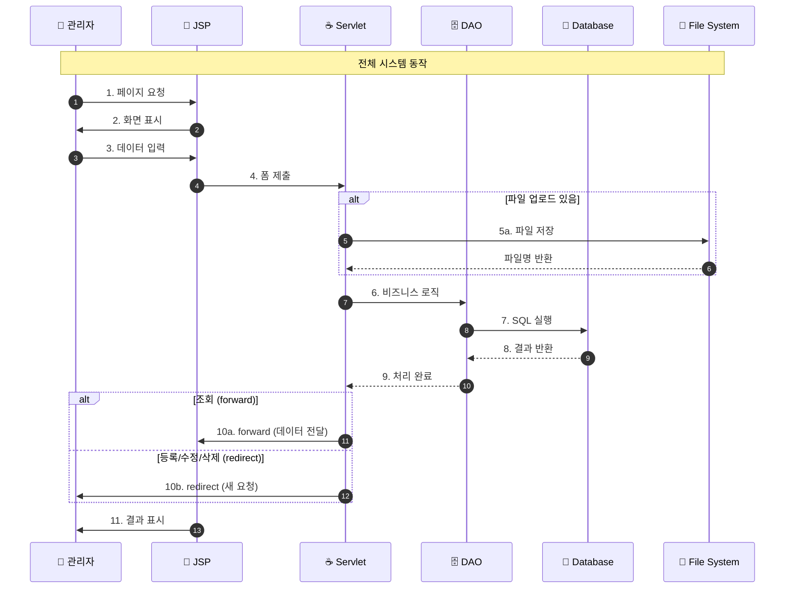
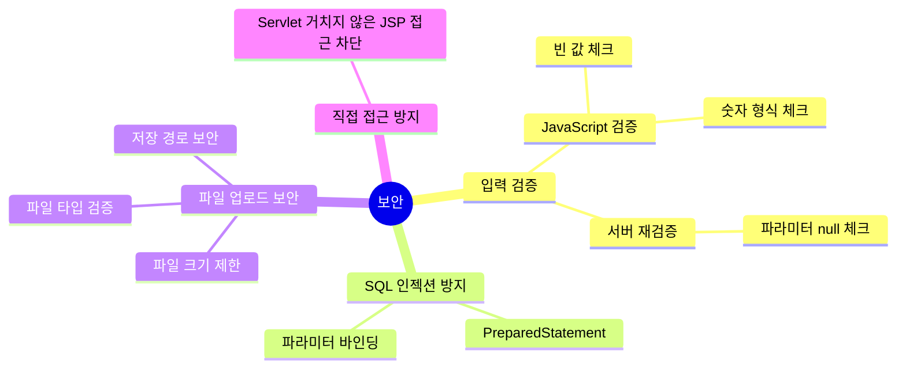

# JSP 상품 관리 시스템 핵심 요약

> 한눈에 보는 전체 시스템 구조와 핵심 흐름

---

## 🏗️ 시스템 아키텍처 한눈에 보기



---

## 📊 4대 핵심 프로세스 비교표

| 프로세스 | 시작 | 주요 Servlet | 핵심 DAO 메소드 | 파일 처리 | 결과 페이지 |
|---------|------|-------------|----------------|----------|-----------|
| **상품목록** | index.jsp | ProductListServlet | selectAllProducts() | ❌ 없음 | productList.jsp |
| **상품등록** | productList.jsp | ProductWriteServlet | insertProduct() | ✅ 업로드 | productList.do (redirect) |
| **상품수정** | productList.jsp | ProductUpdateServlet | selectProductByCode(), updateProduct() | ✅ 업로드 | productList.do (redirect) |
| **상품삭제** | productList.jsp | ProductDeleteServlet | selectProductByCode(), deleteProduct() | ❌ 없음 | productList.do (redirect) |

---

## 🔄 프로세스별 핵심 흐름

### 1️⃣ 상품 목록 조회 (3단계)



**핵심 코드:**
```java
// ProductListServlet.doGet()
ProductDAO dao = ProductDAO.getInstance();
List<ProductVO> list = dao.selectAllProducts();
request.setAttribute("productList", list);
RequestDispatcher dis = request.getRequestDispatcher("/product/productList.jsp");
dis.forward(request, response);
```

---

### 2️⃣ 상품 등록 (4단계)



**핵심 코드:**
```java
// ProductWriteServlet.doPost()
String path = context.getRealPath("upload");
MultipartRequest multi = new MultipartRequest(request, path, 20*1024*1024, "utf-8", new DefaultFileRenamePolicy());

String name = multi.getParameter("name");
int price = Integer.parseInt(multi.getParameter("price"));
String pictureUrl = multi.getFilesystemName("pictureUrl");

ProductVO vo = new ProductVO();
vo.setName(name);
vo.setPrice(price);
vo.setPictureUrl(pictureUrl);

dao.insertProduct(vo);
response.sendRedirect(contextPath + "/productList.do");
```

---

### 3️⃣ 상품 수정 (4단계)



**핵심 코드:**
```java
// ProductUpdateServlet.doGet()
String code = request.getParameter("code");
ProductVO vo = dao.selectProductByCode(code);
request.setAttribute("product", vo);
// forward to productUpdate.jsp

// ProductUpdateServlet.doPost()
String pictureUrl = multi.getFilesystemName("pictureUrl");
if(pictureUrl == null) {
    pictureUrl = multi.getParameter("nonmakeImg"); // 기존 이미지 유지
}
dao.updateProduct(vo);
response.sendRedirect(contextPath + "/productList.do");
```

---

### 4️⃣ 상품 삭제 (3단계)



**핵심 코드:**
```java
// ProductDeleteServlet.doGet()
String code = request.getParameter("code");
ProductVO vo = dao.selectProductByCode(code);
request.setAttribute("product", vo);
// forward to productDelete.jsp (확인 화면)

// ProductDeleteServlet.doPost()
int code = Integer.parseInt(request.getParameter("code"));
dao.deleteProduct(code);
response.sendRedirect(request.getContextPath() + "/productList.do");
```

---

## 🗂️ 파일 구조 한눈에

```
web-study-10/
├─ 📂 Java (로직)
│  ├─ ProductVO.java          ← 상품 데이터 상자
│  ├─ ProductDAO.java          ← DB 전문가 (싱글톤)
│  ├─ ProductListServlet.java  ← 목록 조회 처리
│  ├─ ProductWriteServlet.java ← 상품 등록 처리
│  ├─ ProductUpdateServlet.java← 상품 수정 처리
│  ├─ ProductDeleteServlet.java← 상품 삭제 처리
│  └─ DBManager.java           ← DB 연결 관리
│
├─ 📂 JSP (화면)
│  ├─ index.jsp                ← 메인 화면
│  ├─ productList.jsp          ← 상품 목록 화면
│  ├─ productWrite.jsp         ← 상품 등록 화면
│  ├─ productUpdate.jsp        ← 상품 수정 화면
│  └─ productDelete.jsp        ← 상품 삭제 확인 화면
│
├─ 📂 JavaScript
│  └─ product.js               ← 유효성 검증
│
├─ 📂 CSS
│  └─ shopping.css             ← 스타일시트
│
└─ 📂 Upload
   └─ (상품 이미지 파일들)
```

---

## 🔑 ProductDAO 주요 메소드



| 메소드 | 용도 | SQL | 반환값 |
|-------|------|-----|--------|
| **selectAllProducts()** | 전체 상품 조회 | SELECT * FROM product ORDER BY code DESC | List\<ProductVO\> |
| **insertProduct()** | 상품 등록 | INSERT INTO product VALUES(...) | void |
| **selectProductByCode()** | 특정 상품 조회 | SELECT * FROM product WHERE code=? | ProductVO 객체 |
| **updateProduct()** | 상품 정보 수정 | UPDATE product SET ... WHERE code=? | void |
| **deleteProduct()** | 상품 삭제 | DELETE FROM product WHERE code=? | void |

---

## 📁 파일 업로드 처리



### 파일 업로드 핵심 코드

```java
// 1. upload 폴더 실제 경로 가져오기
ServletContext context = getServletContext();
String path = context.getRealPath("upload");

// 2. MultipartRequest 생성
MultipartRequest multi = new MultipartRequest(
    request,                        // request 객체
    path,                          // 저장 경로
    20*1024*1024,                  // 최대 용량 (20MB)
    "utf-8",                       // 인코딩
    new DefaultFileRenamePolicy()  // 중복 파일명 처리
);

// 3. 파일명 가져오기
String pictureUrl = multi.getFilesystemName("pictureUrl");

// 4. 수정 시 파일 미선택 시 기존 이미지 유지
if(pictureUrl == null) {
    pictureUrl = multi.getParameter("nonmakeImg");
}
```

---

## 📝 forward vs redirect



| 구분 | forward | redirect |
|-----|---------|----------|
| **URL 변경** | ❌ 안 바뀜 | ✅ 바뀜 |
| **속도** | ⚡ 빠름 | 🐢 느림 |
| **request 공유** | ✅ 공유됨 | ❌ 새로운 request |
| **사용 예** | 목록 조회 → productList.jsp | 등록/수정/삭제 → productList.do |

### 이 프로젝트에서의 사용

- **forward 사용**: 조회 기능 (GET)
  - ProductListServlet → productList.jsp
  - ProductUpdateServlet (GET) → productUpdate.jsp
  - ProductDeleteServlet (GET) → productDelete.jsp

- **redirect 사용**: 등록/수정/삭제 후 (POST)
  - ProductWriteServlet (POST) → productList.do
  - ProductUpdateServlet (POST) → productList.do
  - ProductDeleteServlet (POST) → productList.do

---

## 🎯 핵심 흐름 요약



---

## 💡 핵심 개념 치트시트

| 개념 | 설명 | 예시 |
|------|------|------|
| **MVC** | Model(DAO/VO) + View(JSP) + Controller(Servlet) | 역할 분리 |
| **CRUD** | Create(등록), Read(조회), Update(수정), Delete(삭제) | 기본 데이터 작업 |
| **VO** | 데이터를 담는 상자 | ProductVO |
| **DAO** | DB 접근 전문 클래스 | ProductDAO |
| **싱글톤** | 객체를 하나만 만드는 패턴 | getInstance() |
| **PreparedStatement** | 안전한 SQL 실행 | SQL 인젝션 방지 |
| **MultipartRequest** | 파일 업로드 처리 | cos.jar 라이브러리 |
| **enctype** | multipart/form-data | 파일 전송 시 필수 |

---

## 🔒 보안 체크포인트



### 주요 보안 패턴

1. **PreparedStatement 사용**
```java
// ❌ 위험
String sql = "SELECT * FROM product WHERE code=" + code;

// ✅ 안전
String sql = "SELECT * FROM product WHERE code=?";
pstmt.setInt(1, code);
```

2. **직접 접근 방지**
```jsp
<!-- productList.jsp -->
<%
    // Servlet을 거치지 않고 직접 접근한 경우 리다이렉트
    if(request.getAttribute("productList") == null) {
        response.sendRedirect(request.getContextPath() + "/productList.do");
        return;
    }
%>
```

3. **파일 업로드 제한**
```java
// 파일 크기 제한 (20MB)
int sizeLimit = 20*1024*1024;

// 파일 타입 제한 (HTML)
<input type="file" name="pictureUrl" accept="image/*">
```

---

## 🗄️ 데이터베이스 테이블 구조

```sql
CREATE TABLE product(
    code INT AUTO_INCREMENT PRIMARY KEY,
    name VARCHAR(100),
    price INT,
    pictureurl VARCHAR(50),
    description VARCHAR(1000)
);
```

| 필드 | 타입 | 설명 | 제약조건 |
|------|------|------|---------|
| code | INT | 상품 코드 | PRIMARY KEY, AUTO_INCREMENT |
| name | VARCHAR(100) | 상품명 | - |
| price | INT | 가격 | - |
| pictureurl | VARCHAR(50) | 이미지 파일명 | - |
| description | VARCHAR(1000) | 상품 설명 | - |

---

## 🚀 학습 체크리스트

- [ ] MVC 패턴의 각 계층 역할을 설명할 수 있다
- [ ] CRUD 네 가지 작업의 흐름을 이해했다
- [ ] forward와 redirect의 차이를 설명할 수 있다
- [ ] DAO가 싱글톤 패턴을 사용하는 이유를 안다
- [ ] PreparedStatement의 중요성을 이해했다
- [ ] MultipartRequest를 이용한 파일 업로드를 구현할 수 있다
- [ ] POST 후 redirect 패턴의 필요성을 이해했다
- [ ] DBManager를 통한 DB 연결 관리를 이해했다

---

## 🎓 web-study-09와의 차이점

| 구분 | web-study-09 (회원 관리) | web-study-10 (상품 관리) |
|------|------------------------|------------------------|
| **주제** | 로그인/회원 관리 | 상품 CRUD |
| **세션** | ✅ 로그인 상태 관리 | ❌ 세션 미사용 |
| **파일** | ❌ 파일 없음 | ✅ 이미지 업로드 |
| **DB** | Oracle | MySQL |
| **주요 기능** | 로그인, 회원가입, 정보수정 | 등록, 조회, 수정, 삭제 |
| **반환값** | int (성공/실패 코드) | void / List / VO |
| **보안** | 로그인 체크, URL 조작 방지 | 직접 접근 방지 |

---

**이 요약으로 JSP 상품 관리 시스템의 핵심을 완벽하게 파악할 수 있습니다! 🎉**

📌 **상세한 내용은 Part1, Part2 문서를 참고하세요!**

