# JSP 상품 관리 시스템 흐름도 - Part 1

> 전체 시스템의 구조와 상품 조회/등록 프로세스 상세 도식화

---

## 📋 목차

1. [전체 시스템 아키텍처](#1-전체-시스템-아키텍처)
2. [상품 목록 조회 프로세스](#2-상품-목록-조회-프로세스)
3. [상품 등록 프로세스](#3-상품-등록-프로세스)
4. [파일 업로드 메커니즘](#4-파일-업로드-메커니즘)

---

## 1. 전체 시스템 아키텍처

### 1.1 MVC 패턴 구조

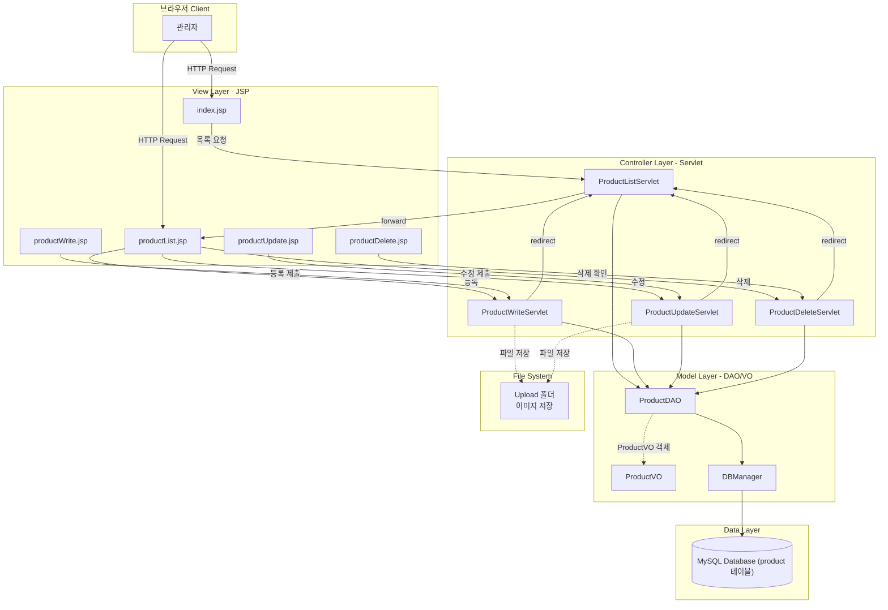

### 1.2 파일 구조와 역할

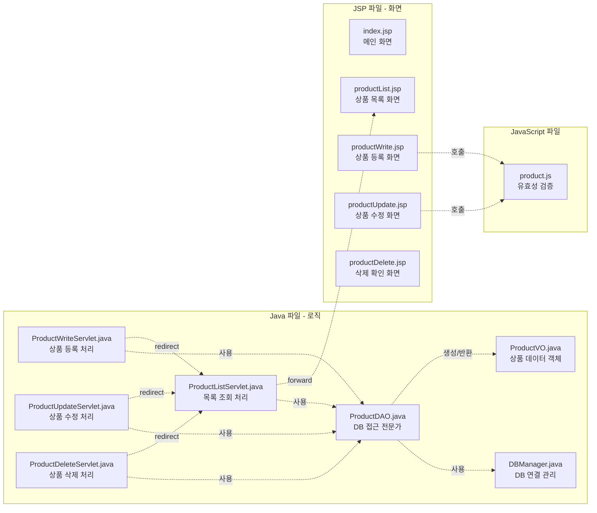

### 1.3 데이터 흐름 개요

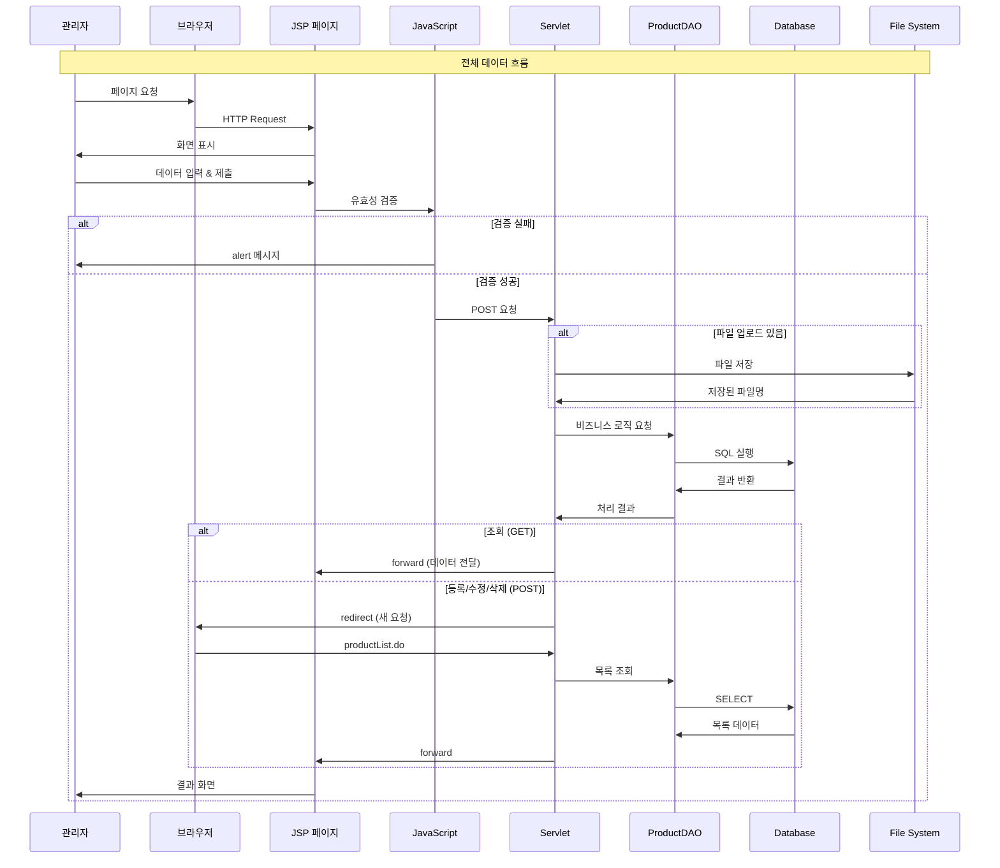

---

## 2. 상품 목록 조회 프로세스

### 2.1 상품 목록 조회 전체 시퀀스 다이어그램

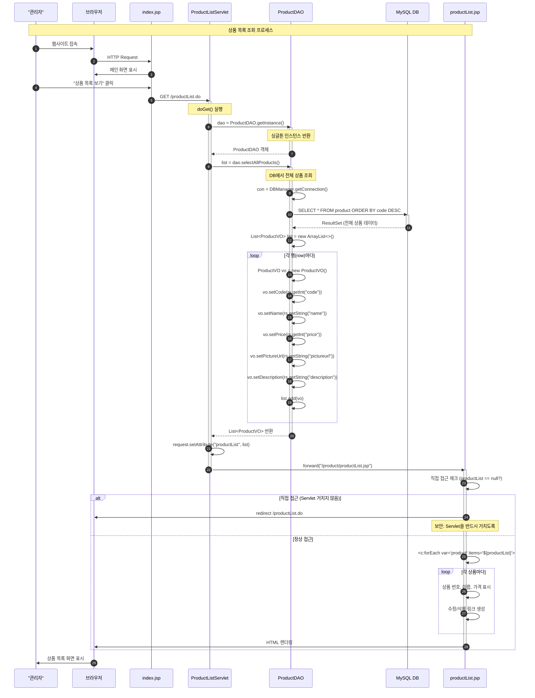

### 2.2 ProductListServlet 메소드 플로우차트

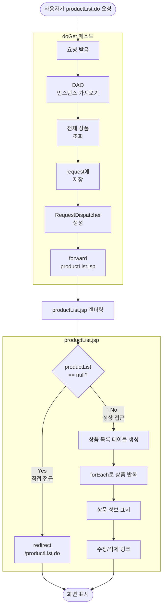

### 2.3 ProductDAO.selectAllProducts() 메소드 상세

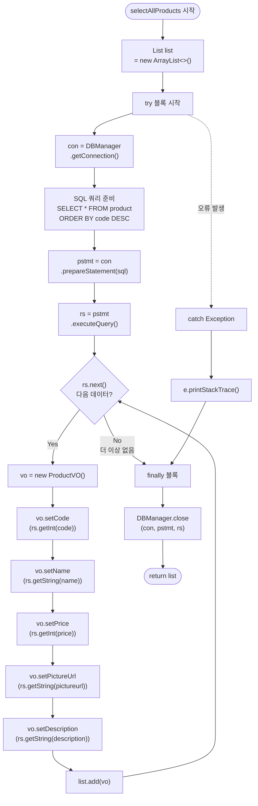

### 2.4 productList.jsp 화면 구성

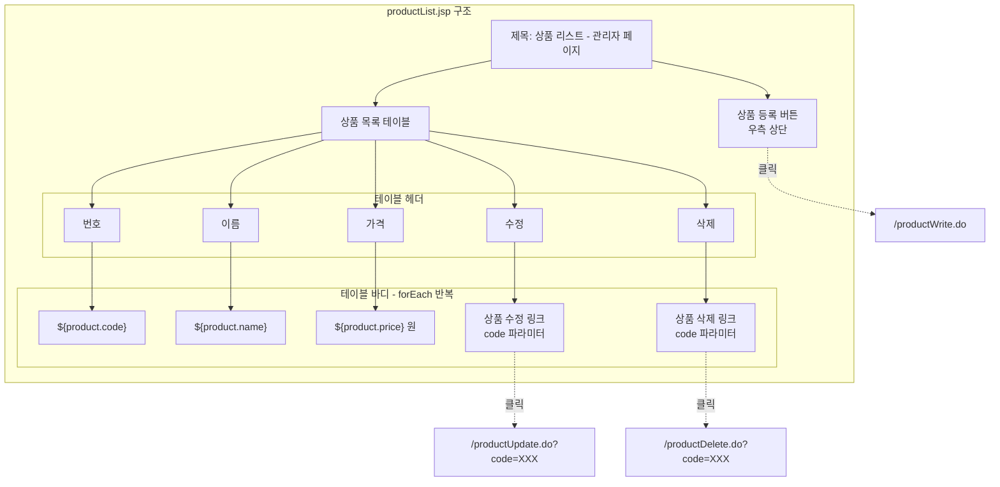

---

## 3. 상품 등록 프로세스

### 3.1 상품 등록 전체 시퀀스 다이어그램

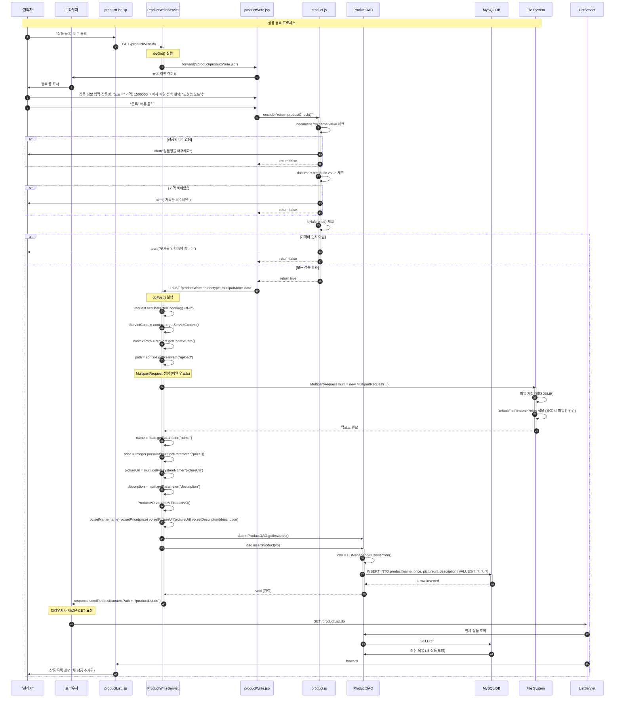

### 3.2 ProductWriteServlet 메소드 플로우차트

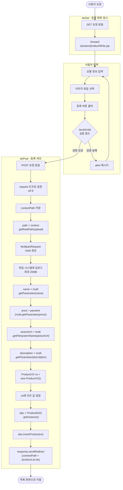

### 3.3 ProductDAO.insertProduct() 메소드 상세

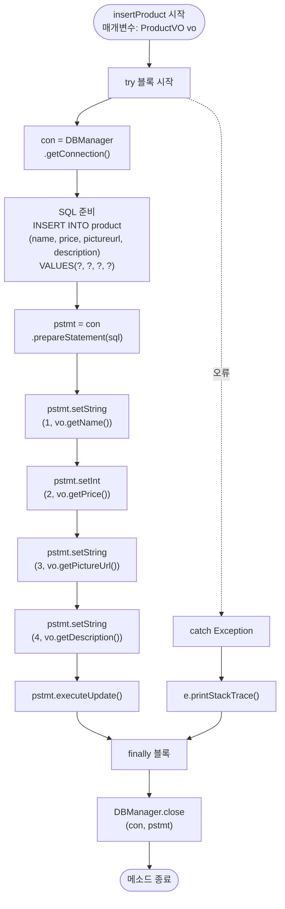

---

## 4. 파일 업로드 메커니즘

### 4.1 MultipartRequest 동작 원리

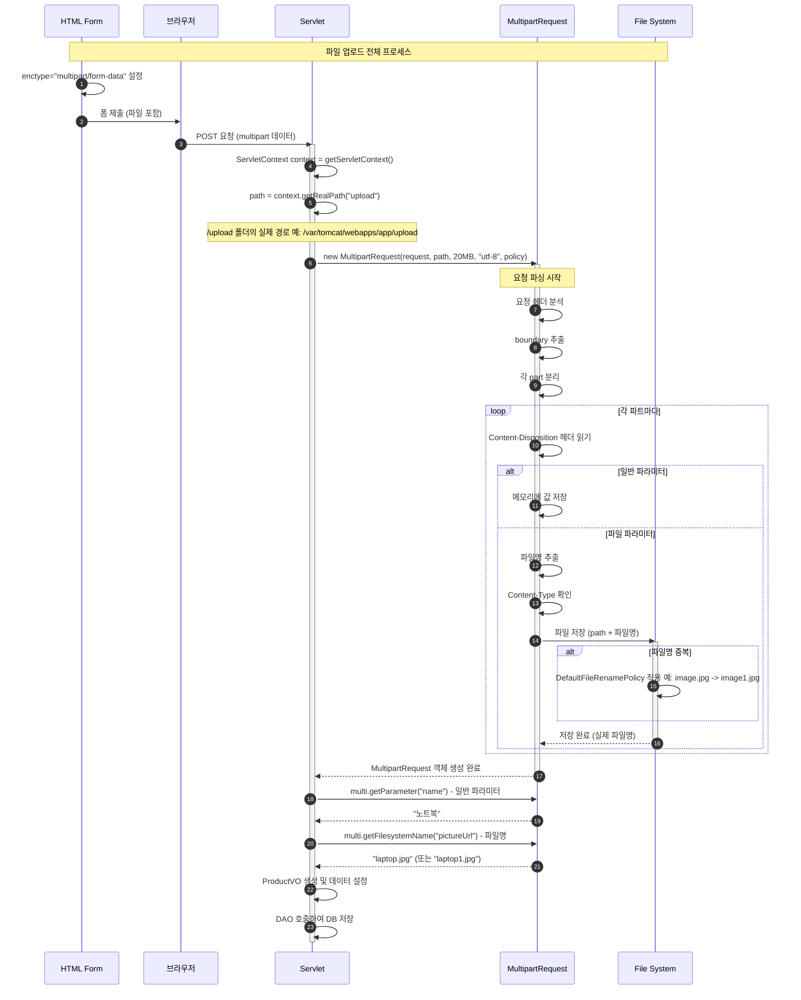

### 4.2 파일 업로드 설정 상세

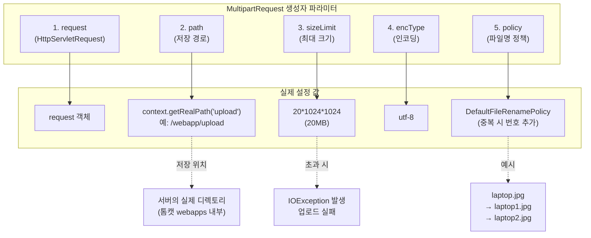

### 4.3 파일 업로드 폼 구조

```mermaid
graph TB
    subgraph "HTML Form 필수 속성"
        A[method='post']
        B["enctype='multipart/form-data'"]
        C["action='productWrite.do'"]
    end
    
    subgraph "입력 필드"
        D["<input type='text' name='name'>"]
        E["<input type='text' name='price'>"]
        F["<input type='file' name='pictureUrl' accept='image/*'>"]
        G["<textarea name='description'>"]
    end
    
    subgraph "버튼"
        H["<input type='submit' onclick='return productCheck()'>"]
        I["<input type='reset'>"]
        J["<input type='button' value='목록'>"]
    end
    
    A --> K[Form 태그]
    B --> K
    C --> K
    
    K --> D
    K --> E
    K --> F
    K --> G
    K --> H
    K --> I
    K --> J
    
    F -.accept 속성.-> L["이미지 파일만 선택 가능<br/>(브라우저 필터)"]
    H -.클릭 시.-> M["productCheck() 실행<br/>유효성 검증"]
```

### 4.4 파일 저장 경로 이해

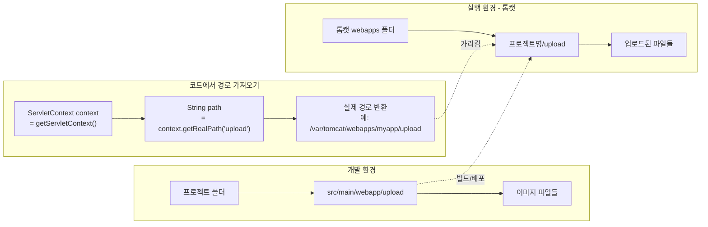

### 4.5 파일 업로드 에러 처리

```mermaid
flowchart TD
    Start([파일 업로드 시작])
    
    A[폼 제출]
    B{enctype 올바른가?}
    C[업로드 실패<br/>일반 request로 처리됨]
    
    D[MultipartRequest 생성 시도]
    E{파일 크기<br/>20MB 이하?}
    F["IOException 발생<br/>파일 크기 초과"]
    
    G{upload 폴더<br/>존재?}
    H["IOException 발생<br/>디렉토리 없음"]
    
    I{파일 타입<br/>적절?}
    J[경고 (선택사항)]
    
    K[파일 저장 성공]
    L[파일명 반환]
    
    End([업로드 완료])
    
    Start --> A
    A --> B
    
    B -->|No| C
    C --> End
    
    B -->|Yes| D
    D --> E
    
    E -->|No| F
    F --> End
    
    E -->|Yes| G
    
    G -->|No| H
    H --> End
    
    G -->|Yes| I
    
    I -->|부적절| J
    J --> K
    
    I -->|적절| K
    K --> L
    L --> End
```

---

## 5. JavaScript 유효성 검증

### 5.1 productCheck() 함수 흐름

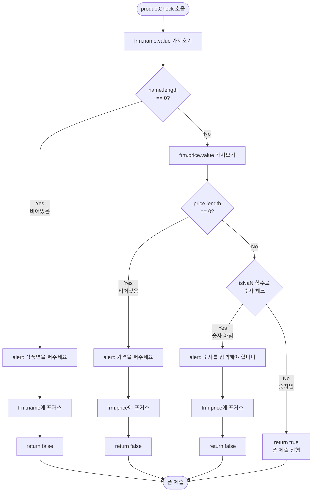

---

**Part 2로 계속됩니다...**

