# JSP 상품 관리 시스템 흐름도 - Part 2

> 상품 수정과 삭제 프로세스 상세 도식화

---

## 📋 목차

1. [상품 수정 프로세스](#1-상품-수정-프로세스)
2. [상품 삭제 프로세스](#2-상품-삭제-프로세스)
3. [전체 시스템 통합 흐름도](#3-전체-시스템-통합-흐름도)
4. [POST-Redirect-GET 패턴](#4-post-redirect-get-패턴)

---

## 1. 상품 수정 프로세스

### 1.1 상품 수정 전체 시퀀스 다이어그램

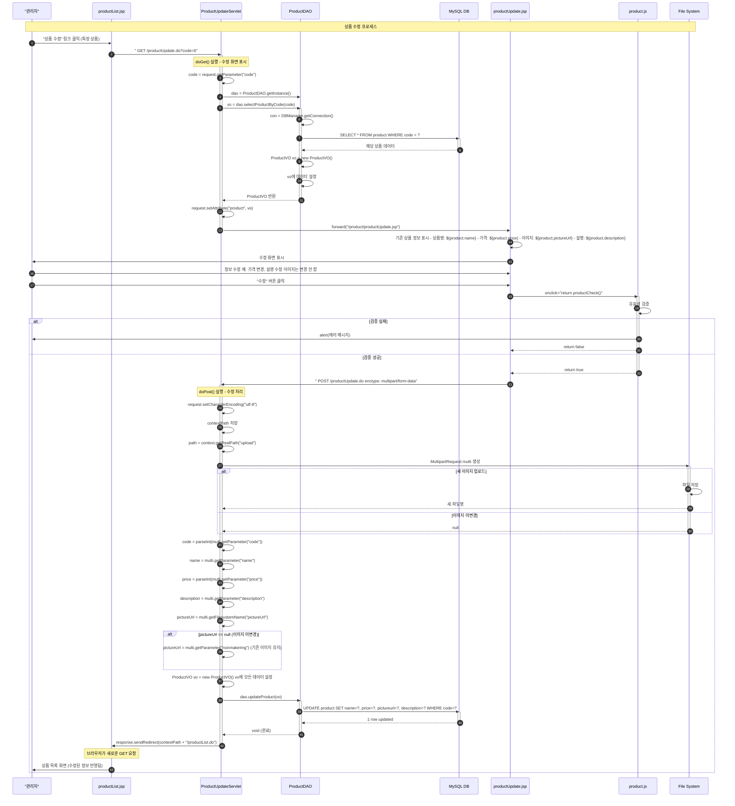

### 1.2 ProductUpdateServlet 메소드 플로우차트

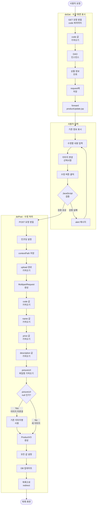

### 1.3 ProductDAO.updateProduct() 메소드 상세

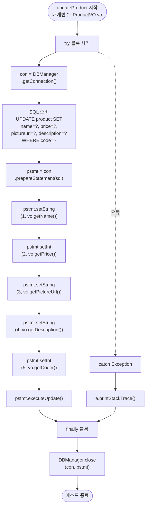

### 1.4 이미지 변경 처리 로직

```mermaid
graph TB
    subgraph "productUpdate.jsp 폼"
        A1["<input type='hidden' name='code' value='${product.code}'>"]
        A2["<input type='hidden' name='nonmakeImg' value='${product.pictureUrl}'>"]
        A3["기존 이미지 표시:<br/><img src='upload/${product.pictureUrl}'>"]
        A4["<input type='file' name='pictureUrl'>"]
        A5["주의사항: 이미지를 변경하고자 할때만 선택"]
    end
    
    subgraph "Servlet 처리 - doPost"
        B1["pictureUrl = multi<br/>.getFilesystemName('pictureUrl')"]
        B2{pictureUrl<br/>== null?}
        B3["새 파일명 사용<br/>사용자가 선택한 새 이미지"]
        B4["pictureUrl = nonmakeImg<br/>기존 이미지 유지"]
    end
    
    subgraph "결과"
        C1["DB에 새 파일명 저장<br/>+ 서버에 새 파일 존재"]
        C2["DB에 기존 파일명 유지<br/>+ 서버의 기존 파일 그대로"]
    end
    
    A1 --> B1
    A2 --> B1
    A4 --> B1
    
    B1 --> B2
    
    B2 -->|No<br/>사용자가 파일 선택| B3
    B2 -->|Yes<br/>파일 미선택| B4
    
    B3 --> C1
    B4 --> C2
    
    style A2 fill:#ffeb3b
    style B4 fill:#4caf50
```

---

## 2. 상품 삭제 프로세스

### 2.1 상품 삭제 전체 시퀀스 다이어그램

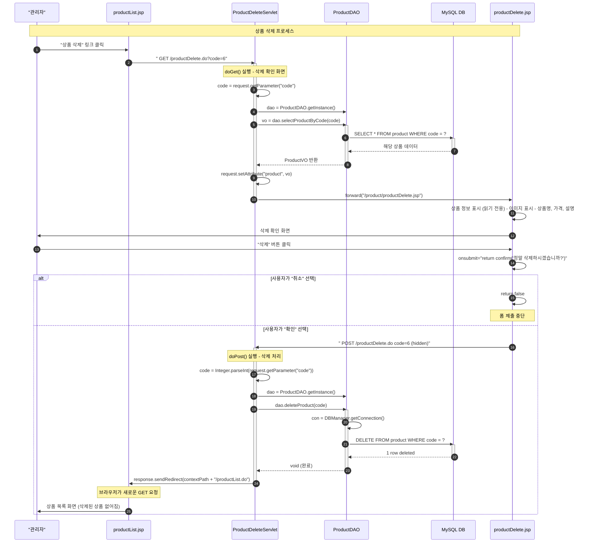

### 2.2 ProductDeleteServlet 플로우차트

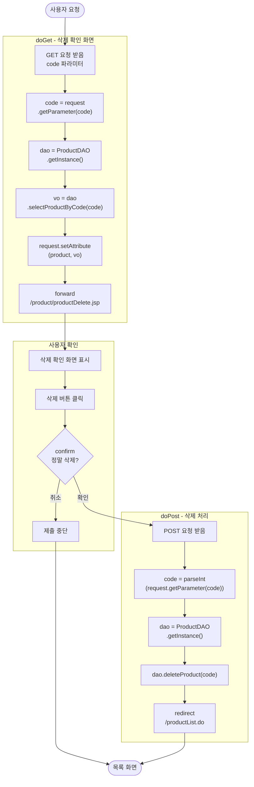

### 2.3 ProductDAO.deleteProduct() 메소드 상세

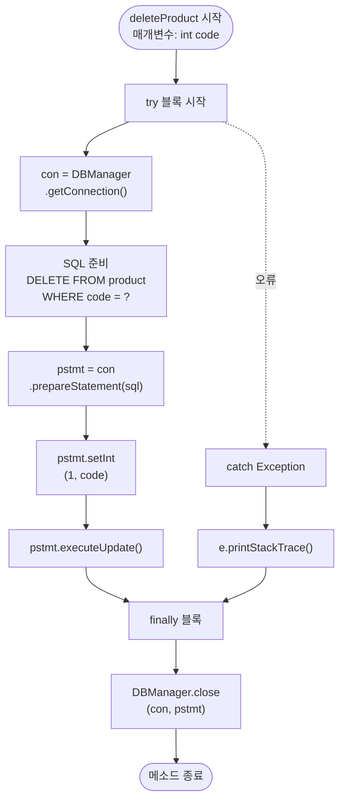

### 2.4 삭제 확인 (Confirm) 패턴

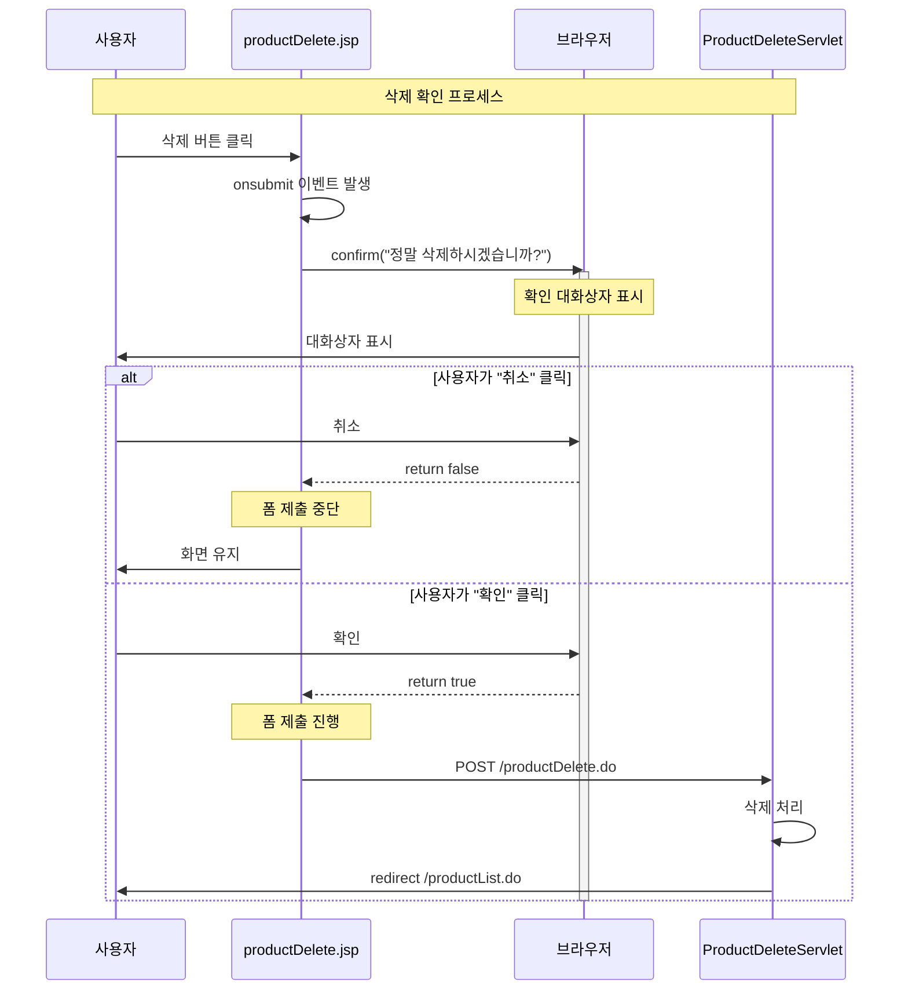

---

## 3. 전체 시스템 통합 흐름도

### 3.1 모든 기능 통합 시퀀스

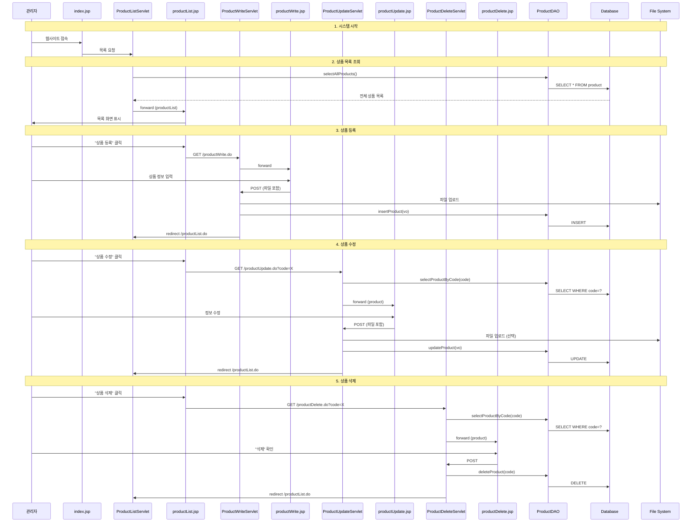

### 3.2 페이지 간 네비게이션 맵

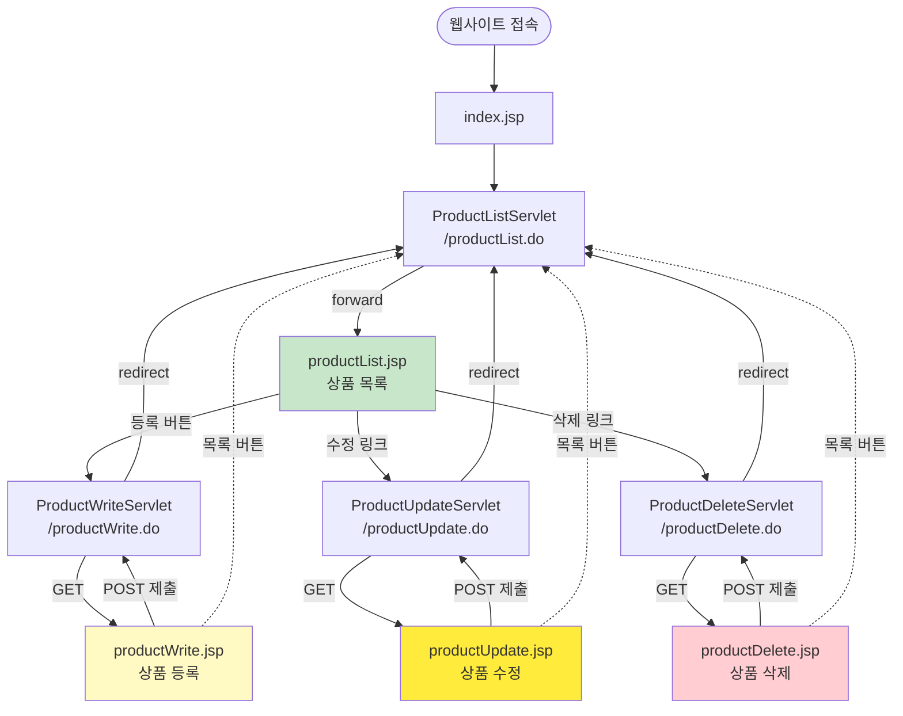

### 3.3 데이터베이스 연동 전체 흐름

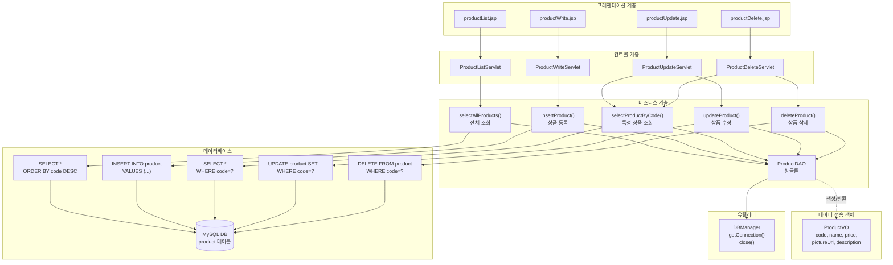

---

## 4. POST-Redirect-GET 패턴

### 4.1 PRG 패턴 개념

```mermaid
graph TB
    subgraph "PRG 패턴 사용 - 이 프로젝트"
        A1[사용자: 상품 등록]
        A2["1. POST<br/>/productWrite.do"]
        A3[Servlet: 처리]
        A4[DB: INSERT]
        A5["2. Redirect<br/>/productList.do"]
        A6["3. GET<br/>/productList.do"]
        A7[목록 조회]
        A8[화면 표시]
        
        A1 --> A2
        A2 --> A3
        A3 --> A4
        A4 --> A5
        A5 --> A6
        A6 --> A7
        A7 --> A8
        
        A9[F5 새로고침]
        A8 --> A9
        A9 -.안전.-> A6
    end
    
    subgraph "PRG 패턴 미사용"
        B1[사용자: 상품 등록]
        B2["1. POST<br/>/productWrite.do"]
        B3[Servlet: 처리]
        B4[DB: INSERT]
        B5["2. Forward<br/>productList.jsp"]
        B6[화면 표시]
        
        B1 --> B2
        B2 --> B3
        B3 --> B4
        B4 --> B5
        B5 --> B6
        
        B7[F5 새로고침]
        B6 --> B7
        B7 -.위험!.-> B2
        B2 -.중복 등록.-> B4
    end
    
    style A5 fill:#c8e6c9
    style B5 fill:#ffcdd2
```

### 4.2 PRG 패턴 장점

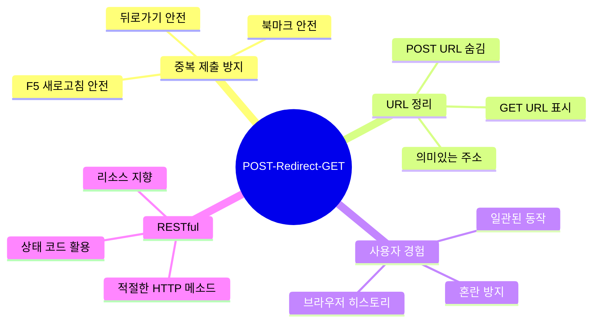

### 4.3 이 프로젝트의 PRG 패턴 적용

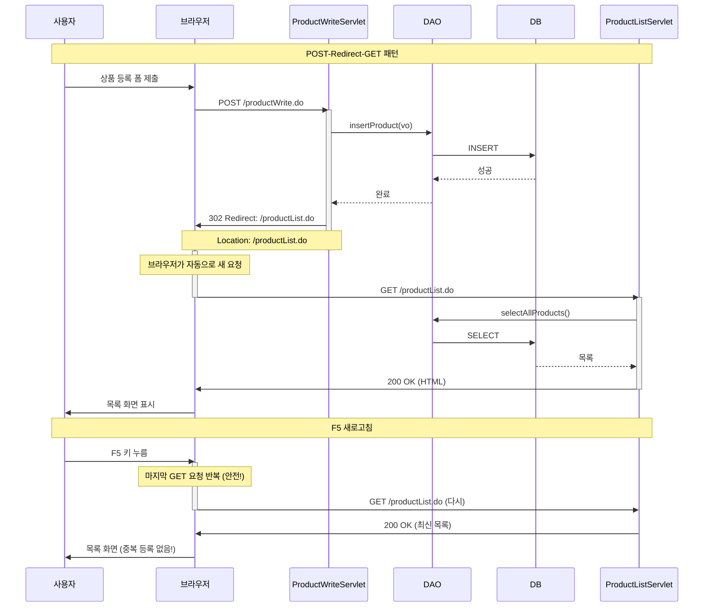

### 4.4 forward vs redirect 비교

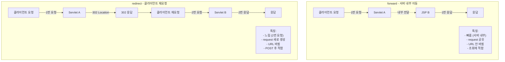

| 구분 | forward | redirect |
|------|---------|----------|
| **요청 횟수** | 1번 | 2번 |
| **속도** | ⚡ 빠름 | 🐢 느림 |
| **URL 변경** | ❌ 안 바뀜 | ✅ 바뀜 |
| **request 객체** | ✅ 공유됨 | ❌ 새로 생성 |
| **데이터 전달** | setAttribute | 파라미터/세션 |
| **사용 예** | 조회 → JSP | 등록/수정/삭제 → 목록 |
| **HTTP 상태** | 200 OK | 302 Found |

### 4.5 이 프로젝트의 사용 패턴

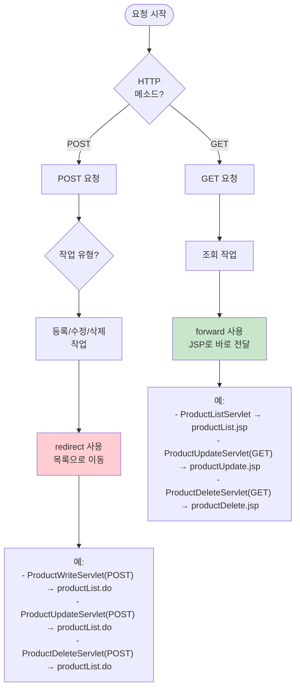

---

## 5. 에러 처리 및 보안

### 5.1 에러 처리 흐름

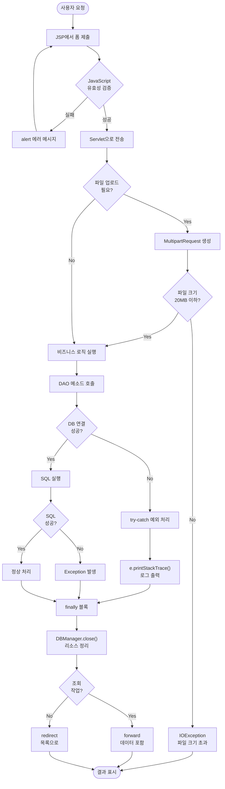

### 5.2 보안 체크포인트

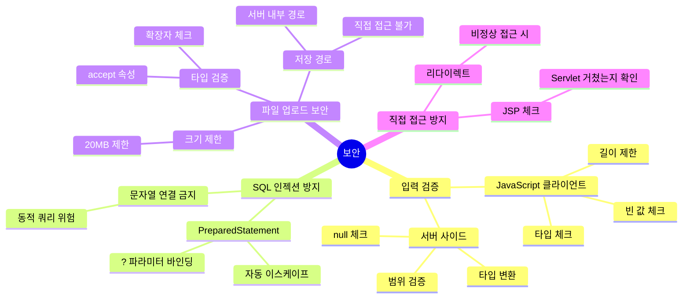

---

## 6. 주요 메소드 호출 체인

### 6.1 상품 등록 메소드 체인

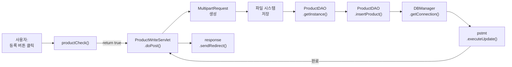

### 6.2 상품 수정 메소드 체인

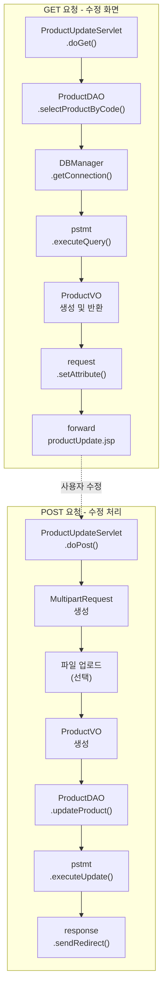

### 6.3 상품 삭제 메소드 체인

```mermaid
graph TB
    subgraph "GET 요청 - 확인 화면"
        A1["ProductDeleteServlet<br/>.doGet()"]
        A2["ProductDAO<br/>.selectProductByCode()"]
        A3["forward<br/>productDelete.jsp"]
        
        A1 --> A2
        A2 --> A3
    end
    
    subgraph "POST 요청 - 삭제 처리"
        B1["ProductDeleteServlet<br/>.doPost()"]
        B2["Integer.parseInt<br/>(code)"]
        B3["ProductDAO<br/>.deleteProduct()"]
        B4["DBManager<br/>.getConnection()"]
        B5["pstmt<br/>.executeUpdate()"]
        B6["response<br/>.sendRedirect()"]
        
        B1 --> B2
        B2 --> B3
        B3 --> B4
        B4 --> B5
        B5 --> B6
    end
    
    A3 -.사용자 확인.-> B1
```

---

**끝! 🎉**

이 문서로 JSP 상품 관리 시스템의 전체 흐름을 완벽하게 이해할 수 있습니다.

**핵심 포인트:**
- ✅ CRUD 4가지 작업의 완전한 구현
- ✅ 파일 업로드 (MultipartRequest) 활용
- ✅ POST-Redirect-GET 패턴 적용
- ✅ MVC 패턴과 싱글톤 패턴
- ✅ PreparedStatement를 통한 안전한 DB 접근
- ✅ 적절한 forward와 redirect 사용

