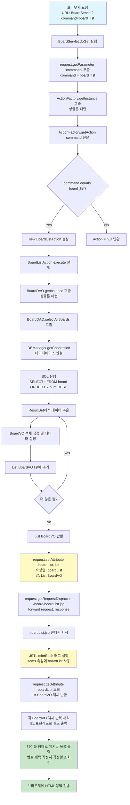

# ${boardList} 출력 흐름도

## 개요
브라우저에서 게시글 목록을 요청했을 때, `${boardList}`가 화면에 출력되기까지의 전체 흐름을 순서도로 설명합니다.

---

## 파일 간 호출 흐름도

```mermaid
flowchart LR
    A["브라우저<br/>(URL 요청)"] --> B["BoardServlet.java<br/>@WebServlet('/BoardServlet')"]
    
    B --> C["ActionFactory.java<br/>getInstance()"]
    
    C --> D["ActionFactory.java<br/>getAction(command)"]
    
    D --> E["BoardListAction.java<br/>execute()"]
    
    E --> F["BoardDAO.java<br/>getInstance()"]
    
    E --> G["BoardDAO.java<br/>selectAllBoards()"]
    
    G --> H["DBManager.java<br/>getConnection()"]
    
    H --> I["MySQL 데이터베이스<br/>(edudb.board 테이블)"]
    
    I --> J["BoardDAO.java<br/>ResultSet 처리"]
    
    J --> K["BoardVO.java<br/>객체 생성"]
    
    K --> L["BoardListAction.java<br/>request.setAttribute()"]
    
    L --> M["boardList.jsp<br/>forward()"]
    
    M --> N["boardList.jsp<br/>EL 표현식 처리"]
    
    N --> O["브라우저<br/>(HTML 응답)"]
    
    style B fill:#ffccbc
    style C fill:#ffccbc
    style D fill:#ffccbc
    style E fill:#c8e6c9
    style F fill:#c8e6c9
    style G fill:#c8e6c9
    style H fill:#fff9c4
    style I fill:#e1f5ff
    style K fill:#f3e5f5
    style M fill:#e8f5e9
    style N fill:#e8f5e9
```



---

## 전체 흐름 순서도



---

## 파일별 역할 및 호출 관계

### 파일 구조
```
web-study-11/
├── src/main/java/com/saeyan/
│   ├── controller/
│   │   ├── BoardServlet.java          ← 진입점 (요청 받기)
│   │   └── ActionFactory.java         ← Action 생성 팩토리
│   ├── controller/action/
│   │   ├── Action.java                 ← 인터페이스
│   │   └── BoardListAction.java        ← 비즈니스 로직 처리
│   ├── dao/
│   │   └── BoardDAO.java               ← 데이터베이스 접근
│   ├── dto/
│   │   └── BoardVO.java                ← 데이터 객체
│   └── util/
│       └── DBManager.java              ← DB 연결 관리
└── src/main/webapp/
    └── board/
        └── boardList.jsp               ← 화면 출력
```

### 파일 간 호출 순서
1. **브라우저** → `BoardServlet.java`
2. **BoardServlet.java** → `ActionFactory.java`
3. **ActionFactory.java** → `BoardListAction.java` (인스턴스 생성)
4. **BoardListAction.java** → `BoardDAO.java`
5. **BoardDAO.java** → `DBManager.java`
6. **DBManager.java** → **MySQL 데이터베이스**
7. **MySQL** → `BoardDAO.java` (데이터 반환)
8. **BoardDAO.java** → `BoardVO.java` (객체 생성)
9. **BoardVO** → `BoardListAction.java` (List로 반환)
10. **BoardListAction.java** → `boardList.jsp` (forward)
11. **boardList.jsp** → **브라우저** (HTML 응답)

---

## 단계별 상세 설명

### 1단계: 브라우저 요청
```
URL: http://localhost:8080/web-study-11/BoardServlet?command=board_list
```
- 사용자가 브라우저에서 URL을 입력하거나 링크를 클릭
- 쿼리 파라미터 `command=board_list`가 포함됨
- `index.jsp`에서 자동 리다이렉트: `response.sendRedirect("BoardServlet?command=board_list")`

---

### 2단계: BoardServlet 처리
**파일**: `BoardServlet.java`  
**위치**: `src/main/java/com/saeyan/controller/BoardServlet.java`  
**역할**: HTTP 요청을 받아서 처리하는 진입점
```java
protected void doGet(HttpServletRequest request, HttpServletResponse response) {
    String command = request.getParameter("command");  // "boardList" 추출
    ActionFactory af = ActionFactory.getInstance();
    Action action = af.getAction(command);
    if(action != null) {
        action.execute(request, response);
    }
}
```
- `@WebServlet("/BoardServlet")` 어노테이션으로 요청 매핑
- `request.getParameter("command")`로 `"board_list"` 추출
- `ActionFactory`에 전달

---

### 3단계: ActionFactory에서 Action 생성
**파일**: `ActionFactory.java`  
**위치**: `src/main/java/com/saeyan/controller/ActionFactory.java`  
**역할**: command 값에 따라 적절한 Action 인스턴스를 생성하는 팩토리
```java
public Action getAction(String command) {
    Action action = null;
    if(command.equals("board_list")) {
        action = new BoardListAction();  // BoardListAction 인스턴스 생성
    }
    return action;
}
```
- `command` 값이 `"board_list"`인지 확인
- 일치하면 `BoardListAction` 인스턴스 생성
- `Action` 인터페이스 타입으로 반환

---

### 4단계: BoardListAction 실행
**파일**: `BoardListAction.java`  
**위치**: `src/main/java/com/saeyan/controller/action/BoardListAction.java`  
**역할**: 게시글 목록 조회 비즈니스 로직 처리 및 JSP로 forward
```java
public void execute(HttpServletRequest request, HttpServletResponse response) {
    String url = "/board/boardList.jsp";
    BoardDAO bdao = BoardDAO.getInstance();
    List<BoardVO> list = bdao.selectAllBoards();  // 데이터베이스에서 조회
    request.setAttribute("boardList", list);      // ⭐ 핵심: 속성 저장
    request.getRequestDispatcher(url).forward(request, response);
}
```
- `BoardDAO`를 통해 데이터베이스에서 게시글 목록 조회
- **핵심**: `request.setAttribute("boardList", list)`로 속성 저장
- `boardList.jsp`로 forward

---

### 5단계: BoardDAO에서 데이터 조회
**파일**: `BoardDAO.java`  
**위치**: `src/main/java/com/saeyan/dao/BoardDAO.java`  
**역할**: 데이터베이스에서 게시글 데이터를 조회하고 BoardVO 객체 리스트로 반환
```java
public List<BoardVO> selectAllBoards() {
    Connection con = DBManager.getConnection();
    PreparedStatement pstmt = con.prepareStatement("SELECT * FROM board ORDER BY num DESC");
    ResultSet rs = pstmt.executeQuery();
    
    List<BoardVO> list = new ArrayList<>();
    while(rs.next()) {
        BoardVO vo = new BoardVO();
        vo.setNum(rs.getInt("num"));
        vo.setName(rs.getString("name"));
        vo.setEmail(rs.getString("email"));
        vo.setTitle(rs.getString("title"));
        vo.setContent(rs.getString("content"));
        vo.setReadcount(rs.getInt("readcount"));
        vo.setWritedate(rs.getTimestamp("writedate"));
        list.add(vo);
    }
    return list;  // List<BoardVO> 반환
}
```
- 데이터베이스 연결
- SQL 쿼리 실행
- `ResultSet`에서 데이터 추출하여 `BoardVO` 객체 생성
- `List<BoardVO>`로 반환

---

### 6단계: JSP에서 JSTL과 EL 표현식 처리
**파일**: `boardList.jsp`  
**위치**: `src/main/webapp/board/boardList.jsp`  
**역할**: request에 저장된 boardList 속성을 JSTL과 EL 표현식으로 테이블 형태로 출력
```jsp
<%@ taglib prefix="c" uri="http://java.sun.com/jsp/jstl/core"%>
<%@ taglib prefix="fmt" uri="http://java.sun.com/jsp/jstl/fmt"%>
<link rel="stylesheet" href="${pageContext.request.contextPath}/css/shopping.css">
<body>
    <table class="list">
        <c:forEach var="board" items="${boardList}">
            <tr>
                <td>${board.num}</td>
                <td>${board.title}</td>
                <td>${board.name}</td>
                <td><fmt:formatDate value="${board.writedate}" /></td>
                <td>${board.readcount}</td>
            </tr>
        </c:forEach>
    </table>
</body>
```
- JSP 엔진이 `<c:forEach>` 태그를 발견
- `items="${boardList}"`에서 EL 표현식 평가
- `request.getAttribute("boardList")` 호출하여 `List<BoardVO>` 객체 조회
- 각 `BoardVO` 객체를 반복하면서 EL 표현식으로 필드 출력
  - `${board.num}` → `board.getNum()` 호출
  - `${board.title}` → `board.getTitle()` 호출
  - `${board.name}` → `board.getName()` 호출
  - `${board.writedate}` → `board.getWritedate()` 호출 (fmt:formatDate로 날짜 포맷팅)
  - `${board.readcount}` → `board.getReadcount()` 호출

---

### 7단계: 화면 출력
- `<c:forEach>` 태그가 `List<BoardVO>`의 각 요소를 반복
- 각 게시글을 테이블 행(`<tr>`)으로 출력
- CSS 파일(`shopping.css`)이 적용되어 스타일링된 테이블로 표시
- 최종 HTML이 브라우저로 전송되어 게시글 목록이 테이블 형태로 표시됨

---

## 핵심 포인트

### 🔑 속성 저장과 조회
```java
// BoardListAction.java에서 저장
request.setAttribute("boardList", list);
```
```jsp
<!-- boardList.jsp에서 조회 및 반복 출력 -->
<c:forEach var="board" items="${boardList}">
    <tr>
        <td>${board.num}</td>
        <td>${board.title}</td>
        <td>${board.name}</td>
        <td><fmt:formatDate value="${board.writedate}" /></td>
        <td>${board.readcount}</td>
    </tr>
</c:forEach>
```

### 📌 데이터 흐름
```
데이터베이스 (edudb.board 테이블)
  → BoardDAO.selectAllBoards() 
  → List<BoardVO> (readcount, writedate 필드 사용)
  → request.setAttribute("boardList", list) 
  → JSP <c:forEach items="${boardList}">
  → EL 표현식으로 각 필드 출력 (${board.num}, ${board.title}, ...)
  → 테이블 형태로 화면 출력
```

### ⚠️ 주의사항
- 속성명 `"boardList"`와 EL 표현식 `${boardList}`의 이름이 **정확히 일치**해야 함
- `request.setAttribute()`로 저장한 데이터는 같은 요청(request) 내에서만 유효
- `forward()`를 통해 JSP로 전달되므로 속성이 유지됨
- 데이터베이스 컬럼명은 `readcount`, `writedate` (소문자)로 통일
- BoardVO의 필드명과 getter/setter도 `readcount`, `writedate`로 통일
- CSS 경로는 `${pageContext.request.contextPath}/css/shopping.css`로 절대 경로 사용

---

## 관련 파일 목록 및 역할

| 파일명 | 경로 | 역할 | 호출하는 파일 | 호출받는 파일 |
|--------|------|------|--------------|--------------|
| **BoardServlet.java** | `src/main/java/com/saeyan/controller/` | HTTP 요청 받기, command 파라미터 추출, Action 실행 | - | ActionFactory |
| **ActionFactory.java** | `src/main/java/com/saeyan/controller/` | command 값에 따라 Action 인스턴스 생성 (board_list 처리) | BoardServlet | BoardListAction (생성) |
| **Action.java** | `src/main/java/com/saeyan/controller/action/` | Action 인터페이스 정의 | - | BoardListAction (구현) |
| **BoardListAction.java** | `src/main/java/com/saeyan/controller/action/` | 비즈니스 로직 처리, 속성 저장, JSP forward | ActionFactory | BoardDAO |
| **BoardDAO.java** | `src/main/java/com/saeyan/dao/` | 데이터베이스 조회, BoardVO 리스트 반환 (readcount, writedate 사용) | BoardListAction | DBManager, BoardVO |
| **DBManager.java** | `src/main/java/util/` | 데이터베이스 연결 관리 | BoardDAO | MySQL |
| **BoardVO.java** | `src/main/java/com/saeyan/dto/` | 게시글 데이터 객체 (readcount, writedate 필드) | BoardDAO | - |
| **boardList.jsp** | `src/main/webapp/board/` | 화면 출력 (JSTL c:forEach, EL 표현식, fmt:formatDate) | BoardListAction | - |
| **index.jsp** | `src/main/webapp/` | 메인 페이지, board_list로 리다이렉트 | - | BoardServlet |

### 파일 간 의존성 관계
```
BoardServlet
  └─→ ActionFactory
        └─→ BoardListAction (implements Action)
              └─→ BoardDAO
                    ├─→ DBManager
                    └─→ BoardVO
              └─→ boardList.jsp (forward)
```

---

## 실행 결과 예시

브라우저 화면에 다음과 같이 테이블 형태로 출력됩니다:

| 번호 | 제목 | 작성자 | 작성일 | 조회 |
|------|------|--------|--------|------|
| 5 | 갯골마을 | 전원지 | 2025. 11. 19. | 0 |
| 4 | 고등애 | 전수빈 | 2025. 11. 19. | 0 |
| 3 | 김밥 | 성윤정 | 2025. 11. 19. | 0 |
| 2 | 첫방문 | 성윤정 | 2025. 11. 19. | 0 |
| 1 | 갯골마을 | 전원지 | 2025. 11. 19. | 0 |

- `<c:forEach>` 태그로 각 `BoardVO` 객체를 반복 처리
- EL 표현식(`${board.num}`, `${board.title}` 등)으로 각 필드 출력
- `fmt:formatDate` 태그로 날짜를 읽기 쉬운 형식으로 포맷팅
- CSS 스타일이 적용되어 스타일링된 테이블로 표시

