# 📚 project2_2 코드 흐름표 (중학생도 이해하는 버전)

## 🎯 이 프로젝트는 무엇인가요?

이 프로젝트는 **할 일 관리 앱**(Todo App)입니다!
여러분이 해야 할 일들을 적어두고, 완료했는지 체크하고, 필요없는 것은 삭제할 수 있는 앱이에요.

**주요 기능:**

- ✏️ 새로운 할 일 추가하기
- ✅ 할 일 완료 체크하기
- 🗑️ 할 일 삭제하기
- 🔍 할 일 검색하기
- ➕➖ 숫자 증가/감소 테스트 기능

---

## 🛠️ 프로젝트를 처음부터 만드는 방법 (단계별 가이드)

이 섹션에서는 빈 프로젝트에서 시작해서 완성된 Todo 앱을 만드는 전 과정을 단계별로 설명합니다!

### 📋 전체 구현 순서

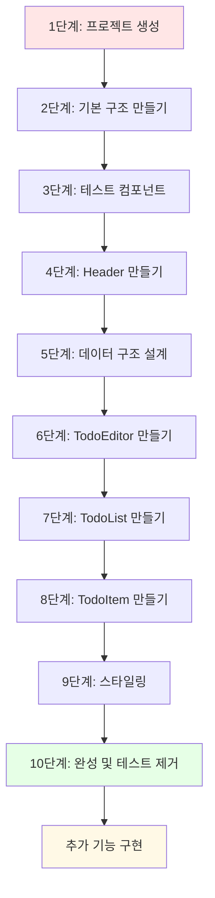

---

### 1단계: 프로젝트 생성 및 초기 설정

#### 1-1. Vite로 React 프로젝트 생성

**터미널에서 실행:**

```bash
npm create vite@latest project2_2 -- --template react
cd project2_2
npm install
npm run dev
```

**왜 Vite를 사용하나요?**

- 빠른 개발 서버 실행 속도
- 간단한 설정
- 최신 React 기능 지원

#### 1-2. 초기 파일 정리

**불필요한 파일 삭제:**

- `src/App.css` 내용 정리
- `src/index.css` 기본 스타일 설정

---

### 2단계: 프로젝트 기본 구조 잡기

#### 2-1. 폴더 구조 만들기

```bash
cd src
mkdir component
```

**최종 폴더 구조:**

```
src/
├── component/        ← 여기에 컴포넌트들을 넣을 거예요
├── App.jsx          ← 메인 앱
├── App.css          ← 앱 스타일
├── main.jsx         ← 시작점
└── index.css        ← 전역 스타일
```

#### 2-2. index.css 작성 (전역 스타일)

**파일: `src/index.css`**

```css
/* 전체 페이지 기본 스타일 */
* {
  margin: 0;
  padding: 0;
  box-sizing: border-box;
}

body {
  font-family: 'Segoe UI', Tahoma, Geneva, Verdana, sans-serif;
  background-color: #f5f5f5;
}

/* 왜 이렇게 작성하나요? */
/* * 선택자: 모든 요소의 기본 여백 제거 */
/* box-sizing: 크기 계산을 쉽게 하기 위해 */
/* background-color: 전체 배경색 */
```

#### 2-3. App.css 작성 (앱 컨테이너 스타일)

**파일: `src/App.css`**

```css
.App {
  width: 500px;
  margin: 0 auto;
  padding: 20px;
}

/* 왜 이렇게 작성하나요? */
/* width: 500px - 앱의 너비를 고정 */
/* margin: 0 auto - 화면 중앙에 배치 */
/* padding: 안쪽 여백으로 내용물과 테두리 사이 공간 확보 */
```

---

### 3단계: TestComp 만들기 (테스트용 - 나중에 삭제)

> **⚠️ 중요: TestComp는 학습용 테스트 컴포넌트입니다!**
>
> **목적:** useReducer의 작동 방식을 이해하기 위한 간단한 예제
>
> **언제 삭제하나요?** Todo 앱의 useReducer가 제대로 작동하는 것을 확인한 후
>
> **삭제 방법:**
>
> 1. `App.jsx`에서 `<TestComp />` 줄 삭제
> 2. `import TestComp from './component/TestComp'` 줄 삭제
> 3. `component/TestComp.jsx` 파일 삭제

#### 3-1. TestComp.jsx 생성

**파일: `src/component/TestComp.jsx`**

```javascript
import React from 'react'
import { useReducer } from 'react';

// ① reducer 함수 정의
function reducer(state, action) {
    // state: 현재 상태값 (숫자)
    // action: 어떤 동작을 할지 정보 { type, data }
    
    switch(action.type) {
        case 'INCREASE':
            return state + action.data;  // 현재값 + 1
        case 'DECREASE':
            return state + action.data;  // 현재값 - 1
        default:
            return state;  // 아무것도 안 함
    }
}

const TestComp = () => {
    // ② useReducer 사용
    // count: 현재 숫자
    // dispatch: reducer에게 명령을 보내는 함수
    // reducer: 위에서 만든 함수
    // 0: 초기값
    const [count, dispatch] = useReducer(reducer, 0);

    // ③ 증가 함수
    const ins = () => dispatch({
        type: 'INCREASE',  // 명령 종류
        data: 1            // 데이터
    });
    
    // ④ 감소 함수
    const dec = () => dispatch({
        type: 'DECREASE',
        data: -1
    });

    return (
        <div>
            <h3>TestComp</h3>
            <div>
                <strong>{count}</strong>
            </div>
            <div>
                <button onClick={ins}>+</button>
                <button onClick={dec}>-</button>
            </div>
        </div>
    )
}

export default TestComp
```

**이해하기:**

1. **reducer 함수**: "명령서"를 받아서 새로운 상태를 만들어요
2. **useReducer**: useState보다 복잡한 상태 관리에 사용
3. **dispatch**: reducer에게 명령을 보내는 우체부
4. **action.type**: 어떤 동작을 할지 (INCREASE, DECREASE)
5. **action.data**: 얼마나 변경할지 (+1, -1)

---

### 4단계: Header 컴포넌트 만들기

#### 4-1. Header.jsx 생성

**파일: `src/component/Header.jsx`**

```javascript
import React from 'react'
import './Header.css'

const Header = () => {
  return (
    <div className='Header'>
      <h2>오늘은 📆</h2>
      {/* new Date(): 현재 날짜/시간 객체 생성 */}
      {/* toDateString(): 날짜를 문자열로 변환 */}
      <h1>{new Date().toDateString()}</h1>
    </div>
  )
}

export default Header
```

#### 4-2. Header.css 생성

**파일: `src/component/Header.css`**

```css
.Header {
  margin-bottom: 20px;
  padding-bottom: 20px;
  border-bottom: 1px solid #e0e0e0;
}

.Header h2 {
  font-size: 18px;
  color: #888;
}

.Header h1 {
  font-size: 24px;
  color: #333;
}
```

**왜 분리하나요?**

- 각 컴포넌트가 독립적인 스타일을 가져요
- 나중에 수정하기 쉬워요

---

### 5단계: App.jsx - 데이터 구조 설계 및 상태 관리

이 단계가 **가장 중요**합니다! 전체 앱의 두뇌 역할을 해요.

#### 5-1. App.jsx 기본 구조 작성

**파일: `src/App.jsx`**

```javascript
import './App.css'
import React from 'react';
import Header from './component/Header'
import TestComp from './component/TestComp'
import { useReducer, useRef } from 'react';

// ============================================
// 1단계: 초기 데이터 정의
// ============================================
const mockTodo = [
  {
    id: 0,                              // 고유 번호
    isDone: false,                      // 완료 여부
    content: 'React 공부하기',          // 할 일 내용
    createDate: new Date().getTime(),   // 만든 시간 (밀리초)
  },
  {
    id: 1,
    isDone: false,
    content: '책 읽기',
    createDate: new Date().getTime(),
  },
  {
    id: 2,
    isDone: false,
    content: '운동하기',
    createDate: new Date().getTime(),
  },
];

// ============================================
// 2단계: reducer 함수 정의
// ============================================
function reducer(state, action) {
  // state: 현재 todo 배열
  // action: { type, newItem, id }
  
  switch(action.type) {
    case "CREATE":
      // 새 항목을 배열 맨 앞에 추가
      // [...] 스프레드 연산자: 기존 배열 복사
      return [action.newItem, ...state];
      
    case "UPDATE":
      // map: 배열의 각 요소를 변환
      // 같은 ID면 isDone 반전, 아니면 그대로
      return state.map(it => 
        it.id === action.id 
          ? { ...it, isDone: !it.isDone }  // 객체 복사 후 isDone만 변경
          : it
      );
      
    case "DELETE":
      // filter: 조건에 맞는 요소만 남김
      // 해당 ID가 아닌 것만 남겨서 삭제 효과
      return state.filter(it => it.id !== action.id);
      
    default:
      return state;
  }
}

// ============================================
// 3단계: Context 생성 (전역 상태 공유)
// ============================================
export const TodoContext = React.createContext();

// ============================================
// 4단계: App 컴포넌트
// ============================================
function App() {
  
  // useReducer로 todo 배열 관리
  // todo: 현재 할 일 목록
  // dispatch: reducer에게 명령 보내기
  const [todo, dispatch] = useReducer(reducer, mockTodo);
  
  // useRef로 다음 ID 관리 (리렌더링되어도 유지됨)
  const idRef = useRef(3);  // 초기 데이터가 0,1,2 이므로 3부터 시작

  // ============================================
  // 5단계: CRUD 함수 정의
  // ============================================
  
  /* 데이터 추가하기 (CREATE) */
  const onCreate = (content) => {
    dispatch({
      type: "CREATE",
      newItem: {
        id: idRef.current,              // 현재 ID 사용
        isDone: false,
        content,                         // content: content 축약형
        createDate: new Date().getTime()
      }
    });
    idRef.current++;  // 다음 ID를 위해 1 증가
  };
  
  /* 데이터 수정하기 (UPDATE) */
  const OnUpdate = (targetId) => {
    dispatch({
      type: "UPDATE",
      id: targetId
    });
  };

  /* 데이터 삭제하기 (DELETE) */
  const OnDelete = (targetId) => {
    dispatch({
      type: "DELETE",
      id: targetId
    });
  };

  // ============================================
  // 6단계: 렌더링
  // ============================================
  return (
    <div className='App'>
      <TestComp />
      <Header />
      {/* Context.Provider로 자식들에게 데이터 공유 */}
      <TodoContext.Provider value={{ todo, onCreate, OnUpdate, OnDelete }}>
        {/* 여기에 TodoEditor와 TodoList가 들어갈 예정 */}
      </TodoContext.Provider>
    </div>
  )
}

export default App
```

**핵심 개념 정리:**

1. **mockTodo**: 초기 샘플 데이터
2. **reducer**: 명령에 따라 데이터를 변경하는 함수
3. **useReducer**: useState보다 복잡한 상태 관리
4. **useRef**: 값을 저장하되 변경해도 리렌더링 안 함 (ID 카운터용)
5. **Context**: 데이터를 여러 자식 컴포넌트에 쉽게 전달

---

### 6단계: TodoEditor 만들기 (할 일 입력)

#### 6-1. TodoEditor.jsx 생성

**파일: `src/component/TodoEditor.jsx`**

```javascript
import './TodoEditor.css'
import { useState, useRef } from 'react';
import { useContext } from 'react';
import { TodoContext } from '../App';  // App에서 만든 Context 가져오기

const TodoEditor = () => {

  // Context에서 onCreate 함수 가져오기
  const {onCreate} = useContext(TodoContext);
  
  // 입력값 관리
  const [content, setContent] = useState('');
  
  // 입력창 참조 (포커스 주기 위해)
  const inputRef = useRef();

  // 입력창에 타이핑할 때마다 실행
  const onChangeContent = (e) => {
    setContent(e.target.value);
  };

  // 추가 버튼 클릭 시
  const onSubmit = () => {
    // 빈 문자열 체크
    if(!content) {
      inputRef.current.focus();  // 입력창에 포커스
      return;
    }
    onCreate(content);  // App의 onCreate 호출
    setContent('');     // 입력창 비우기
  };

  // Enter 키 눌렀을 때
  const onKeyDown = (e) => {
    if(e.keyCode === 13) {  // 13 = Enter
      onSubmit();
    }
  };

  return (
    <div className='TodoEditor'>
      <h3>✏️ 새로운 할 일 작성하기</h3>
      <div className='editor_wrapper'>
        <input 
          value={content}
          onChange={onChangeContent}
          ref={inputRef}
          onKeyDown={onKeyDown}
          placeholder='할 일을 입력해주세요.' 
        />
        <button onClick={onSubmit}>추가</button>
      </div>
    </div>
  )
}

export default TodoEditor
```

#### 6-2. TodoEditor.css 생성

**파일: `src/component/TodoEditor.css`**

```css
.TodoEditor {
  margin-bottom: 20px;
  padding: 20px;
  background-color: white;
  border-radius: 8px;
  box-shadow: 0 2px 4px rgba(0,0,0,0.1);
}

.TodoEditor h3 {
  margin-bottom: 15px;
  font-size: 18px;
}

.editor_wrapper {
  display: flex;
  gap: 10px;
}

.editor_wrapper input {
  flex: 1;  /* 남은 공간 모두 차지 */
  padding: 10px;
  border: 1px solid #ddd;
  border-radius: 4px;
  font-size: 14px;
}

.editor_wrapper button {
  padding: 10px 20px;
  background-color: #4CAF50;
  color: white;
  border: none;
  border-radius: 4px;
  cursor: pointer;
  font-size: 14px;
}

.editor_wrapper button:hover {
  background-color: #45a049;
}
```

#### 6-3. App.jsx에 TodoEditor 추가

**파일: `src/App.jsx` (수정)**

```javascript
// 상단에 import 추가
import TodoEditor from './component/TodoEditor'

// return 부분 수정
return (
  <div className='App'>
    <TestComp />
    <Header />
    <TodoContext.Provider value={{ todo, onCreate, OnUpdate, OnDelete }}>
      <TodoEditor />  {/* ← 이 줄 추가 */}
    </TodoContext.Provider>
  </div>
)
```

---

### 7단계: TodoList 만들기 (목록 표시)

#### 7-1. TodoList.jsx 생성

**파일: `src/component/TodoList.jsx`**

```javascript
import React from 'react'
import './TodoList.css'
import TodoItem from './TodoItem'  // 아직 안 만들었지만 미리 import
import { useState } from 'react';
import { useContext } from 'react';
import { TodoContext } from '../App';

const TodoList = () => {

  // Context에서 todo 배열 가져오기
  const {todo} = useContext(TodoContext);

  // 검색어 관리
  const [search, setSearch] = useState('');

  // 검색창에 입력할 때
  const onChangeSearch = (e) => {
    setSearch(e.target.value);
  };

  // 검색 결과 필터링
  const getSearchResult = () => {
    // 검색어가 없으면 전체 반환
    return search === "" ?
            todo :
            // 검색어가 있으면 필터링
            todo.filter((it) => 
              it.content
                .toLowerCase()              // 소문자로 변환
                .includes(search.toLowerCase())  // 검색어 포함 여부
            );
  };

  return (
    <div className='TodoList'>
      <h3>✅ 할 일 목록</h3>
      <input 
        className='searchbar'
        onChange={onChangeSearch}
        placeholder='검색어를 입력해주세요.' 
      />
      <div className='list_wrapper'>
      {
        // 검색 결과를 map으로 반복
        getSearchResult().map(
          (it) => (
            // 각 할 일마다 TodoItem 생성
            // key: React가 구분하기 위한 고유값
            // {...it}: id, content, isDone, createDate 모두 전달
            <TodoItem key={it.id} {...it} />
          )
        )
      }
      </div>
    </div>
  )
}

export default TodoList
```

#### 7-2. TodoList.css 생성

**파일: `src/component/TodoList.css`**

```css
.TodoList {
  padding: 20px;
  background-color: white;
  border-radius: 8px;
  box-shadow: 0 2px 4px rgba(0,0,0,0.1);
}

.TodoList h3 {
  margin-bottom: 15px;
  font-size: 18px;
}

.searchbar {
  width: 100%;
  padding: 10px;
  margin-bottom: 15px;
  border: 1px solid #ddd;
  border-radius: 4px;
  font-size: 14px;
}

.list_wrapper {
  display: flex;
  flex-direction: column;
  gap: 10px;
}
```

#### 7-3. App.jsx에 TodoList 추가

**파일: `src/App.jsx` (수정)**

```javascript
// 상단에 import 추가
import TodoList from './component/TodoList'

// return 부분 수정
return (
  <div className='App'>
    <TestComp />
    <Header />
    <TodoContext.Provider value={{ todo, onCreate, OnUpdate, OnDelete }}>
      <TodoEditor />
      <TodoList />  {/* ← 이 줄 추가 */}
    </TodoContext.Provider>
  </div>
)
```

---

### 8단계: TodoItem 만들기 (개별 할 일)

#### 8-1. TodoItem.jsx 생성

**파일: `src/component/TodoItem.jsx`**

```javascript
import React, { useContext } from 'react'
import './TodoItem.css'
import { TodoContext } from '../App'

const TodoItem = ({id, content, isDone, createDate}) => {
    // Props로 받은 4가지 데이터:
    // - id: 할 일 번호
    // - content: 할 일 내용
    // - isDone: 완료 여부
    // - createDate: 생성 시간

    // Context에서 수정/삭제 함수 가져오기
    const {OnUpdate, OnDelete} = useContext(TodoContext);
    
  return (
    <div className='TodoItem'>
        {/* 체크박스 */}
        <div className='checkbox'>
            <input 
              type="checkbox" 
              onClick={() => OnUpdate(id)}  // 클릭하면 완료 상태 변경
              checked={isDone}              // isDone이 true면 체크됨
            />
        </div>
        
        {/* 할 일 내용 */}
        <div className='title_col'>
            {content}
        </div>
        
        {/* 생성 날짜 */}
        <div className='date_col'>
            {new Date(createDate).toDateString()}
        </div>
        
        {/* 삭제 버튼 */}
        <div className='btn_col'>
            <button onClick={() => OnDelete(id)}>삭제</button>
        </div>
    </div>
  )
}

export default TodoItem
```

#### 8-2. TodoItem.css 생성

**파일: `src/component/TodoItem.css`**

```css
.TodoItem {
  display: flex;
  align-items: center;
  gap: 15px;
  padding: 15px;
  border: 1px solid #e0e0e0;
  border-radius: 4px;
  background-color: #fafafa;
}

.TodoItem:hover {
  background-color: #f0f0f0;
}

.checkbox input {
  width: 18px;
  height: 18px;
  cursor: pointer;
}

.title_col {
  flex: 1;  /* 남은 공간 모두 차지 */
  font-size: 14px;
}

.date_col {
  font-size: 12px;
  color: #888;
}

.btn_col button {
  padding: 5px 15px;
  background-color: #f44336;
  color: white;
  border: none;
  border-radius: 4px;
  cursor: pointer;
  font-size: 12px;
}

.btn_col button:hover {
  background-color: #da190b;
}
```

---

### 9단계: 앱 실행 및 테스트

```bash
npm run dev
```

브라우저에서 `http://localhost:5173` 접속!

**테스트 항목:**

- ✅ TestComp의 +/- 버튼 작동 확인
- ✅ 할 일 추가되는지 확인
- ✅ 체크박스 클릭 시 상태 변경 확인
- ✅ 삭제 버튼 작동 확인
- ✅ 검색 기능 작동 확인

---

### 10단계: TestComp 제거 (선택사항)

useReducer의 작동을 이해했다면 TestComp를 제거해도 돼요!

#### 10-1. App.jsx 수정

```javascript
// 이 줄 삭제
import TestComp from './component/TestComp'

// return에서 이 줄 삭제
<TestComp />
```

#### 10-2. 파일 삭제

```bash
rm src/component/TestComp.jsx
```

---

## 📂 프로젝트 구조

```
project2_2/
├── index.html          # 웹페이지의 뼈대 (HTML)
├── src/
│   ├── main.jsx        # 앱이 시작되는 곳 (시작점!)
│   ├── App.jsx         # 메인 앱 (모든 것을 관리하는 사령탑)
│   └── component/      # 조각들을 모아둔 폴더
│       ├── Header.jsx      # 날짜를 보여주는 머리글
│       ├── TestComp.jsx    # 테스트용 카운터
│       ├── TodoEditor.jsx  # 할 일 추가 폼
│       ├── TodoList.jsx    # 할 일 목록 전체
│       └── TodoItem.jsx    # 할 일 한 개
```

---

## 🚀 앱이 시작되는 과정 (전체 흐름)

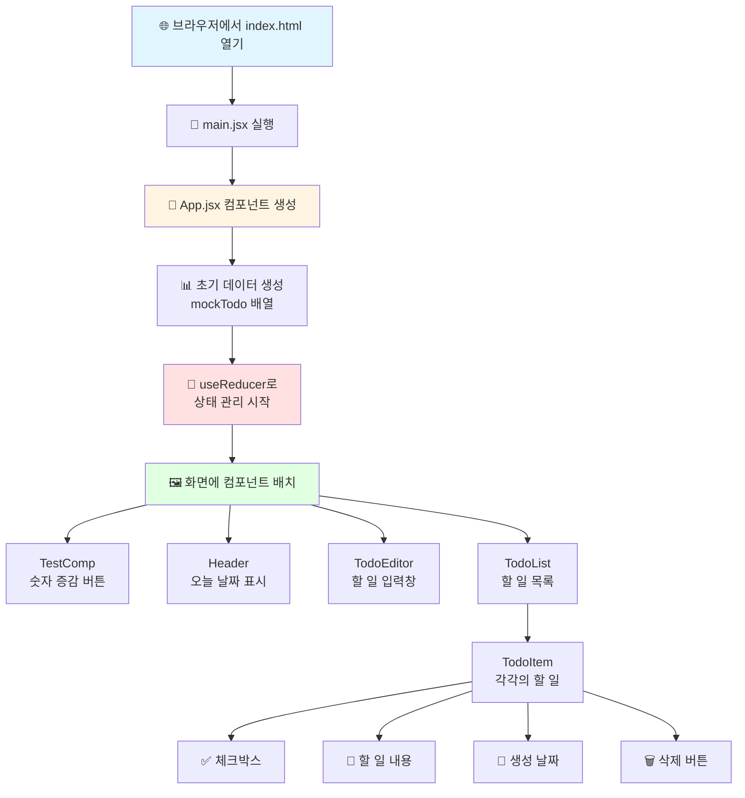

---

## 🧩 각 파일별 상세 흐름

### 1️⃣ index.html - 웹페이지의 뼈대

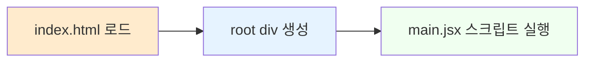

**쉽게 설명하면:**

- 집을 지을 때 기둥이 필요하듯이, 웹페이지에도 뼈대가 필요해요
- `<div id="root">` 라는 빈 공간을 만들어두고
- 여기에 React 앱이 들어갈 거예요!

---

### 2️⃣ main.jsx - 앱의 시작점

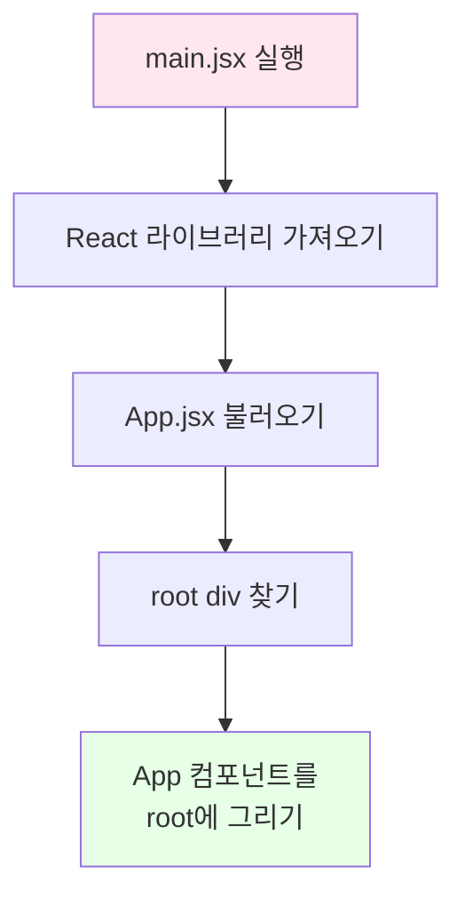

**코드 설명:**

```javascript
// 1. 필요한 도구들을 가져와요
import { createRoot } from 'react-dom/client'
import App from './App.jsx'

// 2. root라는 이름의 상자를 찾아요
// 3. 그 상자 안에 App을 그려넣어요!
createRoot(document.getElementById('root')).render(<App />)
```

**쉽게 설명하면:**

- 도화지(root)를 찾고
- 그 위에 App이라는 그림을 그려요!

---

### 3️⃣ App.jsx - 사령탑 (가장 중요!)

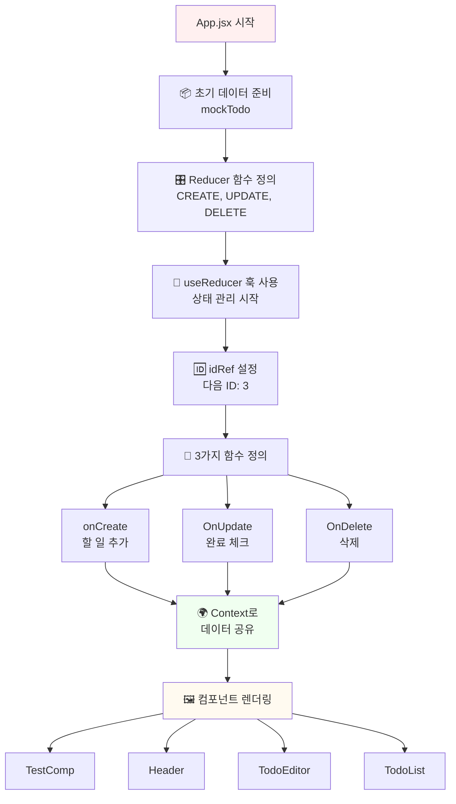

#### 💾 초기 데이터 (mockTodo)

```javascript
const mockTodo = [
  {
    id: 0,                          // 할 일 번호 (0번)
    isDone: false,                  // 완료했나요? (아직!)
    content: 'React 공부하기',      // 할 일 내용
    createDate: new Date().getTime() // 만든 시간
  },
  // ... 더 많은 할 일들
];
```

**쉽게 설명하면:**

- 할 일을 적어둔 메모장이에요
- 각 할 일마다 번호표를 붙이고
- 완료했는지 체크할 수 있어요

#### 🎛️ Reducer - 데이터 변경 담당자

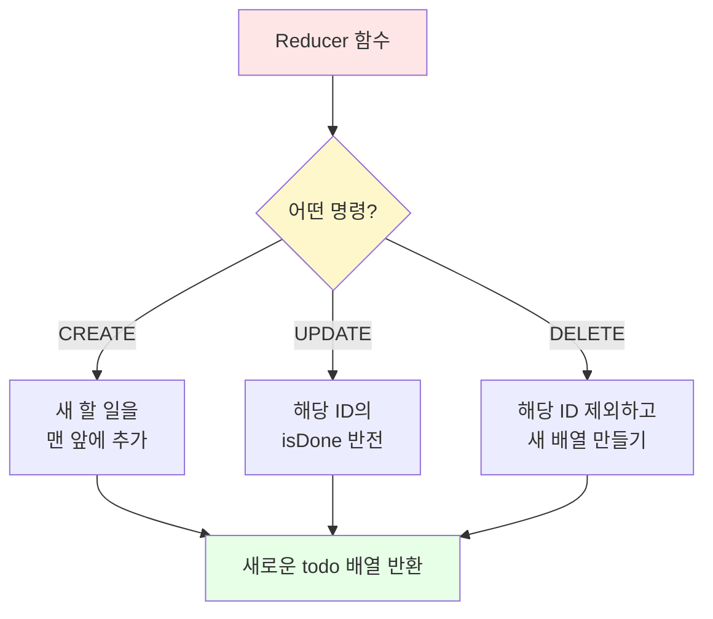

**Reducer가 하는 일:**

1. **CREATE (추가)**:

   ```javascript
   // 새로운 할 일을 맨 앞에 추가해요
   [새로운 할 일, ...기존 할 일들]
   ```

2. **UPDATE (수정)**:

   ```javascript
   // ID가 같은 할 일을 찾아서 완료 상태를 뒤집어요
   // isDone: false → true 또는 true → false
   ```

3. **DELETE (삭제)**:

   ```javascript
   // 해당 ID를 제외한 나머지만 남겨요
   // 필터링: "너는 빼고 나머지만!"
   ```

#### 📝 3가지 주요 함수

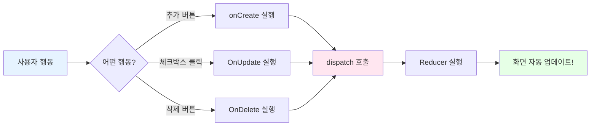

**1. onCreate - 할 일 추가**

```javascript
const onCreate = (content) => {
  // 1. dispatch에게 "CREATE 명령"을 보내요
  dispatch({
    type: "CREATE",        // 명령 종류: 추가
    newItem: {             // 새 할 일 정보
      id: idRef.current,   // 현재 ID 번호
      isDone: false,       // 아직 안 함
      content,             // 할 일 내용
      createDate: new Date().getTime() // 지금 시간
    }
  });
  // 2. 다음 ID 번호를 1 증가시켜요
  idRef.current++;
};
```

**쉽게 설명하면:**

- 새 할 일을 추가할 때 호출돼요
- ID 번호표를 붙이고
- "아직 안 했어요(false)"라고 표시해요
- 그리고 다음 번호를 준비해요 (3 → 4 → 5...)

**2. OnUpdate - 완료 체크/해제**

```javascript
const OnUpdate = (targetId) => {
  dispatch({
    type: "UPDATE",    // 명령 종류: 수정
    id: targetId       // 어떤 할 일을 수정할지 ID
  });
};
```

**쉽게 설명하면:**

- 체크박스를 클릭하면 호출돼요
- "이 번호의 할 일을 완료/미완료로 바꿔줘!"라고 요청해요

**3. OnDelete - 삭제**

```javascript
const OnDelete = (targetId) => {
  dispatch({
    type: "DELETE",    // 명령 종류: 삭제
    id: targetId       // 어떤 할 일을 삭제할지 ID
  });
};
```

**쉽게 설명하면:**

- 삭제 버튼을 누르면 호출돼요
- "이 번호의 할 일을 지워줘!"라고 요청해요

#### 🌍 Context - 데이터 공유 시스템

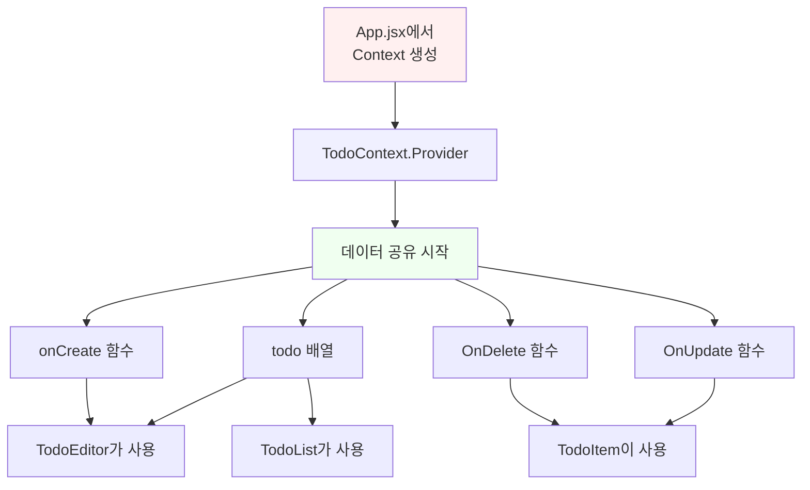

**쉽게 설명하면:**

- Context는 "공용 창고" 같은 거예요
- App에서 만든 데이터와 함수들을
- 자식 컴포넌트들이 자유롭게 가져다 쓸 수 있어요
- 일일이 props로 전달할 필요가 없어요!

**코드:**

```javascript
// Context 만들기
export const TodoContext = React.createContext();

// Context로 데이터 공유하기
<TodoContext.Provider value={{ todo, onCreate, OnUpdate, OnDelete }}>
  <TodoEditor />
  <TodoList />
</TodoContext.Provider>
```

---

### 4️⃣ Header.jsx - 날짜 표시

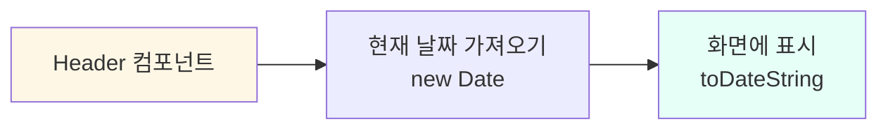

**코드:**

```javascript
<div className='Header'>
  <h2>오늘은 📆</h2>
  <h1>{new Date().toDateString()}</h1>
  {/* 예: Sun Dec 01 2024 */}
</div>
```

**쉽게 설명하면:**

- 오늘 날짜를 보여주는 머리글이에요
- 매번 새로 고침하면 현재 날짜가 나와요

---

### 5️⃣ TodoEditor.jsx - 할 일 입력 폼

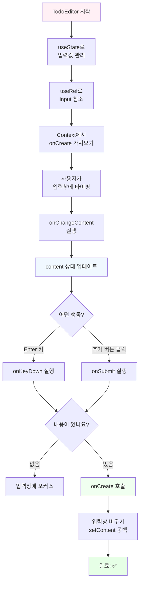

#### 🔍 상세 코드 흐름

**1. 초기 설정**

```javascript
const [content, setContent] = useState('');  // 입력값 저장
const inputRef = useRef();                   // 입력창 참조
const {onCreate} = useContext(TodoContext);  // 추가 함수 가져오기
```

**2. 타이핑할 때마다**

```javascript
const onChangeContent = (e) => {
  setContent(e.target.value);  // 타이핑한 내용을 content에 저장
};
```

**3. Enter 키를 누르면**

```javascript
const onKeyDown = (e) => {
  if(e.keyCode === 13) {  // 13 = Enter 키
    onSubmit();           // 제출!
  }
};
```

**4. 추가 버튼을 클릭하면**

```javascript
const onSubmit = () => {
  // 빈 칸이면 경고
  if(!content) {
    inputRef.current.focus();  // 입력창에 커서 깜빡이게
    return;                    // 여기서 끝!
  }
  
  // 내용이 있으면
  onCreate(content);     // App의 onCreate 함수 호출
  setContent('');        // 입력창 비우기
};
```

**쉽게 설명하면:**

1. 입력창에 할 일을 적어요
2. Enter 키를 누르거나 "추가" 버튼을 클릭해요
3. 빈 칸이면 "할 일을 입력해주세요!" 하고 다시 포커스
4. 내용이 있으면 onCreate를 통해 App에 추가 요청!
5. 입력창을 깨끗이 비워요

---

### 6️⃣ TodoList.jsx - 할 일 목록 전체

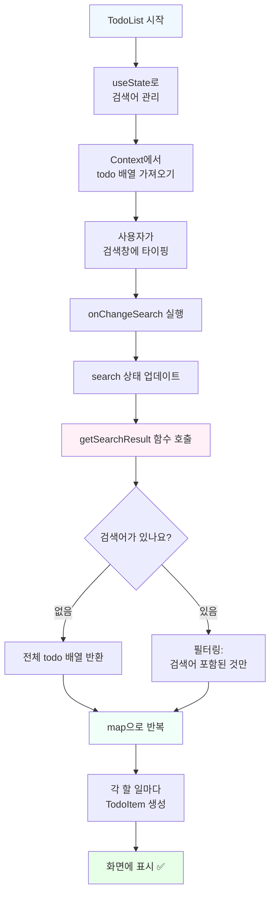

#### 🔍 상세 코드 흐름

**1. 검색 기능**

```javascript
const [search, setSearch] = useState('');  // 검색어 저장

const onChangeSearch = (e) => {
  setSearch(e.target.value);  // 타이핑한 검색어 저장
};
```

**2. 검색 결과 필터링**

```javascript
const getSearchResult = () => {
  // 검색어가 없으면
  if (search === "") {
    return todo;  // 전체 목록 반환
  }
  
  // 검색어가 있으면
  return todo.filter((it) => 
    it.content                    // 할 일 내용에서
      .toLowerCase()              // 소문자로 바꿔서
      .includes(                  // 포함하는지 확인
        search.toLowerCase()      // 검색어도 소문자로
      )
  );
};
```

**쉬운 예시:**

- 할 일: "React 공부하기", "책 읽기", "운동하기"
- 검색어: "공부"
- 결과: "React 공부하기"만 표시!

**3. 목록 표시**

```javascript
getSearchResult().map((it) => (
  <TodoItem key={it.id} {...it} />
  // 각 할 일을 TodoItem으로 만들어요
  // key는 React가 구분하기 위한 고유 번호
  // {...it}는 모든 정보를 전달하는 마법 문법!
))
```

**쉽게 설명하면:**

1. 검색창에 단어를 입력해요
2. 그 단어가 포함된 할 일만 찾아서 보여줘요
3. 검색어가 없으면 전부 보여줘요
4. 각 할 일은 TodoItem 컴포넌트로 만들어져요

---

### 7️⃣ TodoItem.jsx - 할 일 하나

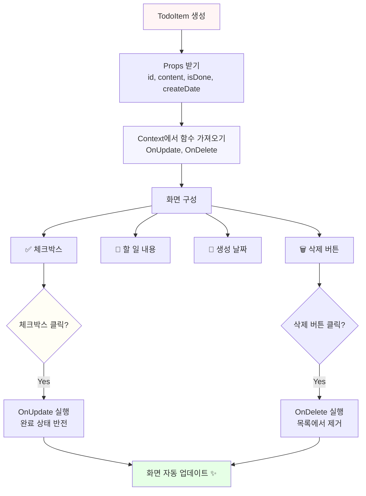

#### 🔍 상세 코드 흐름

**1. 데이터 받기**

```javascript
const TodoItem = ({id, content, isDone, createDate}) => {
  // 부모(TodoList)로부터 이 4가지 정보를 받아요
  
  const {OnUpdate, OnDelete} = useContext(TodoContext);
  // Context에서 수정/삭제 함수를 가져와요
}
```

**2. 화면 구성**

```javascript
<div className='TodoItem'>
  {/* 1. 체크박스 */}
  <div className='checkbox'>
    <input 
      type="checkbox" 
      onClick={() => OnUpdate(id)}  // 클릭하면 OnUpdate 호출
      checked={isDone}              // 완료 상태에 따라 체크
    />
  </div>
  
  {/* 2. 할 일 내용 */}
  <div className='title_col'>
    {content}  {/* "React 공부하기" 같은 내용 */}
  </div>
  
  {/* 3. 생성 날짜 */}
  <div className='date_col'>
    {new Date(createDate).toDateString()}
    {/* 숫자를 날짜 형식으로 변환 */}
  </div>
  
  {/* 4. 삭제 버튼 */}
  <div className='btn_col'>
    <button onClick={() => OnDelete(id)}>삭제</button>
  </div>
</div>
```

**쉽게 설명하면:**

- 할 일 한 줄을 표시하는 컴포넌트예요
- 체크박스를 누르면 완료/미완료가 바뀌어요
- 삭제 버튼을 누르면 목록에서 사라져요
- 각 할 일에는 내용과 만든 날짜가 표시돼요

---

### 8️⃣ TestComp.jsx - 테스트용 카운터

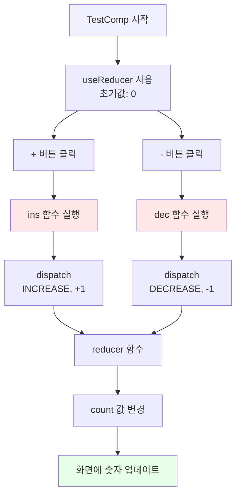

**코드:**

```javascript
const [count, dispatch] = useReducer(reducer, 0);

const ins = () => dispatch({
  type: 'INCREASE',
  data: 1      // +1
});

const dec = () => dispatch({
  type: 'DECREASE',
  data: -1     // -1
});
```

**쉽게 설명하면:**

- useReducer 연습용 간단한 카운터예요
- - 버튼을 누르면 숫자가 1 증가
- - 버튼을 누르면 숫자가 1 감소
- Todo 앱의 useReducer와 같은 원리로 작동해요!

---

## 🔄 전체 데이터 흐름 요약

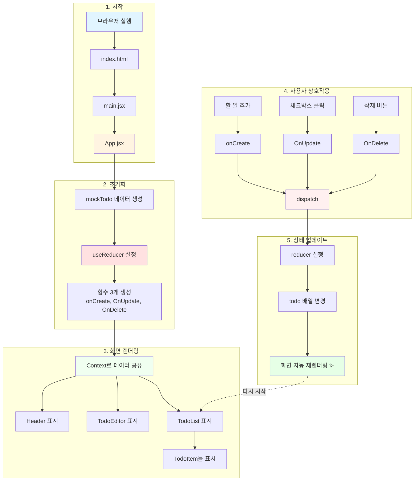

---

## 🎓 핵심 개념 정리 (중학생 눈높이)

### 1. **State (상태)** 💾

```
비유: 노트에 적힌 메모
- 변할 수 있는 데이터를 저장해요
- 상태가 바뀌면 화면도 자동으로 바뀌어요!
```

### 2. **useReducer** 🎛️

```
비유: 리모컨
- "추가해줘", "수정해줘", "삭제해줘" 같은 명령을 보내요
- reducer 함수가 명령을 받아서 처리해요
- 복잡한 상태 관리에 좋아요!
```

### 3. **Context** 🌍

```
비유: 학교 게시판
- 모든 학생(컴포넌트)이 볼 수 있는 공지사항
- props로 일일이 전달하지 않아도 돼요
- 필요한 곳 어디서든 가져다 쓸 수 있어요
```

### 4. **Props** 📬

```
비유: 편지
- 부모가 자식에게 데이터를 전달하는 방법
- 읽기만 가능, 수정은 불가능!
```

### 5. **Component (컴포넌트)** 🧩

```
비유: 레고 블록
- 화면의 한 부분을 담당하는 조각
- 여러 개를 조립해서 완성된 화면을 만들어요
- 재사용 가능해요!
```

---

## 🎯 사용자 행동별 전체 흐름

### ✏️ 할 일 추가하기

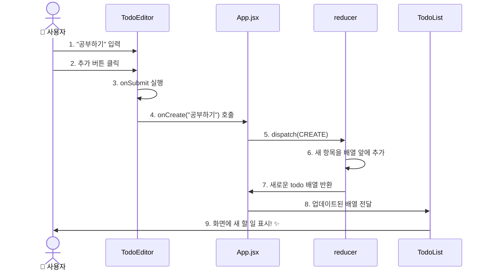

### ✅ 할 일 완료 체크하기

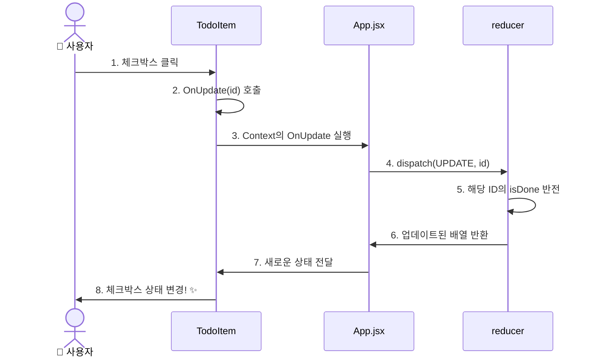

### 🗑️ 할 일 삭제하기

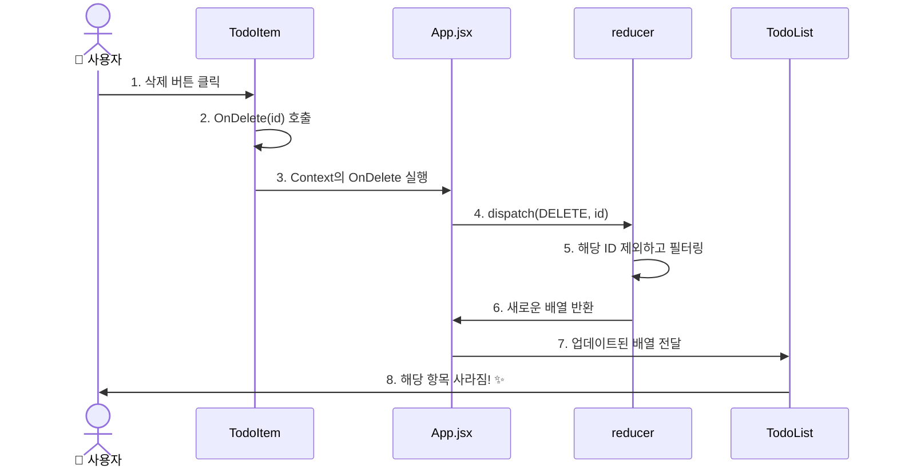

### 🔍 할 일 검색하기

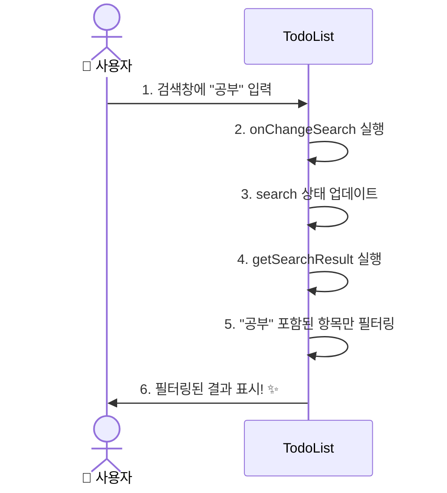

---

## 🌟 프로젝트의 핵심 원리

### 1. **단방향 데이터 흐름** ⬇️

```
App (최상위)
 ↓ 데이터 전달 (prop/context)
TodoEditor, TodoList
 ↓ 데이터 전달
TodoItem

⬆️ 이벤트만 위로 전달 (함수 호출)
```

**쉽게 설명:**

- 데이터는 위에서 아래로만 흘러요 (폭포수처럼!)
- 아래에서 위로는 "이벤트(버튼 클릭 등)"만 전달해요

### 2. **불변성 (Immutability)** 🔒

```javascript
// ❌ 잘못된 방법: 직접 수정
todo.push(newItem);

// ✅ 올바른 방법: 새 배열 생성
[newItem, ...todo]
```

**쉽게 설명:**

- 원본 데이터는 건드리지 않아요
- 항상 새로운 복사본을 만들어요
- React가 변화를 감지하고 화면을 업데이트하기 위해서예요!

### 3. **선언적 프로그래밍** 📝

```javascript
// "어떻게"가 아니라 "무엇을" 그릴지 선언해요
return (
  <div>
    {todo.map(it => <TodoItem {...it} />)}
  </div>
)
```

**쉽게 설명:**

- "이렇게 하라 저렇게 하라" 명령하지 않아요
- "이런 모습이어야 해"라고 선언만 해요
- React가 알아서 화면을 만들어줘요!

---

## 📊 컴포넌트 관계도

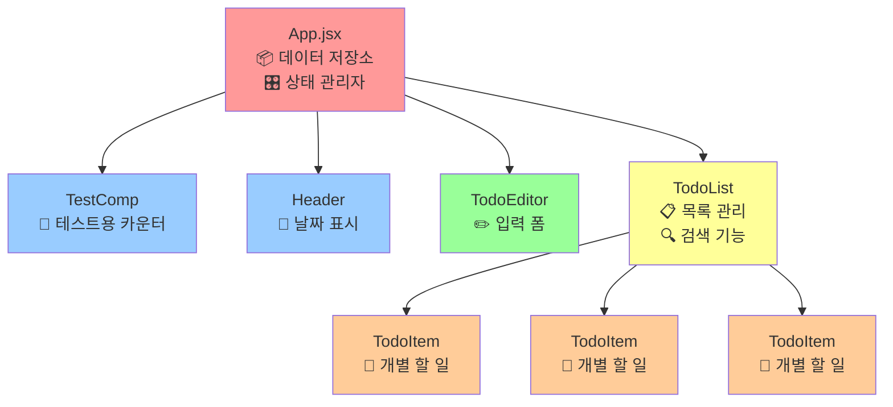

**컴포넌트별 역할:**

- 🔴 **App**: 모든 것을 관리하는 사령탑
- 🔵 **TestComp, Header**: 독립적으로 작동하는 단순한 컴포넌트
- 🟢 **TodoEditor**: 데이터를 추가하는 입력 담당
- 🟡 **TodoList**: 데이터를 보여주는 목록 담당
- 🟠 **TodoItem**: 실제 한 줄의 할 일을 표시

---

## 💡 자주 하는 질문 (FAQ)

### Q1: Context는 왜 써요? Props로 전달하면 안 되나요?

**답변:**

```
Props로 전달하려면:
App → TodoList → TodoItem

Context를 사용하면:
App → TodoItem (바로 전달!)

중간 단계를 건너뛸 수 있어서 편리해요!
```

### Q2: useReducer vs useState, 뭐가 다른가요?

**답변:**

```
useState: 간단한 상태
- const [count, setCount] = useState(0)
- setCount(1), setCount(2) 직접 변경

useReducer: 복잡한 상태
- 여러 가지 동작(추가, 수정, 삭제)이 필요할 때
- 명령(type)을 보내서 처리
- 코드가 더 체계적이에요!
```

### Q3: map을 사용하는 이유는?

**답변:**

```javascript
// 반복문 대신 map 사용
todo.map(it => <TodoItem {...it} />)

// 배열의 각 항목을 컴포넌트로 변환해요!
// 자동으로 화면에 여러 개를 그려줘요
```

### Q4: key는 왜 필요한가요?

**답변:**

```
<TodoItem key={it.id} />

React가 각 항목을 구분하기 위해서예요.
없으면 React가 헷갈려해요!
"이 할 일이 저 할 일이었나?"

key가 있으면:
"아, ID가 3인 할 일이 삭제됐구나!"
```

---

## 🎨 실행 화면 예시

```
┌─────────────────────────────────────┐
│         TodoApp                      │
├─────────────────────────────────────┤
│  TestComp                            │
│  [  0  ]  [+] [-]                   │
├─────────────────────────────────────┤
│  오늘은 📆                           │
│  Sun Dec 01 2024                    │
├─────────────────────────────────────┤
│  ✏️ 새로운 할 일 작성하기            │
│  [________________] [추가]          │
├─────────────────────────────────────┤
│  ✅ 할 일 목록                       │
│  🔍 [________________]              │
│                                      │
│  □ React 공부하기    Sun Dec 01 [삭제]│
│  ☑ 책 읽기          Sun Dec 01 [삭제]│
│  □ 운동하기         Sun Dec 01 [삭제]│
└─────────────────────────────────────┘
```

---

## 🎉 앱 완성하기 - 추가 기능 구현

기본 Todo 앱이 완성되었으니, 이제 더 실용적인 기능들을 추가해봅시다!

### 📌 추가 기능 로드맵

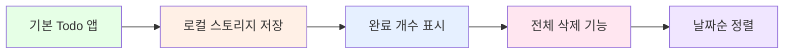

---

### 기능 1: 로컬 스토리지에 데이터 저장하기

> **왜 필요하나요?**
> 현재는 새로고침하면 데이터가 사라져요. 로컬 스토리지에 저장하면 브라우저를 닫았다 열어도 데이터가 유지돼요!

#### 1-1. App.jsx 수정 (useEffect 추가)

**파일: `src/App.jsx` 수정**

```javascript
import { useReducer, useRef, useEffect } from 'react';  // useEffect 추가

function App() {
  
  const [todo, dispatch] = useReducer(reducer, mockTodo);
  const idRef = useRef(3);

  // ============================================
  // 로컬 스토리지에서 데이터 불러오기
  // ============================================
  useEffect(() => {
    // 처음 실행될 때만 (마운트될 때)
    const savedTodos = localStorage.getItem('todos');
    
    if (savedTodos) {
      // 저장된 데이터가 있으면 복원
      const parsedTodos = JSON.parse(savedTodos);
      
      // 각 할 일을 하나씩 추가
      parsedTodos.forEach((item) => {
        dispatch({
          type: "CREATE",
          newItem: item
        });
      });
      
      // 다음 ID 설정 (가장 큰 ID + 1)
      if (parsedTodos.length > 0) {
        const maxId = Math.max(...parsedTodos.map(item => item.id));
        idRef.current = maxId + 1;
      }
    }
  }, []);  // 빈 배열: 컴포넌트 마운트될 때만 실행

  // ============================================
  // todo가 변경될 때마다 로컬 스토리지에 저장
  // ============================================
  useEffect(() => {
    localStorage.setItem('todos', JSON.stringify(todo));
  }, [todo]);  // todo가 바뀔 때마다 실행

  // ... 나머지 코드는 그대로
}
```

**이해하기:**

- **useEffect**: 특정 작업을 특정 시점에 실행
- **localStorage**: 브라우저에 데이터를 저장하는 공간
- **JSON.stringify**: 객체를 문자열로 변환
- **JSON.parse**: 문자열을 객체로 복원

---

### 기능 2: 완료된 할 일 개수 표시하기

#### 2-1. Header.jsx 수정

**파일: `src/component/Header.jsx` 수정**

```javascript
import React, { useContext } from 'react'
import './Header.css'
import { TodoContext } from '../App'

const Header = () => {
  // Context에서 todo 배열 가져오기
  const {todo} = useContext(TodoContext);
  
  // 완료된 일 개수 계산
  const doneCount = todo.filter((it) => it.isDone).length;
  
  // 전체 할 일 개수
  const totalCount = todo.length;
  
  return (
    <div className='Header'>
      <h2>오늘은 📆</h2>
      <h1>{new Date().toDateString()}</h1>
      {/* 진행 상황 표시 */}
      <div className='progress'>
        <span>완료: {doneCount} / {totalCount}</span>
        {totalCount > 0 && (
          <span className='percent'>
            ({Math.round((doneCount / totalCount) * 100)}%)
          </span>
        )}
      </div>
    </div>
  )
}

export default Header
```

#### 2-2. Header.css 수정

```css
.Header {
  margin-bottom: 20px;
  padding-bottom: 20px;
  border-bottom: 1px solid #e0e0e0;
}

.Header h2 {
  font-size: 18px;
  color: #888;
}

.Header h1 {
  font-size: 24px;
  color: #333;
}

/* 진행 상황 스타일 추가 */
.Header .progress {
  margin-top: 10px;
  font-size: 14px;
  color: #666;
}

.Header .percent {
  margin-left: 8px;
  color: #4CAF50;
  font-weight: bold;
}
```

---

### 기능 3: 전체 삭제 기능

#### 3-1. reducer에 CLEAR 액션 추가

**파일: `src/App.jsx` 수정**

```javascript
function reducer(state, action) {
  switch(action.type) {
    case "CREATE":
      return [action.newItem, ...state];
    case "UPDATE":
      return state.map(it => 
        it.id === action.id 
          ? { ...it, isDone: !it.isDone }
          : it
      );
    case "DELETE":
      return state.filter(it => it.id !== action.id);
    
    // ✨ 새로 추가: 전체 삭제
    case "CLEAR":
      return [];
    
    default:
      return state;
  }
}
```

#### 3-2. App.jsx에 OnClear 함수 추가

```javascript
function App() {
  // ... 기존 코드
  
  /* 전체 삭제하기 (CLEAR) */
  const OnClear = () => {
    if (window.confirm('모든 할 일을 삭제하시겠습니까?')) {
      dispatch({
        type: "CLEAR"
      });
    }
  };

  return (
    <div className='App'>
      <Header />
      <TodoContext.Provider value={{ 
        todo, 
        onCreate, 
        OnUpdate, 
        OnDelete,
        OnClear  // ← Context에 추가
      }}>
        <TodoEditor />
        <TodoList />
      </TodoContext.Provider>
    </div>
  )
}
```

#### 3-3. TodoList.jsx에 전체 삭제 버튼 추가

```javascript
const TodoList = () => {
  const {todo, OnClear} = useContext(TodoContext);  // OnClear 추가
  
  // ... 기존 코드
  
  return (
    <div className='TodoList'>
      <div className='list_header'>
        <h3>✅ 할 일 목록</h3>
        {todo.length > 0 && (
          <button className='clear_btn' onClick={OnClear}>
            전체 삭제
          </button>
        )}
      </div>
      <input 
        className='searchbar'
        onChange={onChangeSearch}
        placeholder='검색어를 입력해주세요.' 
      />
      {/* ... 나머지 코드 */}
    </div>
  )
}
```

#### 3-4. TodoList.css 수정

```css
.list_header {
  display: flex;
  justify-content: space-between;
  align-items: center;
  margin-bottom: 15px;
}

.list_header h3 {
  margin: 0;
  font-size: 18px;
}

.clear_btn {
  padding: 8px 16px;
  background-color: #ff6b6b;
  color: white;
  border: none;
  border-radius: 4px;
  cursor: pointer;
  font-size: 12px;
}

.clear_btn:hover {
  background-color: #ff5252;
}
```

---

### 기능 4: 날짜순 정렬 기능

#### 4-1. TodoList.jsx에 정렬 기능 추가

```javascript
import { useState, useMemo } from 'react';

const TodoList = () => {
  const {todo, OnClear} = useContext(TodoContext);
  const [search, setSearch] = useState('');
  const [sortOrder, setSortOrder] = useState('latest');  // 'latest' 또는 'oldest'

  // 검색 및 정렬 결과 (useMemo로 성능 최적화)
  const getFilteredAndSorted = useMemo(() => {
    // 1. 검색 필터링
    let filtered = search === "" 
      ? todo 
      : todo.filter((it) => 
          it.content.toLowerCase().includes(search.toLowerCase())
        );
    
    // 2. 정렬
    return [...filtered].sort((a, b) => {
      if (sortOrder === 'latest') {
        return b.createDate - a.createDate;  // 최신순
      } else {
        return a.createDate - b.createDate;  // 오래된순
      }
    });
  }, [todo, search, sortOrder]);

  return (
    <div className='TodoList'>
      <div className='list_header'>
        <h3>✅ 할 일 목록</h3>
        <div className='controls'>
          <select 
            value={sortOrder} 
            onChange={(e) => setSortOrder(e.target.value)}
            className='sort_select'
          >
            <option value='latest'>최신순</option>
            <option value='oldest'>오래된순</option>
          </select>
          {todo.length > 0 && (
            <button className='clear_btn' onClick={OnClear}>
              전체 삭제
            </button>
          )}
        </div>
      </div>
      <input 
        className='searchbar'
        onChange={onChangeSearch}
        placeholder='검색어를 입력해주세요.' 
      />
      <div className='list_wrapper'>
      {
        getFilteredAndSorted.map((it) => (
          <TodoItem key={it.id} {...it} />
        ))
      }
      </div>
    </div>
  )
}
```

#### 4-2. TodoList.css에 스타일 추가

```css
.controls {
  display: flex;
  gap: 10px;
  align-items: center;
}

.sort_select {
  padding: 6px 12px;
  border: 1px solid #ddd;
  border-radius: 4px;
  font-size: 12px;
  cursor: pointer;
}

.sort_select:focus {
  outline: none;
  border-color: #4CAF50;
}
```

---

### 기능 5: 할 일이 없을 때 메시지 표시

#### 5-1. TodoList.jsx 수정

```javascript
return (
  <div className='TodoList'>
    {/* ... 헤더 부분 */}
    
    <div className='list_wrapper'>
    {
      getFilteredAndSorted.length === 0 ? (
        <div className='empty_message'>
          {search === "" 
            ? "📝 할 일을 추가해보세요!" 
            : "🔍 검색 결과가 없습니다."}
        </div>
      ) : (
        getFilteredAndSorted.map((it) => (
          <TodoItem key={it.id} {...it} />
        ))
      )
    }
    </div>
  </div>
)
```

#### 5-2. TodoList.css에 스타일 추가

```css
.empty_message {
  padding: 40px 20px;
  text-align: center;
  color: #999;
  font-size: 16px;
}
```

---

### 기능 6: 완료된 항목에 취소선 효과

#### 6-1. TodoItem.css 수정

```css
.title_col {
  flex: 1;
  font-size: 14px;
  transition: all 0.3s ease;
}

/* 완료된 항목 스타일 */
.TodoItem.done .title_col {
  text-decoration: line-through;
  color: #999;
}
```

#### 6-2. TodoItem.jsx 수정

```javascript
return (
  <div className={`TodoItem ${isDone ? 'done' : ''}`}>  {/* 클래스 추가 */}
    {/* ... 나머지 코드 */}
  </div>
)
```

---

## 📱 추가 개선 아이디어

### 1. 우선순위 기능

```javascript
// 할 일에 priority 필드 추가
{
  id: 0,
  content: 'React 공부하기',
  isDone: false,
  priority: 'high',  // 'high', 'medium', 'low'
  createDate: new Date().getTime()
}
```

### 2. 카테고리 분류

```javascript
// 카테고리 추가
{
  id: 0,
  content: 'React 공부하기',
  isDone: false,
  category: '공부',  // '공부', '운동', '생활' 등
  createDate: new Date().getTime()
}
```

### 3. 마감일 설정

```javascript
// 마감일 추가
{
  id: 0,
  content: 'React 공부하기',
  isDone: false,
  dueDate: '2024-12-31',
  createDate: new Date().getTime()
}
```

### 4. 다크 모드

```css
/* App.css에 다크 모드 스타일 추가 */
.App.dark {
  background-color: #1a1a1a;
  color: #ffffff;
}

.App.dark .TodoEditor {
  background-color: #2d2d2d;
  color: #ffffff;
}
```

---

## 🚀 정리 및 마무리

### 전체 흐름 한 줄 요약

```
1. 브라우저 실행 → main.jsx → App.jsx
2. App에서 데이터(mockTodo)와 함수(onCreate 등) 준비
3. Context로 자식들에게 공유
4. 사용자가 버튼 클릭 → 함수 호출 → dispatch → reducer
5. reducer가 데이터 변경 → 화면 자동 업데이트! ✨
```

### 이 프로젝트에서 배울 수 있는 것

- ✅ React 기본 구조 (컴포넌트 분리)
- ✅ State 관리 (useState, useReducer)
- ✅ Context API (전역 상태 공유)
- ✅ 배열 다루기 (map, filter)
- ✅ 이벤트 처리 (onClick, onChange, onKeyDown)
- ✅ CRUD 구현 (Create, Read, Update, Delete)

### 다음 단계로 발전시킬 수 있는 것

- 💾 로컬 스토리지에 저장하기
- 🎨 더 예쁜 디자인 추가
- ⏰ 마감일 설정 기능
- 📱 모바일 반응형 디자인
- 🌈 드래그 앤 드롭으로 순서 변경

---

**축하합니다! 🎉**
이제 여러분은 이 Todo 앱의 코드 흐름을 완벽하게 이해했어요!
천천히 읽어보면서 코드와 비교해보세요. 궁금한 점이 있으면 언제든 질문하세요! 😊
