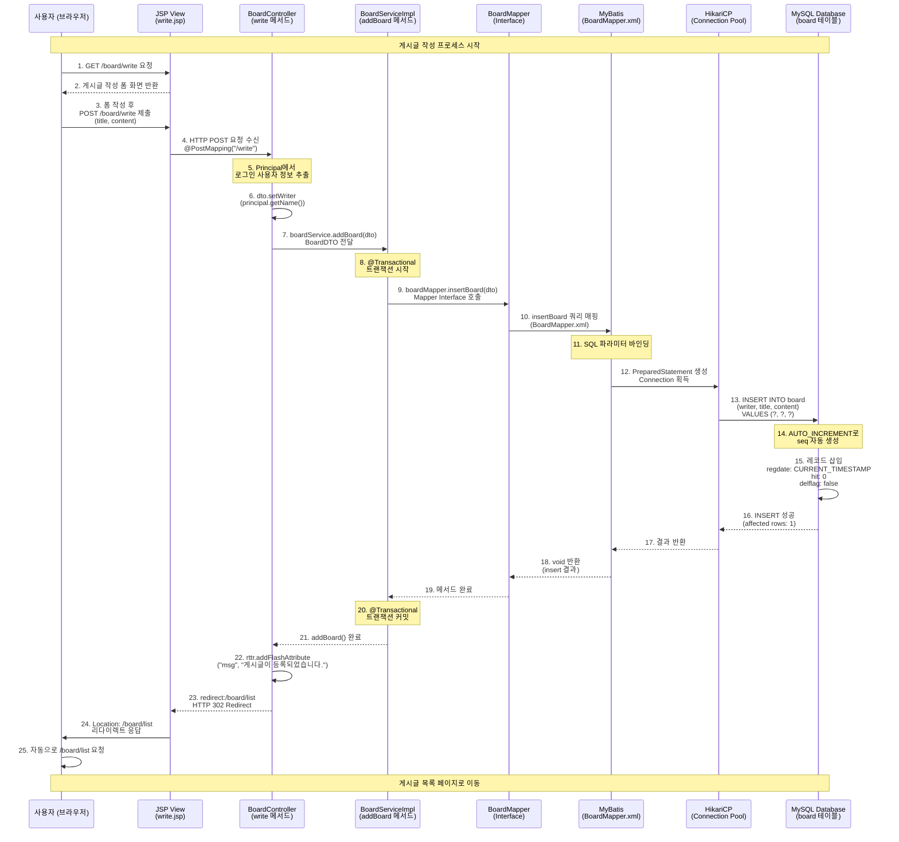
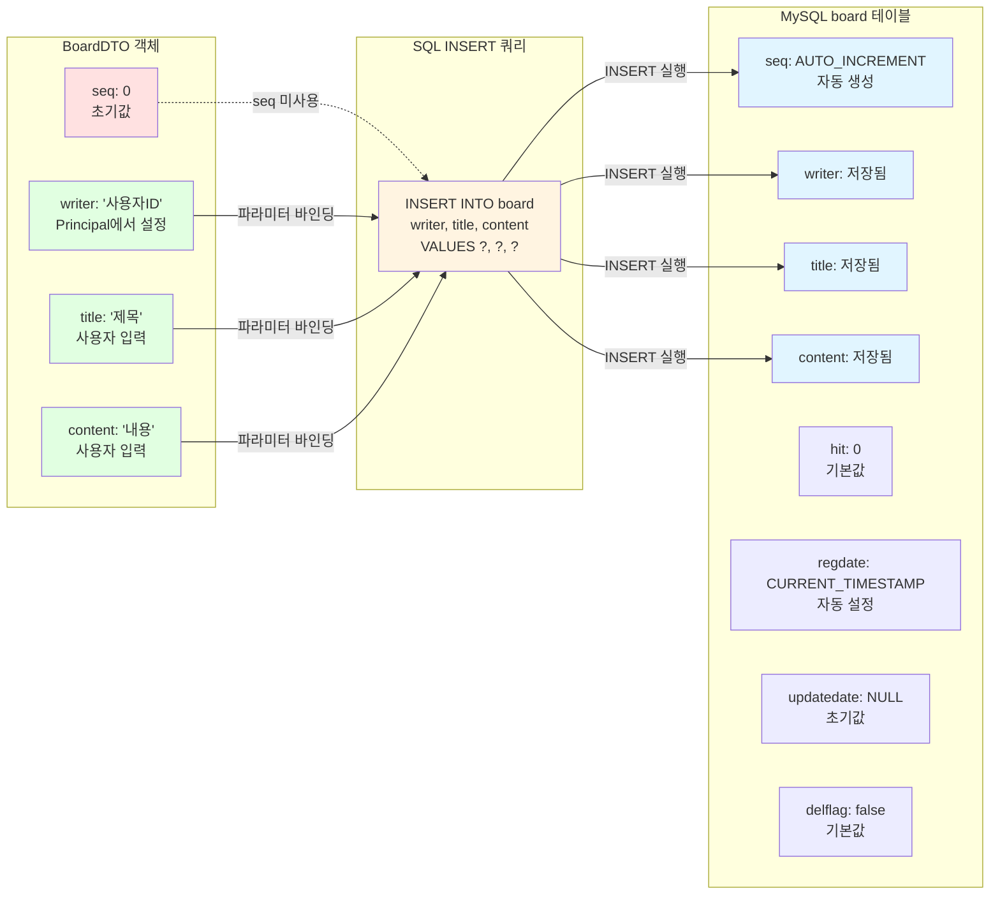

# 게시판 글 작성 프로세스 플로우

## 전체 흐름 다이어그램



## 레이어별 역할 및 데이터 흐름

```mermaid
graph TB
    subgraph "Presentation Layer"
        A[사용자 브라우저]
        B[JSP View<br/>write.jsp]
    end

    subgraph "Controller Layer"
        C[BoardController<br/>@PostMapping write 메서드]
        D[Principal<br/>Spring Security]
    end

    subgraph "Service Layer"
        E[BoardServiceImpl<br/>@Transactional addBoard]
    end

    subgraph "Data Access Layer"
        F[BoardMapper<br/>Interface]
        G[BoardMapper.xml<br/>MyBatis Mapper]
    end

    subgraph "Connection Layer"
        H[HikariCP<br/>Connection Pool]
    end

    subgraph "Database Layer"
        I[(MySQL Database<br/>board 테이블)]
    end

    A -->|1. GET /board/write| B
    B -->|2. 폼 화면| A
    A -->|3. POST /board/write<br/>title, content| B
    B -->|4. HTTP POST| C
    C -->|5. 인증 정보 조회| D
    D -->|6. username 반환| C
    C -->|7. BoardDTO<br/>writer, title, content| E
    E -->|8. 트랜잭션 시작| E
    E -->|9. BoardDTO 전달| F
    F -->|10. insertBoard 메서드 호출| G
    G -->|11. SQL 생성<br/>INSERT INTO board| H
    H -->|12. PreparedStatement<br/>파라미터 바인딩| I
    I -->|13. INSERT 실행<br/>seq AUTO_INCREMENT| I
    I -->|14. 결과 반환| H
    H -->|15. 성공 결과| G
    G -->|16. void 반환| F
    F -->|17. 완료| E
    E -->|18. 트랜잭션 커밋| E
    E -->|19. 완료| C
    C -->|20. redirect:/board/list| A

    style A fill:#e1f5ff
    style B fill:#fff4e1
    style C fill:#ffe1f5
    style D fill:#ffe1f5
    style E fill:#e1ffe1
    style F fill:#f0e1ff
    style G fill:#f0e1ff
    style H fill:#ffe1e1
    style I fill:#e1e1ff
```

## 데이터베이스 실행 상세



## 주요 코드 참조

### 1. Controller Layer
```68:79:dc-SF/src/main/java/org/zerock/controller/BoardController.java
    @PostMapping("/write")
    public String write(BoardDTO dto, Principal principal, RedirectAttributes rttr) {
        log.info("board write... dto: {}", dto);

        // 로그인한 사용자를 작성자로 설정
        if (principal != null) {
            dto.setWriter(principal.getName());
        }

        boardService.addBoard(dto);
        rttr.addFlashAttribute("msg", "게시글이 등록되었습니다.");
        return "redirect:/board/list";
    }
```

### 2. Service Layer
```55:60:dc-SF/src/main/java/org/zerock/service/BoardServiceImpl.java
    @Override
    @Transactional
    public void addBoard(BoardDTO dto) {
        log.info("addBoard... dto: {}", dto);
        boardMapper.insertBoard(dto);
    }
```

### 3. Mapper Interface
```48:53:dc-SF/src/main/java/org/zerock/mapper/BoardMapper.java
    /**
     * 게시글 등록
     * 
     * @param dto 게시글 정보
     */
    void insertBoard(BoardDTO dto);
```

### 4. MyBatis Mapper XML
```20:24:dc-SF/src/main/resources/mapper/BoardMapper.xml
    <!-- 게시글 등록 -->
    <insert id="insertBoard" parameterType="BoardDTO">
        INSERT INTO board (writer, title, content)
        VALUES (#{writer}, #{title}, #{content})
    </insert>
```

## 특징 요약

1. **보안**: Spring Security의 Principal을 통한 작성자 자동 설정
2. **트랜잭션**: Service 계층에서 @Transactional로 데이터 무결성 보장
3. **영속성**: MyBatis를 통한 SQL 매핑 및 파라미터 바인딩
4. **연결 풀**: HikariCP를 통한 효율적인 DB 연결 관리
5. **응답 처리**: RedirectAttributes를 사용한 Flash 메시지 전달
